---
puppeteer:
  displayHeaderFooter: true
  headerTemplate: '
第三章：文字與影像的交會：從 Token 到多模態向量空間
'
  footerTemplate: '
第  頁 / 共  頁
'
  margin:
    top: "1.5cm"
    bottom: "1.5cm"
    left: "1.5cm"
    right: "1.5cm"
---

---

# 第三章：文字與影像的交會：從 Token 到多模態向量空間

## 課程導讀

在上一章中，我們深入剖析了神經網路從多層感知機（MLP）一路演進至 Transformer 的五代架構，理解了計算機科學如何透過拓撲結構克服空間幾何與時間序列的運算瓶頸。

然而，在這些精密的神經網路開始運作之前，我們必須先回答一個更根本的認知哲學與工程問題：

> **計算機底層只認識二進位的「0」與「1」，既沒有眼睛也沒有聽覺神經，它究竟是如何「讀懂」人類的自然語言，甚至「看懂」一張照片的？**

當我們向 AI 輸入一段文字、一張照片或一段語音時，AI 並非像人類一樣產生主觀體驗，而是透過一套精密的**數學轉譯管線（Mathematical Translation Pipeline）**，將現實世界的符號與連續訊號拆解成離散的「詞元（Token）」，再映射為高維幾何空間中的「嵌入向量（Embedding）」。

本章將帶領讀者揭開多模態 AI 的底層大腦地圖，從文字的詞元化、語意幾何空間（Latent Space）、編碼與解碼機制，一路探討至當代多模態兩大里程碑——**CLIP 圖文跨模態對齊**與 **Diffusion 擴散去噪生成模型**，建立起將現實訊號轉化為幾何數學的完整工程視野。

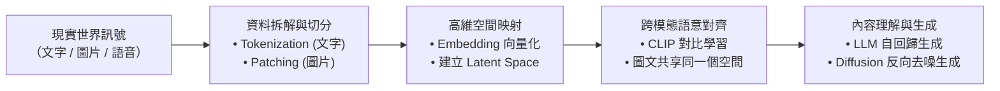

---

## 第一節：AI 如何閱讀文字？詞元化（Tokenization）與分詞機制

### 1.1 什麼是 Token（詞元）？

人類閱讀文章時，大腦能自動辨識字形、詞彙與語法結構；但對於大型語言模型（Large Language Models，LLM）而言，電腦無法直接將一串由字元構成的字串直接塞進神經網路進行矩陣運算。

在進入神經網路之前，原始文本必須先經過一個前處理軟體模組——**分詞器（Tokenizer）**。分詞器的任務是將長篇字串切割成一段段標準化的最小處理單位，這個單位就稱為 **Token（詞元）**。

每個被切割出來的 Token，都會對應到模型預先建立好的「詞表（Vocabulary）」中的一個專屬整數索引（Token ID）。換言之，**模型在計算時看到的從來不是文字，而是一串數字序列**。

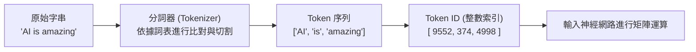

### 1.2 分詞機制的演進：從字元、單字到次詞（Subword）

在自然語言處理發展史上，分詞方法歷經了三次主要演進：

1. **字元級分詞（Character-based）：**
   - **作法：** 將句子拆成單一字母（如 `a`, `p`, `p`, `l`, `e`）或單一漢字。
   - **缺點：** 詞表雖然極小，但切分出來的序列長度暴增數倍，且單一字母缺乏足夠的語意資訊，模型運算成本極高。
2. **詞級分詞（Word-based）：**
   - **作法：** 以空格或標點為界，將每個詞視為一個 Token（如 `apple`, `run`）。
   - **缺點：** 容易遭遇「未登錄詞（Out of Vocabulary，OOV）」問題。英文中詞形變化繁多（如 `play`, `player`, `playing`, `unplayable`），若要收錄所有衍生詞，詞表將膨脹至數百萬個，導致記憶體崩潰。
3. **次詞級分詞（Subword-based，現代主流）：**
   - **作法：** 結合上述兩者優點。常見的高頻詞保持完整詞，罕見詞或複合詞則拆解為常見的「詞首、詞根、詞尾」詞綴。
   - **主流演算法：** **位元組對編碼（Byte-Pair Encoding，BPE）**。

#### BPE 演算法的運作邏輯：
BPE 是一種從資料驅動的統計壓縮演算法。它從最基礎的字元開始，統計訓練語料庫中相鄰字元對出現的頻率，反覆將出現次數最高的一對字元「合併（Merge）」成一個新的次詞 Token，直到詞表達到預設大小（例如 32,000 到 100,000 個詞元）。

例如，單字 `unbelievable` 在 BPE 分詞器中可能會被優雅地拆解為：
\[
\text{"unbelievable"} \longrightarrow \text{["un", "believ", "able"]}
\]
如此一來，模型既能透過 `un` 理解「否定」語意，透過 `believ` 理解「相信」，透過 `able` 理解「能夠」，同時將詞表大小控制在非常緊湊的範圍內。

### 1.3 中文分詞的特殊挑戰與計算成本

英文單字之間天然帶有「空格」作為分界，但中文是連續書寫的文字系統，沒有空格可供直觀切分。現代大語言模型在處理中文時，通常面臨以下現象：

1. **高頻常見詞彙合併：**
   如「人工智慧」、「國立臺灣大學」、「非常」等常見高頻詞，通常會被收錄為單一 Token。
2. **罕見詞與單字拆解：**
   如「這」、「款」、「的」或較罕見的成語，會被切分為單一中文字。
3. **位元組回退（Byte-fallback）與跨語系不均：**
   在以英文語料為主的開源模型（如早期的 LLaMA 1）中，由於中文詞表收錄不足，一個中文字常被拆解為 3 個 UTF-8 底層位元組 Token。這導致處理一篇 1000 字的中文文章，英文模型可能需要消耗 3000 個 Tokens，而中文優化模型（如 Qwen、Claude 3.5）只需消耗約 600 到 800 個 Tokens。

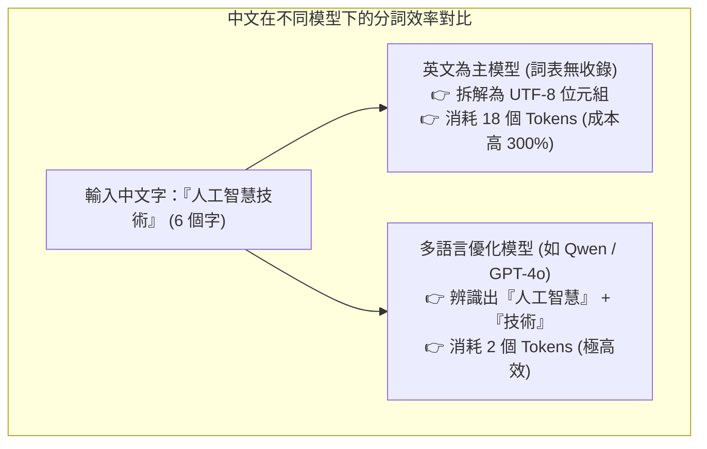

> **Token 與商業成本的直接關聯：**
> 現代大模型 API 的計費基準（如 每百萬 Tokens 美金）以及模型的**上下文視窗長度（Context Window）**，完全是以 Token 數量而非字數計算。分詞器的效率直接決定了系統的推論速度與雲端運算帳單。

---

### 1.4 課堂實作活動：Tokenizer 分詞模擬與多語言分詞比對

請小組成員打開瀏覽器，進入 OpenAI 官方視覺化分詞工具（[platform.openai.com/tokenizer](https://platform.openai.com/tokenizer)）或開源分詞展示頁面。

#### 實驗步驟與任務：
1. **任務 A（語意斷詞 vs 統計斷詞）：**
   - 請在輸入框輸入以下中英混雜句子：
     > *「這款紅色的 Smartphone 設計非常 amazing，但價格太貴了。」*
   - 觀察下方彩色區塊所標示的 Token 切分邊界。
   - **比較：** 人類在直覺上是按語法（「紅色 / 的 / 智慧型手機」）斷詞，而機器是按統計頻率（可能切分為 `這` / `款` / `紅` / `色` / ` 的` / ` Smartphone` / ` 設計` / ` 非常` / ` amazing` / `，` / `但` / `價格` / `太` / `貴` / `了` / `。`）。
2. **任務 B（顏色與詞頻的 Token 數量探測）：**
   - 嘗試在上面的句子中替換不同的顏色單字：
     - 輸入常見顏色：`紅色`、`藍色`、`黑色`。
     - 輸入罕見顏色：`蒂芙尼藍`、`莫蘭迪灰`、`鵪鶉蛋色`。
   - **觀察：** 哪些顏色被視為 1 個 Token？哪些罕見顏色被拆解成了 3 到 5 個 Tokens？這說明了什麼？

> **老師的提醒：**
> - **小心「空格」也是一個 Token 的一部分**：在多數 BPE 分詞器中，英文單字前面的空格會被當作前綴（例如 ` amazing` 前面帶有特殊的 `Ġ` 或 ` ` 標記）。因此 `"amazing"` 和 `" amazing"` 在模型眼中是兩個完全不同的 Token ID！
> - **不要用字數估算 LLM 成本**：評估多語言專案時，務必使用專屬 Tokenizer 實際計算 Token 膨脹比率（Token-to-Char Ratio），切勿直接以中文字數換算 API 費用。

---

## 第二節：從符號到幾何座標：嵌入向量（Embedding）

分詞器完成了將文字字串轉換為整數 Token ID 的工作。然而，整數索引本質上只是一個標籤號碼（例如「狗」編號為 $9552$，「貓」編號為 $9553$，「飛機」編號為 $9554$）。神經網路依然無法理解這些號碼背後代表什麼語意。

這時，我們需要深度學習最核心的語意轉譯器——**嵌入向量（Embedding）**。

### 2.1 獨熱編碼（One-Hot Encoding）的維度災難與語意孤島

在早期機器學習中，最直觀的編碼方式是**獨熱編碼（One-Hot Encoding）**。
若詞表大小為 $N$（例如 $N = 50,000$），每個詞會被表示為一個長度為 $N$ 的向量，其中只有該詞對應的索引位置為 $1$，其餘全部為 $0$：

\[
\begin{aligned}
\mathbf{v}_{\text{貓}} &= [1, 0, 0, 0, \dots, 0]^T \\
\mathbf{v}_{\text{狗}} &= [0, 1, 0, 0, \dots, 0]^T \\
\mathbf{v}_{\text{飛機}} &= [0, 0, 1, 0, \dots, 0]^T
\end{aligned}
\]

#### 獨熱編碼的兩大致命缺陷：
1. **維度災難（Curse of Dimensionality）：** 向量極度稀疏（Sparse），絕大多數數值都是無意義的 $0$，造成巨大的儲存與運算浪費。
2. **語意孤島（Semantic Isolation）：** 任意兩個獨熱向量進行內積運算，結果永遠為 $0$（$\mathbf{v}_{\text{貓}} \cdot \mathbf{v}_{\text{狗}} = 0$ 且 $\mathbf{v}_{\text{貓}} \cdot \mathbf{v}_{\text{飛機}} = 0$）。在幾何上，所有詞彙彼此正交，模型完全無法得知「貓」和「狗」是相近的寵物，而「飛機」是交通工具。

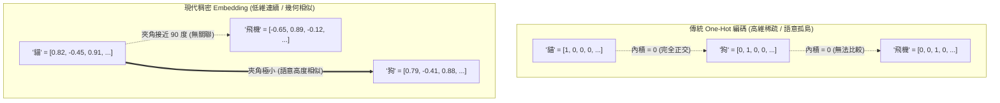

### 2.2 稠密嵌入向量（Dense Embedding）的數學本質

現代深度學習將每個 Token 映射為一個**低維度、連續且稠密的浮點數向量（Dense Vector）**。

- **維度設定：** 通常為 768（如 BERT-base）、1536（如 OpenAI text-embedding-3-small）或 4096 維（如 LLaMA-70B）。
- **查表運算（Embedding Lookup）：** 在模型內部，存在一個巨大的矩陣 $\mathbf{E} \in \mathbb{R}^{V \times D}$（其中 $V$ 為詞表大小，$D$ 為向量維度）。當輸入 Token ID 為 $k$ 時，系統只需從矩陣中取出第 $k$ 列，即可獲得該詞的高維座標向量 $\mathbf{e}_k$。

### 2.3 幾何距離即語意關聯：餘弦相似度

在嵌入向量空間中，**幾何上的「距離」與「夾角」直接代表了概念上的「語意相似度」**。

衡量兩個嵌入向量 $\mathbf{A}$ 與 $\mathbf{B}$ 相似程度最常用的指標是**餘弦相似度（Cosine Similarity）**。它計算的是兩個向量在高維空間中的夾角 $\theta$ 之餘弦值：

\[
\text{Cosine Similarity}(\mathbf{A}, \mathbf{B}) = \cos(\theta) = \frac{\mathbf{A} \cdot \mathbf{B}}{\|\mathbf{A}\| \|\mathbf{B}\|} = \frac{\sum_{i=1}^{D} A_i B_i}{\sqrt{\sum_{i=1}^{D} A_i^2} \sqrt{\sum_{i=1}^{D} B_i^2}}
\]

- **數值為 $+1.0$：** 夾角為 $0^\circ$，代表兩者語意完全相同。
- **數值為 $0.0$：** 夾角為 $90^\circ$，代表兩者語意完全獨立、毫不相干。
- **數值為 $-1.0$：** 夾角為 $180^\circ$，代表兩者在語意維度上處於完全對立的反向概念。

---

### 2.4 課堂計算小活動：手算餘弦相似度與語意方向性

假設我們在一個簡化的二維語意空間中（維度 1 代表「寵物指數」，維度 2 代表「飛行載具指數」），三個詞彙的嵌入向量座標如下：
- $\mathbf{v}_{\text{小貓}} = [4, 1]$
- $\mathbf{v}_{\text{小狗}} = [5, 2]$
- $\mathbf{v}_{\text{客機}} = [1, 6]$

#### 計算任務：
1. 請小組成員計算 $\mathbf{v}_{\text{小貓}}$ 與 $\mathbf{v}_{\text{小狗}}$ 的點積 $\mathbf{v}_{\text{小貓}} \cdot \mathbf{v}_{\text{小狗}} = (4 \times 5) + (1 \times 2) = 22$。
2. 計算兩者向量長度乘積：$\|\mathbf{v}_{\text{小貓}}\| = \sqrt{4^2+1^2} = \sqrt{17} \approx 4.12$，$\|\mathbf{v}_{\text{小狗}}\| = \sqrt{5^2+2^2} = \sqrt{29} \approx 5.385$。
3. 算出餘弦相似度：$\frac{22}{4.12 \times 5.385} \approx \mathbf{0.991}$（高度相似）。
4. 依相同步驟計算 $\mathbf{v}_{\text{小貓}}$ 與 $\mathbf{v}_{\text{客機}}$ 的相似度，觀察其數值差異。

> **老師的真心話：**
> - **Embedding 是現代 RAG（檢索增強生成）的靈魂**：在建構企業知識庫時，我們之所以能用自然語言精準搜尋出相關的 PDF 段落，靠的就是把使用者提問與所有檔案段落都轉成 Embedding 向量，並透過向量資料庫（Vector DB）進行毫秒級的「餘弦相似度最近鄰居搜尋（KNN）」。
> - **維度不是越大越好**：許多人誤以為 4096 維一定比 1536 維好。高維度雖然能容納更多細膩語意，但會帶來龐大的儲存開銷與檢索延遲。在實務工程中，選擇適當維度並搭配向量量化（Quantization）技術才是成熟架構師的考量。

---

## 第三節：AI 腦中的知識地圖：潛在空間（Latent Space）

當數百萬個詞彙與概念都透過深度神經網路轉換為 Embedding 座標，並在海量文本訓練下調整好彼此的相對距離後，就形成了一個極其壯麗的高維幾何宇宙——學術上稱為 **潛在空間（Latent Space）**。

### 3.1 什麼是潛在空間？

潛在空間可以被視為 **AI 內化人類文明知識的「心智地圖」**。在這個空間中，現實世界的離散符號被連續的幾何流形（Manifold）所取代。所有概念不再是死板的定義，而是具有方向、距離與分佈密度的數學實體。

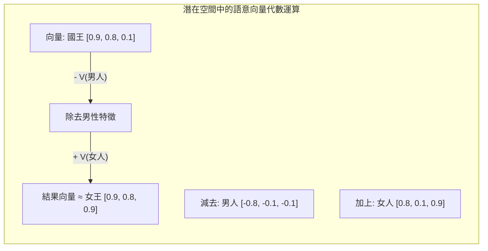

### 3.2 向量運算與語意代數（Semantic Algebra）

潛在空間最令人驚嘆的特性在於：**抽象的邏輯推理與語意演繹，竟然可以直接轉化為國中程度的「向量加減法」！**

在 Mikolov 等人提出的 Word2Vec 以及當代大模型嵌入空間中，存在著極為精確的語意位移向量（Semantic Shift Vectors）：

#### 經典案例 1：性別維度位移
\[
\mathbf{V}(\text{國王}) - \mathbf{V}(\text{男人}) + \mathbf{V}(\text{女人}) \approx \mathbf{V}(\text{女王})
\]
神經網路在訓練過程中，自動提煉出了一條名為「性別方向（Gender Direction）」的幾何位移軸。當你把「國王」減去「男性軸向量」並加上「女性軸向量」，空間指標便精準指向了「女王」的座標位置。

#### 經典案例 2：首都與國家關係
\[
\mathbf{V}(\text{巴黎}) - \mathbf{V}(\text{法國}) + \mathbf{V}(\text{日本}) \approx \mathbf{V}(\text{東京})
\]
這說明模型在沒有人類硬性撰寫地理規則的情況下，自主學會了「國家與首都」之間的幾何映射關係。

### 3.3 跨語言的語意對齊

潛在空間的另一個宏大能力是**超越單一語言的表象符號**。

如果一個大型語言模型同時在大規模的中文、英文、日文與法文語料上進行預訓練，其潛在空間會自發性地將不同語言中代表相同實體的字詞聚合在極其接近的幾何區域：
- 英文的 `Apple`
- 中文的 `蘋果`
- 日文的 `リンゴ`
- 法文的 `Pomme`

這些詞彙在潛在空間中的座標高度重疊。這解釋了為什麼現代 LLM 具備強大的即時翻譯能力——**模型並不是在詞彙層面進行字對字替換，而是在潛在空間中提取出語言無關（Language-Agnostic）的純粹概念，再由解碼器用目標語言將該概念重新具象化**。

---

### 3.4 課堂探索活動：TensorFlow Embedding Projector 3D 語意空間探索

請各位同學使用電腦瀏覽器進入 Google 開發的語意空間視覺化平台：[projector.tensorflow.org](https://projector.tensorflow.org)。

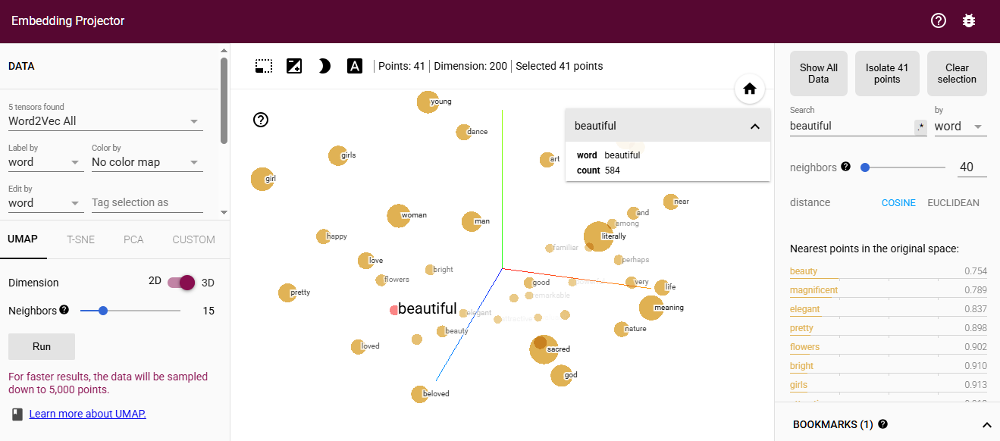

#### 實驗環境配置：
- 確認左側 Data 面板預載為 **"Word2Vec All"**（包含數萬個常用單字的高維詞向量）。
- 網頁透過 PCA（主成分分析）或 t-SNE 演算法，將數百維的空間即時降維成畫面上可自由拖曳、旋轉與縮放的 3D 星雲圖。

#### 實驗步驟與任務：
1. **任務 A（語意鄰居的幾何凝聚）：**
   - 在右上角 "Search" 搜尋框輸入：`pretty`。
   - 點擊該單字，觀察被外顯標記（高亮）的最近鄰居（Neighbors）。
   - **觀察：** 圍繞在 `pretty` 身邊的點是否包含了 `gorgeous`, `lovely`, `beautiful`, `cute`？
2. **任務 B（概念星系隔離探索）：**
   - 搜尋 `king`（國王），並點擊右側面板的 **"Isolate 101 points"**（隔離出周遭最接近的 101 個單字）。
   - 用滑鼠旋轉星雲，觀察圍繞在 `king` 身邊的字詞群體（是否包含 `queen`, `prince`, `monarch`, `kingdom`, `empire`）。
3. **任務 C（跨領域概念跳躍）：**
   - 嘗試搜尋一個科技詞彙（如 `computer`）與一個自然詞彙（如 `forest`），觀察這兩個詞彙群體在 3D 空間中是否被遙遠地隔開在星雲的兩端。

> **老師的提醒：**
> - **空間中的「偏見（Bias）」印記**：潛在空間是人類社會語料的鏡子。早期的 Word2Vec 空間中曾被發現經典的偏見問題（如 $\mathbf{V}(\text{醫生}) - \mathbf{V}(\text{男人}) + \mathbf{V}(\text{女人}) \approx \mathbf{V}(\text{護理師})$）。這提醒我們：Embedding 完全是從歷史資料的統計關聯中學習，如果訓練資料中存在性別、種族或文化偏見，這些偏差也會被原封不動地編碼進幾何空間中。
> - **降維展示只是冰山一角**：在網頁上看到的 3D 空間是透過演算法壓縮後的投影，在真實的 1536 維空間中，概念之間的相互幾何關係比我們肉眼能看到的複雜與精確數百萬倍。

---

## 第四節：資訊的壓縮與重構：編碼器（Encoder）與解碼器（Decoder）

理解了潛在空間後，我們接下來要探討：**現實世界的資訊究竟如何進入這個幾何空間？我們又如何從空間中取出我們需要的產出？**

這整個過程仰賴兩大核心組件：**編碼器（Encoder）** 與 **解碼器（Decoder）**。

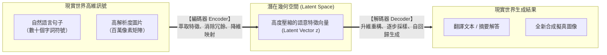

### 4.1 編碼器（Encoder）：理解與特徵萃取

**編碼器（Encoder）的本質任務是「理解與壓縮」。**

現實世界的輸入訊號（如一張 $1920 \times 1080$ 的圖片或一篇數千字的文章）包含了大量的高頻冗餘資訊（例如純白背景的像素、無意義的填充助詞）。
編碼器的作用是透過多層神經網路（如 Transformer Encoder 或 CNN 卷積層），過濾掉次要雜訊，將輸入訊號壓縮並映射為潛在空間中的一個或一組高階特徵向量 $\mathbf{z}$。

- **代表架構：** **BERT**（純編碼器架構）。它專注於雙向理解整篇文章的上下文，非常適合用於文本分類、實體識別（NER）與語意檢索。

### 4.2 解碼器（Decoder）：生成與逆向重構

**解碼器（Decoder）的本質任務是「生成與具象化」。**

解碼器接收潛在空間中的特徵向量 $\mathbf{z}$，並將其反向還原為人類能夠感知的形式（如自然語言文字、合成影像或音訊）。在文字生成領域，現代解碼器通常採用**自回歸（Autoregressive）**機制——根據前文向量與已經生成的字詞，一步一步預測下一個最可能出現的 Token。

- **代表架構：** **GPT 系列**（純解碼器架構）。它專注於給定提示詞（Prompt）後的自回歸接龍，是當代聊天機器人與內容生成的核心基礎。

### 4.3 經典架構三大流派

依據編碼器與解碼器的組合方式，現代深度學習模型形成了三大主流分支：

| 架構類別 | 組件構成 | 注意力方向 | 核心優勢 | 經典代表模型 | 典型應用場景 |
| :--- | :--- | :--- | :--- | :--- | :--- |
| **Encoder-only** (純編碼器) | 僅有 Encoder | 雙向注意力 (Bidirectional) | 深層理解全域語意，特徵表徵極其精準 | **BERT**, RoBERTa | 情感分析、文本分類、RAG 向量嵌入提取 |
| **Decoder-only** (純解碼器) | 僅有 Decoder | 單向因果注意力 (Causal / Masked) | 生成能力極強，架構簡單且極具擴展性 (Scaling Law) | **GPT-4**, LLaMA, Claude, Qwen | 對話問答、文章創作、程式碼生成 |
| **Encoder-Decoder** (編解碼器) | Encoder + Decoder | 編碼雙向 + 解碼單向 + 交叉注意力 | 擅長將一種結構完整轉化為另一種結構 | **T5**, BART, Whisper | 跨語言翻譯、文章摘要、語音轉文字 |

---

### 4.4 課堂對比小活動：三大架構選型辨析

請小組成員討論以下三項工程任務，並決定哪一種架構（Encoder-only、Decoder-only、Encoder-Decoder）最適合：

1. **任務 1（智慧法規分類器）：** 某政府機關需要一個系統，能自動閱讀民眾陳情書，並將其精確分類到 50 個不同的行政局處。
2. **任務 2（多國語言語音翻譯機）：** 將使用者即時說出的法文語音音波，直接翻譯並輸出成英文文字。
3. **任務 3（多功能程式碼助手）：** 根據軟體工程師寫下的需求說明，自動撰寫出整段 Python 演算法函式。

> **老師的提醒：**
> - **為什麼當代 LLM 幾乎清一色採用 Decoder-only？**：初學者常疑惑：既然 Encoder-Decoder 結構看起來最完整，為什麼 ChatGPT、LLaMA、Gemini 都採用純 Decoder 架構？因為在超大規模預訓練（數萬億 Tokens）下，Decoder-only 架構在硬體記憶體利用率、KV Cache 推論快取以及自回歸訓練的泛化能力上展現了驚人的優勢，證明了「簡單的架構搭配極致的算力與資料」往往能勝過複雜的手工設計。

---

## 第五節：跨模態語意對齊：CLIP 架構與圖文同構空間

在 2021 年以前，電腦視覺（CV）與自然語言處理（NLP）是兩個幾乎平行的獨立領域：
- 影像模型（如 ResNet）在 ImageNet 的 1000 個固定類別上訓練，輸出的是「第 385 號類別（柴犬）」。
- 語言模型（如 BERT）在文本語料上訓練，輸出的是文字 Token。

這帶來了一個巨大的**跨模態語意鴻溝（Cross-Modal Semantic Chasm）**：文字向量存在於文字空間，影像向量存在於影像空間，兩者彼此無法通話。AI 無法根據一句「請幫我找一張夕陽下奔跑的小狗」在未標註的圖片庫中找出對應照片。

OpenAI 提出的 **CLIP（Contrastive Language-Image Pre-training，對比語言-影像預訓練）** 架構，徹底粉碎了這道鴻溝。

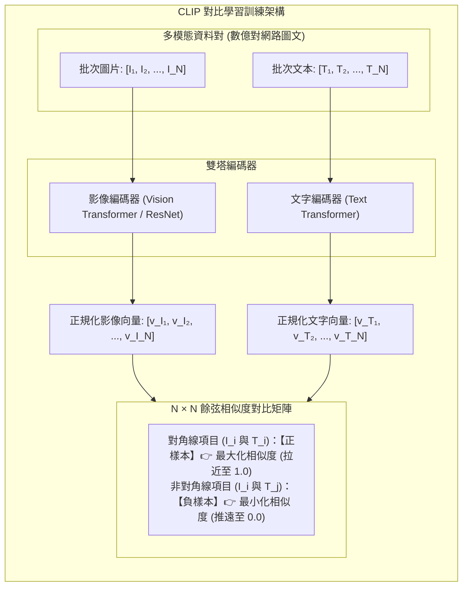

### 5.1 CLIP 的核心哲學：對比學習（Contrastive Learning）

CLIP 的架構採用簡潔的**雙塔結構（Two-Tower Architecture）**：
1. **影像編碼器（Image Encoder，記為 $E_I$）：** 接收圖片，將其轉化為一個 $D$ 維的影像向量 $\mathbf{v}_I$。
2. **文字編碼器（Text Encoder，記為 $E_T$）：** 接收文字描述，將其轉化為相同 $D$ 維的文字向量 $\mathbf{v}_T$。

#### 批次對比學習機制：
在每次訓練迭代中，輸入一個批次（Batch）包含 $N$ 對真實的「圖片與對應文本描述」對 $(I_1, T_1), (I_2, T_2), \dots, (I_N, T_N)$：
- 系統計算這 $N$ 個影像向量與 $N$ 個文字向量之間的兩兩內積，形成一個 $N \times N$ 的相似度矩陣。
- **正樣本（Positive Pairs，對角線上的 $N$ 個組合）：** $(I_i, T_i)$ 是真正互相對應的圖文，演算法強制**最大化（拉近）**它們的餘弦相似度。
- **負樣本（Negative Pairs，非對角線上的 $N^2 - N$ 個組合）：** $(I_i, T_j)$ 是不匹配的隨機圖文，演算法強制**最小化（推遠）**它們的相似度。

透過在數億對網路圖文資料上的海量對比訓練，**文字與影像終於被強行對齊在「同一個數學潛在空間」中**。在該空間中，「一張小狗奔跑的照片」與「一句 'A dog running' 的英文」其向量座標幾乎完全重合！

### 5.2 零樣本分類（Zero-Shot Classification）

CLIP 帶來了革命性的**零樣本遷移能力（Zero-Shot Transfer）**。在傳統電腦視覺中，若想增加一個新類別（如「無人機」），必須重新蒐集數千張照片並重新訓練分類層；而在 CLIP 空間中：

1. 我們只需將欲分類的類別名稱寫成提示詞句子（如 *"A photo of a [guacamole]"*, *"A photo of a [pizza]"*）。
2. 將這些句子輸入 Text Encoder，得到各類別的文字特徵向量。
3. 將測試圖片輸入 Image Encoder 得到圖片向量。
4. 計算圖片向量與哪一個類別的文字向量夾角最小（餘弦相似度最高），該類別即為預測結果。

這意味著：**AI 不再需要針對特定任務微調，就能辨識全世界幾乎所有物體！**

---

### 5.3 課堂動手做活動：Hugging Face CLIP 跨模態對齊與相似度評測

請各位同學打開瀏覽器，進入 Hugging Face 的開源 CLIP 體驗空間（可搜尋 `CLIP Retrieval`、`Sentence Transformers CLIP Demo` 或相關 Spaces）。

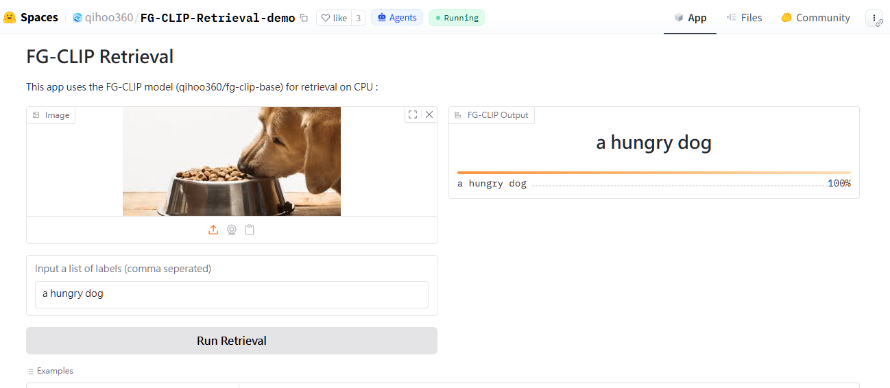

#### 實驗步驟與任務：
1. **任務 A（圖文高度吻合測試）：**
   - 上傳一張清晰的「金色獵犬在草地上奔跑」照片。
   - 在文字框輸入提示詞：`"A golden retriever running happily on the green grass"`。
   - 點擊計算，觀察系統輸出的餘弦相似度分數（通常高達 `0.85 ~ 0.95`）。
2. **任務 B（語意偏移干擾測試）：**
   - 保持原本的狗狗圖片不變，將文字框依序改為：
     - 文字 1（微小偏差）：`"A cat sleeping on a sofa"`（觀察分數驟降至 `0.10 ~ 0.20`）。
     - 文字 2（完全無關）：`"An astronaut walking on the moon"`（觀察分數逼近 `0.00`）。
3. **引導反思：**
   - 嘗試輸入抽象概念（如 `"Happiness"`, `"Technology"`, `"Chaos"`），觀察圖片與抽象概念向量的匹配分數。這證明 CLIP 不僅能辨識實體物體，更內化了跨模態的抽象氛圍與情感語意。

> **老師的提醒：**
> - **CLIP 是現代多模態 AI 的通用基礎設施**：不管是 Midjourney、Stable Diffusion 還是各類以圖搜圖引擎，其底層能夠「聽懂提示詞」全部依賴 CLIP（或其改良版 OpenCLIP / SigLIP）所建立的圖文同構空間。
> - **CLIP 依然容易受到文字干擾（Typographic Attack）**：研究發現，如果你在一顆蘋果上貼一張寫著「iPod」的便利貼，CLIP 常常會以 99% 的信心度將這張照片判定為「iPod 播放器」！這是因為強大的文字表徵有時會壓過弱視覺特徵，突顯出多模態對齊在特定場景下的脆弱性。

---

## 第六節：從隨機雜訊中作畫：擴散模型（Diffusion Model）與文字導引生成

學會了如何將文字與圖片對齊在同一個空間後，我們終於能探討當前生成式 AI 最耀眼的明星——**擴散模型（Diffusion Models，如 Stable Diffusion、Midjourney、DALL-E 3）**。

### 6.1 擴散模型的生成哲學：並非拼貼，而是去噪

許多初學者對 AI 繪圖有嚴重的誤解，以為 AI 是「在龐大的圖片庫中剪下別人的線條、拼貼組合出一張新圖片」。

事實上，擴散模型的生成哲學完全來自於**熱力學中的非平衡態擴散過程**：

> **生成影像的本質，是在一團毫無意義的高斯白雜訊（Pure Noise）中，依據文字 Embedding 向量的幾何方向，一步一步「擦除雜訊、還原出符合該語意特徵的清晰像素」。**

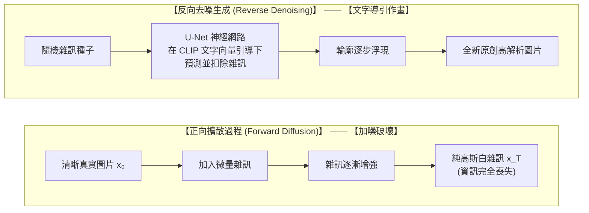

### 6.2 擴散模型兩大核心流程

擴散模型的運作由兩個互逆的物理數學過程構成：

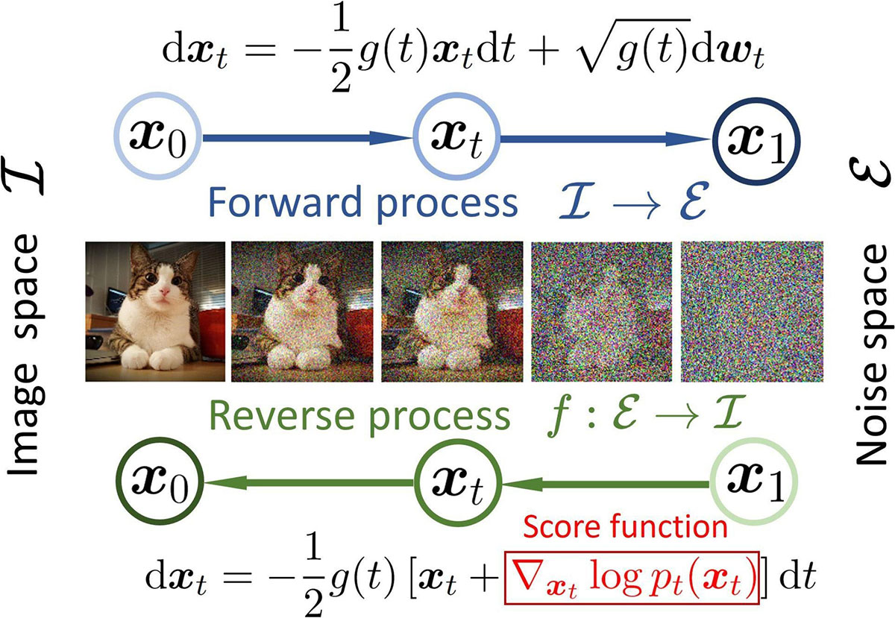

1. **正向擴散（Forward Process，破壞過程）：**
   - 在訓練階段，給定一張清晰的真實圖片 $\mathbf{x}_0$，演算法在 $T$ 個時間步內（例如 $T = 1000$ 步），每一步都向圖片中疊加微量的高斯隨機雜訊 $\epsilon$。
   - 到了第 $T$ 步時，整張圖片的所有結構資訊被徹底破壞，退化為一片純粹的數學白雜訊 $\mathbf{x}_T$。這個過程是純數學公式定義的，不需要神經網路學習。
2. **反向去噪（Reverse Process，生成過程）：**
   - 這是神經網路（通常採用 **U-Net** 架構搭配交叉注意力機制）真正學習的精髓。
   - 模型的任務是：**在給定時間步 $t$、當前模糊圖片 $\mathbf{x}_t$ 以及 CLIP 文字嵌入向量 $\mathbf{c}$ 的條件下，精準預測出「當前圖片中混入了多少雜訊 $\epsilon_\theta(\mathbf{x}_t, t, \mathbf{c})$」**。
   - 當模型準確預測出雜訊後，只要從 $\mathbf{x}_t$ 中扣除該雜訊，就能反推還原出上一時刻更清晰一點的畫面 $\mathbf{x}_{t-1}$。重複此步驟 30 到 50 次，一張驚豔的原創圖像便從虛無的雜訊中誕生。

---

### 6.3 課堂觀察活動：Diffusion Explainer 去噪時序軌跡動態解析

為了將抽象的「去噪」數學公式轉化為肉眼可見的動態畫面，請各組同學進入由喬治亞理工學院（Georgia Tech）團隊開發的教學專用互動平台：[poloclub.github.io/diffusion-explainer](https://poloclub.github.io/diffusion-explainer)。

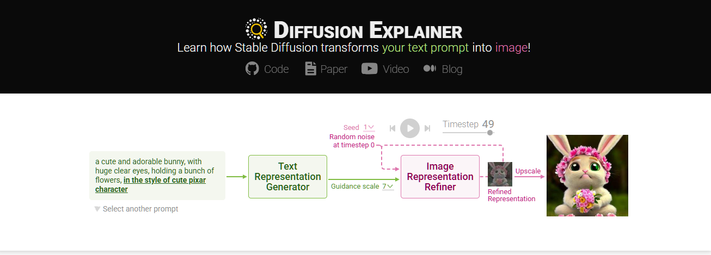

#### 實驗步驟與任務：
1. **任務 A（Prompt 向量投影觀測）：**
   - 在畫面頂端的文字提示框中輸入一組描述（例如：`"a cute dog in a spacesuit"`）。
   - 觀察架構圖中 **Text Encoder (CLIP)** 如何將提示詞切分為 Tokens，並投影為一組條件特徵向量，注入到下方的 U-Net 中。
2. **任務 B（時序去噪步進追蹤）：**
   - 拖動中央的 **Timestep 時間滑桿**，仔細觀察上方預覽畫布在不同時間步的變化：
     - **第 1 步（純雜訊）：** 畫布呈現一片隨機的灰白雜色，完全看不出任何圖形。
     - **第 15 步（語意架構形成）：** 畫面開始出現大色塊與模糊的球狀輪廓（太空頭盔與小狗體態）。
     - **第 30 步（部件細節刻畫）：** 狗的五官、太空衣縫線與背景光影變得清晰。
     - **第 50 步（高頻細節收斂）：** 雜訊完全被消除，生成一張光影與細節完美的高解析度原創圖片。

> **老師的真心話：**
> - **為什麼每次生成的圖片都不一樣？**：因為反向去噪的起點是一團「隨機高斯雜訊」。這團雜訊是由一個隨機數字——**「隨機種子（Seed）」** 決定的。只要 Seed 不同，去噪的初始起點就不同，即使使用完全相同的提示詞，生成的圖片細節也會千變萬化；反之，固定 Seed 則能確保生成結果完全復現。
> - **潛在擴散模型（Latent Diffusion Models，LDM）的工程飛躍**：早期的 Diffusion 是直接在 $512 \times 512 \times 3$ 的像素空間進行去噪，運算慢到無法普及。Stable Diffusion 的偉大突破在於**先用 VAE（變分自編碼器）把圖片壓縮進低維度的 Latent Space**，在潛在空間裡進行極速去噪，最後才解碼還原成大圖，這才讓一般消費級顯示卡也能在幾秒內生成精美畫作。

---

## 第七節：從單模態到多模態 AI 的端到端完整管線

經過前面各節的探討，我們現在可以將文字與影像在多模態生成系統中的完整生命週期串聯起來。

### 7.1 多模態 AI 端到端管線全景圖

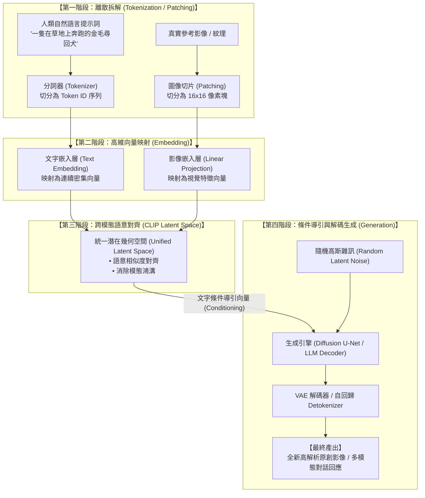

### 7.2 核心組件功能與決策矩陣

| 處理階段 | 核心任務 | 代表技術與組件 | 輸入格式 | 輸出格式 | 關鍵工程考量 |
| :--- | :--- | :--- | :--- | :--- | :--- |
| **1. 拆解** | 實體資料數位化與切分 | **BPE Tokenizer** (文字) **Patch Extraction** (影像) | 原始字串 / 完整圖片像素 | Token IDs / 圖像 Patches | 詞表大小平衡、多語言 Token 膨脹率 |
| **2. 編碼** | 將離散符號轉為稠密座標 | **Embedding Layer** **Vision Transformer** | 離散索引 ID | 高維連續向量 (如 1536 維) | 向量維度選擇、儲存空間與檢索延遲權衡 |
| **3. 對齊** | 消除跨模態鴻溝，拉近關聯 | **CLIP 對比學習** (Text/Image Dual Encoders) | 各模態獨立向量 | 統一潛在空間共用座標 | 對比學習負樣本數量、圖文標註品質 |
| **4. 生成** | 依據向量導引合成全新內容 | **Diffusion (U-Net)** **LLM (Autoregressive Decoder)** | 潛在語意座標 + 隨機種子 | 全新自然文本 / 高解析影像 | 去噪步數（Steps）、推論延遲、幻覺控制 |

---

### 7.3 課堂小組活動：設計多模態應用系統架構

請各組同學發揮架構師思維，為以下實際業務場景繪製出端到端的技術管線流程圖：

- **業務場景（智慧電商以圖找商品與文案生成系統）：**
  使用者在手機端拍攝一張路人穿戴的流行服飾照片，系統需要：
  1. 在後台數百萬件服飾資料庫中，**秒級搜尋出外觀最相似的 3 款在售商品**。
  2. 自動為這 3 款商品**撰寫一段符合小紅書風格的吸睛行銷短文**。
- **請討論並標記：**
  - 在哪一個步驟調用 CLIP 進行檢索？
  - 在哪一個步驟使用 Vector DB 進行向量比對？
  - 在哪一個步驟使用 LLM Decoder 進行文案接龍？

> **老師的真心話：**
> - **多模態不是魔法，是精密的資料流水線**：當我們把看似神奇的「AI 看圖說故事」或「文字生圖」拆解開來，每一步都是嚴謹的工程模組——Tokenizer 切割符號、Embedding 映射座標、CLIP 對齊空間、Diffusion / LLM 解碼輸出。掌握了這套管線，你就不再只是被動的使用者，而是具備系統設計能力的 AI 架構開發者。

---

## 本章小結與思考問題

### 核心觀念回顧

1. **資訊轉譯的基石（Token 与 Tokenizer）：** 電腦無法直接讀取人類語言。分詞器透過 BPE 等次詞演算法，將文本切分為兼顧語意與詞表大小的 Token，這直接決定了 LLM 的運算成本與上下文視窗利用率。
2. **語意的幾何化（Embedding）：** 獨熱編碼因維度災難與語意孤島而被淘汰；現代稠密嵌入向量將抽象符號映射為高維幾何座標，以餘弦相似度精確度量概念之間的關聯性。
3. **心智地圖的數學代數（Latent Space）：** 潛在空間使語意推理能透過向量加減法實現（如 $\text{國王} - \text{男人} + \text{女人} \approx \text{女王}$），並為跨語言與跨模態理解提供了語言無關的概念表徵基座。
4. **跨模態對齊的里程碑（CLIP）：** 透過雙塔架構與巨量對比學習，CLIP 將影像與文字強行對齊在同一個潛在空間中，賦予了 AI 零樣本分類與跨模態圖文檢索的通用能力。
5. **物理去噪的生成哲學（Diffusion）：** 擴散模型拋棄了機械式的素材拼貼，透過在 U-Net 中注入 CLIP 文字條件向量，在隨機高斯雜訊中逐步預測並扣除雜訊，實現了高畫質的原創圖像生成。

---

### 課後思考題

請同學們在進入下一章之前，深入思考以下三個問題：

1. **中文 Token 膨脹的影響：** 為什麼在部分以英文為主的開源模型中，輸入中文的收費與推論耗時顯著高於英文？這對非英語系國家的企業在落地開源大模型時會帶來哪些架構考量？
2. **多模態對齊的極限：** CLIP 能夠精準辨識「一張照片中有貓也有狗」，但當被要求分辨「貓在狗的左邊」與「狗在貓的左邊」時，CLIP 往往表現不佳。試從向量內積與詞袋特徵的角度，思考為什麼單純的全局對比學習難以捕捉細膩的空間幾何關係？
3. **生成式 AI 的版權爭議：** 既然擴散模型是從「隨機白雜訊中去噪生成」而非「複製貼上圖片資料庫」，為什麼在實務中某些生成影像依然會偶然出現知名藝術家的標誌性簽名或特定商標水印？這背後的統計學原因是什麼？
