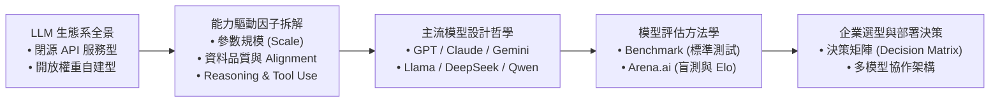
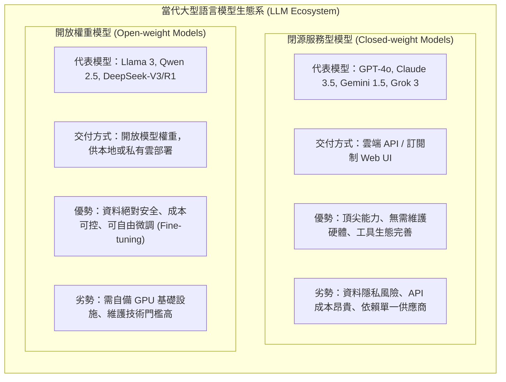
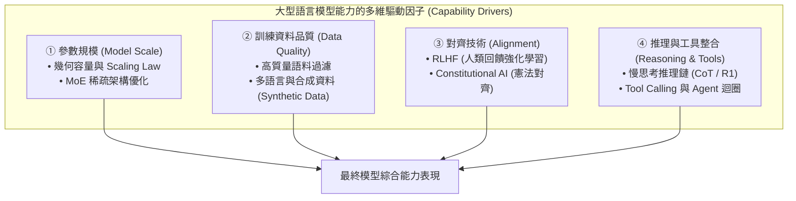
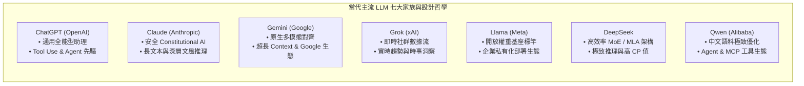
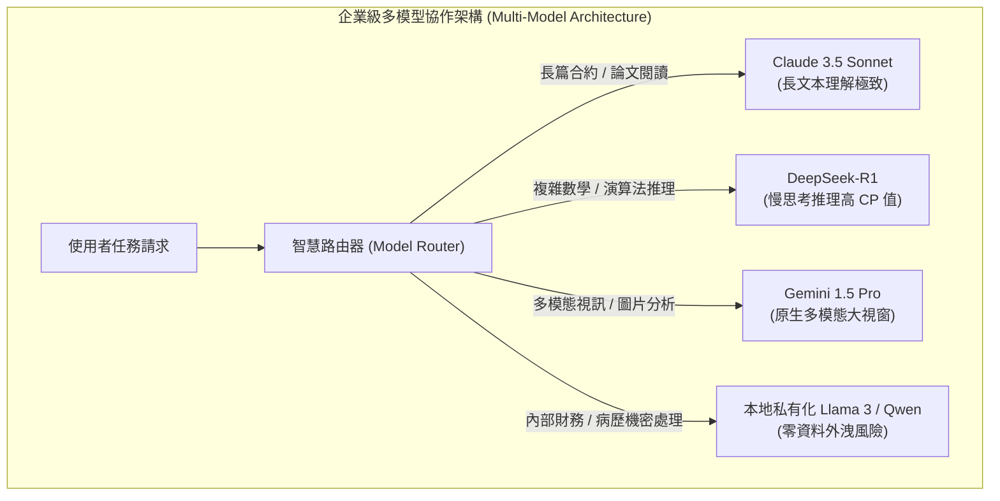
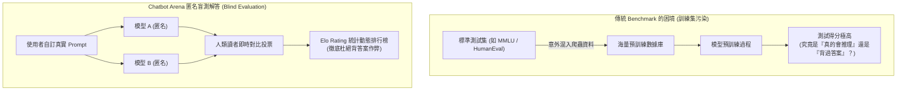
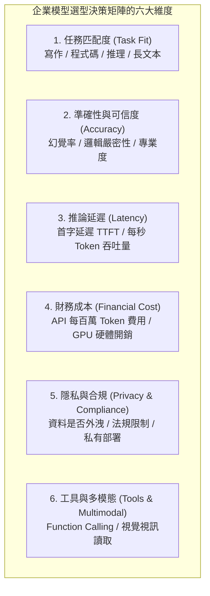
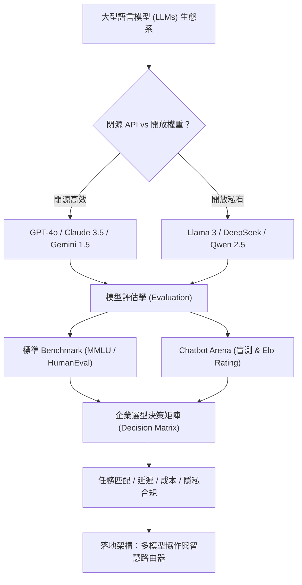

---
puppeteer:
  displayHeaderFooter: true
  headerTemplate: '
第四章：當代百模大戰與主流 LLM 評估與選型策略
'
  footerTemplate: '
第  頁 / 共  頁
'
  margin:
    top: "1.5cm"
    bottom: "1.5cm"
    left: "1.5cm"
    right: "1.5cm"
---

---

# 第四章：當代百模大戰與主流 LLM 評估與選型策略

## 課程導讀

在模組一的前三章中，我們奠定了生成式人工智慧的底層知識體系。我們梳理了人工智慧從規則導向系統（Rule-based Systems）跨越至統計機器學習與深度學習的歷史脈絡；拆解了多層感知機（MLP）、卷積神經網路（CNN）、循環神經網路（RNN）、長短期記憶模型（LSTM）與 Transformer 注意力機制如何逐步突破空間與時間維度的物理限制；並透徹理解了 Token、Embedding、潛在空間（Latent Space）與 CLIP 跨模態對齊如何將現實世界的文字與像素轉化為可計算的高維幾何向量。

然而，Transformer 機制的發明並非人工智慧演進的終點，而是**大型語言模型（Large Language Models，LLMs）百模大戰的起點**。

近年來，OpenAI（GPT 系列）、Anthropic（Claude 系列）、Google（Gemini 系列）、Meta（Llama 系列）、xAI（Grok 系列）、阿里巴巴（Qwen 系列）以及 DeepSeek 等頂尖研究機構與科技巨頭，紛紛推出各自的大型模型，將生成式 AI 帶入前所未有的技術競爭與快速迭代時代。

作為 AI 系統的開發者與決策者，我們面臨著一個核心問題：

> **當當代所有主流大模型都建立於相似的 Transformer 架構之上時，為什麼市場上依然需要如此多的模型？模型的能力真的僅由參數規模決定嗎？我們該如何超越行銷話術，以客觀、可驗證的方法評估並選擇最適模型？**

本章將帶領讀者透徹解構當代主流 LLM 生態系、剖析模型能力的深層驅動因子、建立基於人類偏好的匿名盲測評估方法（Arena.ai），並掌握企業級的模型選型決策矩陣（Decision Matrix），培養在多模態共存時代做出理性技術決策的核心能力。

---

## 第一節：LLM 百模大戰與百家爭鳴的生態系

### 1.1 百模大戰的背景：從 Transformer 骨幹到產品策略的分化

自 2022 年底 ChatGPT 問世以來，生成式人工智慧的發展速度遠超資訊科技史上的任何一次革命。在短短數年間，市場從單一模型的獨大，迅速演變成多國、多企業共同角逐的「百模大戰」。

儘管絕大多數主流 LLM 的底層演算法骨幹均源自 Transformer 的自回歸解碼器（Decoder-only）架構，但最終產出的模型在回應風格、邏輯推理能力、程式碼品質、長文本理解與多模態整合上卻展現出顯著的差異。

這種差異並非隨機產生，而是來自各家機構在**訓練資料配比、對齊演算法（Alignment）、硬體優化策略以及最終產品定位**上的深刻分化。

### 1.2 閉源服務型模型 vs 開放權重可部署模型

從商業模式、隱私控制與部署架構來看，當前主流 LLM 生態系可明確劃分為兩大陣營：

1. **閉源服務型模型（Closed-weight API Models）：**
   - **代表：** OpenAI（GPT-4o）、Anthropic（Claude 3.5 Sonnet）、Google（Gemini 1.5 Pro）、xAI（Grok 3）。
   - **模式：** 廠商封閉模型權重，僅透過雲端 API 或 Web 介面提供服務。使用者按 Token 支付費用。
   - **定位：** 代表了當前前端技術的最前沿能力，內建豐富的工具調用（Tool Calling）、網頁搜尋與多模態分析能力，適合追求極致效能且無嚴格本地私有化限制的應用。
2. **開放權重模型（Open-weight Models）：**
   - **代表：** Meta（Llama 3）、阿里巴巴（Qwen 2.5）、DeepSeek（DeepSeek-V3 / R1）。
   - **模式：** 廠商開源模型權重檔案，允許全球開發者與企業免費或遵循開源協議自由下載、本地部署與客製化微調。
   - **定位：** 賦予企業絕對的資料隱私自主權，適合金融、醫療、國防等對資料安全性有極高要求的敏感場景。

### 1.3 為什麼沒有「唯一最強」的模型？

在初學者中，最常發生的迷思是追問：「目前哪一個模型是全世界最好的？」

然而，在專業的 AI 工程領域，這個問題本身是不成立的。**每一個大型模型都有其獨特的設計哲學（Design Philosophy）與權衡（Trade-offs）**。

例如，某個模型可能為了達到極致的寫作流暢度而稍微犧牲了程式碼的嚴謹度；另一個模型可能為了極致的安全性對齊而表現得過於謹慎拘謹。模型選型本質上是**任務需求與模型特性的精準匹配**，而非單純的排行榜追逐。

---

### 1.4 課堂暖身活動：AI 使用習慣調查與選擇偏誤討論

請小組成員花費 3 分鐘完成以下調查，並在組內進行交流：

#### 統計問題：
1. 在過去一個月內，你在學習或工作中最常使用的 AI 工具是什麼？
   - $\square$ ChatGPT (OpenAI)
   - $\square$ Claude (Anthropic)
   - $\square$ Gemini (Google)
   - $\square$ Copilot (Microsoft)
   - $\square$ Grok (xAI)
   - $\square$ DeepSeek
   - $\square$ Perplexity
   - $\square$ 自建 Llama / Qwen 本地模型
2. 你選擇該工具的最主要原因是什麼？（可多選）
   - $\square$ 免費或取得成本低
   - $\square$ 介面順手、響應速度快
   - $\square$ 中文表達自然流暢
   - $\square$ 程式碼除錯能力強
   - $\square$ 長篇 PDF 讀取能力佳
   - $\square$ 單純習慣，尚未認真比較過其他模型

#### 組內討論議題：
- 我們現在使用的模型，究竟是因為它在我們的特定任務上「表現最好」，還是僅僅因為它「最容易取得（First Choice Bias）」？
- 如果今天公司要求所有資料不得離開內部局域網，你目前慣用的工具是否還能繼續使用？

> **老師的提醒：**
> - **區分「開源（Open Source）」與「開放權重（Open Weight）」**：許多媒體常將 Llama 或 DeepSeek 稱為「開源模型」。但在嚴格的軟體工程定義下，大多數廠商僅放出了預訓練好的**模型權重檔案（Model Weights）**，並未完整公開原始訓練資料集、資料清洗腳本與完整預訓練代碼。因此，學術界更精確地將其稱為「開放權重模型（Open-weight Models）」。

---

## 第二節：模型能力從何而來？解構模型性能的多維驅動因子

當我們讚嘆某個大型語言模型特別聰明時，這份「聰明」在底層究竟是由哪些工程元素所決定的？

許多人直覺地以為：「參數數量越龐大（例如 1750 億參數），模型就一定越聰明。」然而，當代深度學習研究表明，**模型能力是多個維度共同作用的綜合結果**，參數規模僅是其中之一。

### 2.1 參數規模與 Scaling Law 的邊際效應

根據 OpenAI 提出的 **規模擴展定律（Scaling Law，亦常譯為縮放定律）**，「Scaling」一詞在工程上指的是 **「規模化擴展（Scaling Up）」**。意即當我們將資源的規模——包含模型參數數量（Parameters $N$）、訓練資料集規模（Dataset Size $D$）以及總計算量（Compute $C$）——進行同比例擴大時，模型的預測誤差/損失（Loss $L$）會呈現可預測的**冪律（Power-law）下降趨勢**。

在 Kaplan 等人的研究中，當其他資源不成為瓶頸時，損失 $L$ 與各個維度之間分別存在獨立的冪律關聯：
- **參數規模冪律：** $L(N) \approx \left(\frac{N_c}{N}\right)^{\alpha_N}$
- **資料規模冪律：** $L(D) \approx \left(\frac{D_c}{D}\right)^{\alpha_D}$
- **計算量冪律：** $L(C) \approx \left(\frac{C_c}{C}\right)^{\alpha_C}$

其中 $\alpha_N, \alpha_D, \alpha_C$ 為對應維度的**冪律擴展指數（Scaling Exponents）**，代表資源擴大時性能提升的敏感度；而 $N_c, D_c, C_c$ 則為常數項。若同時考慮參數 $N$ 與資料量 $D$ 的聯合效應，亦可整合為聯合冪律公式：

\[
L(N, D) = \left(\frac{N_c}{N}\right)^{\frac{\alpha_N}{\alpha_D}} + \left(\frac{D_c}{D}\right)^{\frac{\alpha_D}{\alpha_N}}
\]

然而，隨著模型規模從百億（10B）暴增至千億（100B）乃至萬億（1T），純粹透過單一維度（如堆疊參數 $N$）來提升能力的**邊際效應開始遞減**，且訓練硬體成本呈指數級飆升（如 DeepMind 的 Chinchilla 研究進一步指出：過去業界過度擴充了參數 $N$，而忽略了同步擴充資料量 $D$）。

為了在不增加推論計算延遲的前提下擴大模型容量，當代模型普遍採用了**混合專家架構（Mixture of Experts，MoE）**（如 DeepSeek-V3、Mixtral）。MoE 架構在推論時僅激活總參數中的一小部分（如 6710 億總參數中僅激活 370 億），實現了高容量與高速推論的選型平衡。

### 2.2 訓練資料品質：Data is the New Code

在深度學習領域有一句名言：*「Garbage in, Garbage out.」*（輸入垃圾，輸出垃圾）。

近年研究（如 Phi 系列模型、Llama 3 訓練報告）證實：**高質量的訓練資料配比，其重要性遠勝於單純擴大模型參數。**
- **資料清洗與去重：** 剔除網路爬蟲資料中的垃圾廣告、重複段落與低品質自動生成文字。
- **合成資料（Synthetic Data）：** 利用頂尖大模型生成高質量的數學推導過程、高標準程式碼與邏輯對話，作為新模型的訓練教材。
- **領域均衡配比：** 精密調配程式碼、學術論文、多語言書籍與百科知識的比例，直接決定了模型在特定領域的專業度。

### 2.3 對齊技術（Alignment）：將野獸馴化為專家

未經對齊的預訓練模型（Base Model）本質上只是一個「超級文字接龍機器」。如果你輸入 *"如何製造炸彈？"*，Base Model 可能會順著文字機率接續寫出詳細步驟。

為了讓模型安全、有用且符合人類價值觀，必須經過 **對齊（Alignment）** 階段：

1. **指令微調（Supervised Fine-Tuning，SFT）：** 使用高質量的「人工撰寫問答對」對模型進行監督式微調，使其學會以「問答助理」的格式回答問題。
2. **人類回饋強化學習（Reinforcement Learning from Human Feedback，RLHF）：** 透過人類專家對模型的複數回答進行排序，訓練一個獎勵模型（Reward Model），並利用 PPO 或 DPO 演算法引導 LLM 產生更符合人類偏好的回答。
3. **憲法 AI（Constitutional AI）：** 由 Anthropic 提出，透過預先設定的一套原則（憲法），讓模型自我監督與修剪回答，大幅降低對人工標註的依賴。

### 2.4 推理突破與工具整合

當代 LLM 的另一個能力分水嶺在於**慢思考推理（Slow-thinking Reasoning）** 與 **工具調用（Tool Calling）**：
- **推理模型（如 OpenAI o1 / o3, DeepSeek-R1）：** 在輸出最終解答前，模型會在內部生成長篇的**思考鏈（Chain of Thought，CoT）**，進行自我反思、糾錯與多路嘗試，大幅提升了複雜數學、邏輯與演算法競賽的準確率。
- **工具與 Agent 生態：** 模型能否精確輸出 JSON / Function Call 格式，調用外部搜尋引擎、Python 直譯器或資料庫 API，決定了它是「只能聊天的對話框」還是「能落地的 AI Agent」。

---

### 2.5 課堂思考活動：規模 vs 品質 vs 對齊的權衡對比

請小組成員思考並討論以下案例：

- **情境：** 某研究團隊訓練了兩個模型：
  - **模型甲：** 擁有 700 億參數（70B），但在未經清洗的 Raw Common Crawl 網路廢料上記誦訓練，僅做基礎 SFT。
  - **模型乙：** 僅有 80 億參數（8B），但使用了經嚴格過濾的高品質教科書、高品質程式碼與合成資料，並經過精細的 DPO 對齊與推理鏈強化。
- **問題：**
  1. 在回答專業 Python 演算法設計與邏輯推理時，哪一個模型的表現可能更好？為什麼？
  2. 在記憶罕見歷史冷知識時，哪一個模型的表現可能更好？為什麼？

> **老師的提醒：**
> - **不要被「幻覺（Hallucination）」與「無知」搞混**：模型答錯問題有兩種原因——一種是訓練資料中根本沒有該知識（無知）；另一種是模型在自回歸取樣時高自信地編造了錯誤細節（幻覺）。對齊技術（Alignment）主要是在抑制幻覺與改善回答態度，而無法無中生有地創造模型未曾學過的知識。

---

## 第三節：主流 LLM 生態地圖：設計哲學與典型應用情境

為了幫助讀者在實務中精準選型，本節將全面解構當前全球最具代表性的七大 LLM 家族，分析其背後的**設計哲學、核心優勢與最適應用情境**。

---

### 3.1 ChatGPT（OpenAI）：通用全能型助理與 Agent 核心

- **設計哲學：** OpenAI 的核心願景是打造能夠執行通用智力勞動的 AGI。因此，GPT 系列（如 GPT-4o）並不追求單一能力的偏鋒，而是致力於在**寫作、邏輯推理、程式碼、多模態與工具調用**等全方位維持最頂尖且均衡的表現。
- **核心優勢：** 工具整合（Tool Use）與 API 生態最為成熟，具備極強的 Function Calling 與結構化 JSON 輸出能力，是建構複雜 AI Agent 迴圈（Loop）的首選基座。
- **適用情境：** 全能型辦公助理、複雜 Agent 工作流建構、高難度程式碼除錯、通用知識問答。

---

### 3.2 Claude（Anthropic）：安全性與長文本深層推理

- **設計哲學：** Anthropic 由前 OpenAI 核心研究員創立，其核心宗旨是「可控、安全與可信任（Steerable and Trustworthy）」。Claude 引入了憲法 AI（Constitutional AI），並極度重視回答的邏輯嚴密性與文風質感。
- **核心優勢：** 在**長篇 PDF 閱讀、複雜程式碼庫分析、學術論文摘要與長文寫作**上展現出極為細膩的理解力。其輸出的代碼與文章質感普遍獲得開發者與文字工作者的高度的評價。
- **適用情境：** 上百頁合約與法律文件審查、學術論文深度閱讀、複雜系統架構重構、高品質文字創作。

---

### 3.3 Gemini（Google）：原生多模態與超長上下文

- **設計哲學：** Google 從第一天起就將 Gemini 設計為「原生多模態模型（Native Multimodal）」。它並非將文字模型與視覺模型後天拼接，而是在預訓練階段就同時吞吐文字、像素、音訊與視訊幀。
- **核心優勢：** 擁有驚人的超長上下文視窗（Context Window 高達 1M 至 2M Tokens），能一次性讀入一整本書、一小時的視訊影片或整個專案程式庫；並與 Google Workspace（Docs, Gmail, Drive）深度整合。
- **適用情境：** 長視訊影片分析、超大型文檔庫即時檢索、跨媒體多模態分析、Google 生態系自動化。

---

### 3.4 Grok（xAI）：即時社群數據流與趨勢洞察

- **設計哲學：** xAI 強調「理解宇宙的真實本質」，並將 Grok 與 X（原 Twitter）社群平台進行深度綁定。
- **核心優勢：** 能即時存取 X 平台上全球發生的最新新聞、科技突破與社群討論數據串流，突破了傳統模型訓練切止日（Knowledge Cutoff）的限制。
- **適用情境：** 突發新聞分析、科技趨勢追蹤、社群輿情監測與即時時事問答。

---

### 3.5 Llama（Meta）：開放權重基座與企業私有化生態

- **設計哲學：** Meta 執行長 Mark Zuckerberg 主導的開放權重策略，旨在將 Llama 打造為 AI 時代的 Linux。Meta 開放權重供全球社群自由使用與二次開發。
- **核心優勢：** 擁有全球最龐大的開源社群生態。企業可在本地 GPU 伺服器上免費部署，並透過 LoRA 等技術進行私有領域資料微調（Fine-tuning），確保敏感資料零外洩。
- **適用情境：** 企業內部私有知識庫、金融/醫療高敏感資料處理、特定領域微調模型開發。

---

### 3.6 DeepSeek：高效率架構與極致推理 CP 值

- **設計哲學：** DeepSeek 專注於透過演算法創新（如 Multi-head Latent Attention MLA、MoE 架構與強化學習 R1 推理鏈）突破算力封鎖，以極低的訓練與推論成本達成媲美頂尖閉源模型的性能。
- **核心優勢：** 在數學競賽、邏輯推理與程式碼生成（DeepSeek-R1 / V3）上表現出驚人的實力，且提供極具競爭力的 API 價格與開放權重下載。
- **適用情境：** 高難度數學與演算法推理、大規模程式碼生成、高 CP 值 API 批次處理、企業私有化推理部署。

---

### 3.7 Qwen（阿里巴巴）：中文語境極致優化與 Agent / MCP 生態

- **設計哲學：** 阿里巴巴開發的通義千問（Qwen）系列，旨在打造兼具全球多語言能力與頂尖中文語義理解的開放權重模型。
- **核心優勢：** 在中文文化背景、成語詩詞、中國法律法規及在地化商業語境上展現出最強烈的適應力；同時對 Tool Calling 與模型上下文協定（MCP）提供了極其出色的支援。
- **適用情境：** 中文行銷文案創作、在地化客服系統、亞洲企業 Agent 工作流、開源私有化部署。

---

### 3.8 專題決策討論：單模型 vs 多模型策略（Multi-model Strategy）

在企業真實落地時，決策者經常面臨：「我們應該統一採購單一模型 API，還是建構多模型協作架構？」

- **單模型策略優勢：** 系統架構簡單、Prompt 管理統一、API 密鑰與帳單維護方便。
- **多模型策略優勢：** 能依據任務特性發揮各模型長處（如用 DeepSeek 解算術、用 Claude 寫文章、用 Llama 處理個資），同時分散單一供應商服務中斷（Downtime）或漲價的風險。

---

### 3.9 課堂小組案例研討：企業模型採購提案

某中型金融科技公司準備導入生成式 AI 系統，預算有限且包含以下五大業務場景：
1. **場景 A：** 法務部門每天需要閱讀上百頁的英文跨國投資合約並標註風險。
2. **場景 B：** 工程團隊需要協助撰寫 Python / Rust 程式碼與除錯。
3. **場景 C：** 客服部門需要處理顧客查詢，資料包含客戶帳戶餘額與交易紀錄（極度敏感）。
4. **場景 D：** 行銷部門需要撰寫繁體中文的社群貼文與新聞稿。
5. **場景 E：** 經營高層需要即時追蹤全球財經新聞與科技趨勢。

#### 請小組討論並規劃：
- 請為這五大場景分別推薦最適合的模型（說明理由）。
- 如果公司硬性規定「只能採購一套閉源 API + 部署一套開源模型」，你會如何組合？

> **老師的提醒：**
> - **切勿忽視「供應商鎖定（Vendor Lock-in）」風險**：如果你的系統程式碼中寫死了某個特定模型的專有參數或特殊 Prompt，當該模型停產或 API 調整時，轉換成本將會極高。在軟體架構設計上，務必使用 LangChain、LiteLLM 或 MCP 等抽象層來解耦模型調用。

---

## 第四節：模型評估方法學：Benchmark 與匿名盲測

當市場上存在如此多的模型時，我們該如何客觀、公正地評估它們的能力？

如果單純依賴各家廠商在發表會上展示的簡報，每個模型看起來都是「世界第一」。因此，計算機科學界發展出了兩大評估體系：**標準基準測試（Benchmark）** 與 **基於人類偏好的匿名盲測（Blind Evaluation）**。

### 4.1 標準基準測試（Benchmark）及其工程局限

Benchmark 是一組預先設計好的標準化試題集，用來定量評估模型在特定領域的得分。

#### 當代主流 Benchmark 導覽：
- **MMLU（Massive Multitask Language Understanding）：** 涵蓋人文、社科、STEM 等 57 個學科的大學等級多選擇題，評估模型的通用知識廣度。
- **GSM8K & MATH：** 國中與高中等級的數學應用題，評估模型的邏輯與數理推理能力。
- **HumanEval & MBPP：** Python 程式碼生成測試集，透過實際運行單元測試（Unit Test）來驗證模型寫出程式碼的正確率。
- **GSM8K / SWE-bench：** 評估模型在真實 GitHub Issue 上進行軟體工程除錯與修復的能力。

#### Benchmark 的致命局限：訓練集污染（Data Contamination）
近年學界發現，許多 Benchmark 的得分存在嚴重失真。原因在於**訓練集污染（Data Contamination）**——在爬取網路海量資料進行預訓練時，Benchmark 的題目與答案不小心被混入訓練資料庫中。

模型拿高分，究竟是因為它「真的具備強大的推理能力」，還是因為它「預先背過了這道題目的標準答案」？這正是傳統 Benchmark 越來越難反映真實使用體驗的原因。

---

### 4.2 Chatbot Arena：基於人類偏好的匿名盲測

為了解決傳統 Benchmark 易被作弊與脫離真實應用的困境，由 UC Berkeley LMSYS 團隊創立的 **Chatbot Arena（[arena.ai](https://arena.ai)）** 成為了當今全球 AI 界公認最具權威性的模型排行榜。

#### Arena 的核心設計哲學：
1. **匿名盲測（Blind Evaluation）：** 使用者輸入任意提示詞後，系統隨機指派兩個隱藏名稱的模型（如 Model A 與 Model B）同時生成解答。使用者在不知道模型身份的情況下，依據答案品質投票選出獲勝者（A 勝、B 勝、平手或兩者皆差）。
2. **消除品牌偏誤（Brand Bias）：** 人類普遍存在認知偏誤。若預先知道這段文字來自 GPT-4o 或 Claude 3.5，評分很容易受到品牌知名度影響。匿名機制強制使用者專注於回答內容本身的品質。
3. **真實分佈 Prompt（Wild Prompts）：** 測試題目並非死板的庫存題目，而是來自全球數百萬真實使用者在日常生活中提出的真實問題（包含寫作、除錯、翻譯、腦力激盪等）。

---

### 4.3 Elo Rating 評分系統的數學原理

Arena 如何將數百萬次的一對一匿名投票，轉化為一份精確的實力排行榜？答案是採用了起源於西洋棋與電競比賽的 **Elo Rating（等級分分數）** 數學模型。

#### Elo 評分機制：
- 每個新參賽的模型給定一個初始基礎分數（如 1000 分）。
- **預期勝率計算：** 若模型 $A$（分數 $R_A$）與模型 $B$（分數 $R_B$）對決，模型 $A$ 獲勝的期望機率 $E_A$ 為：
  \[
  E_A = \frac{1}{1 + 10^{(R_B - R_A) / 400}}
  \]
- **分數動態更新：** 對決結束後，模型 $A$ 的新分數 $R_A'$ 根據實際結果 $S_A$（勝為 1，負為 0）進行調整：
  \[
  R_A' = R_A + K \cdot (S_A - E_A)
  \]

#### Elo 機制的強大優勢：
- **擊敗強者獎勵多：** 如果一個小型開源模型意外擊敗了分數極高的 GPT-4o，該模型將獲得巨額加分；反之，若高分模型擊敗低分模型，分數增加極少。
- **動態持續演進：** 排名非一次性定格，而是隨全球使用者的每日對戰持續自我修正。

---

### 4.4 課堂實作活動：Arena.ai 匿名對戰實測與盲測體驗

請各位同學打開瀏覽器，進入 Chatbot Arena 官方平台（[arena.ai](https://arena.ai)），親自體驗模型盲測流程。

#### 實驗步驟與任務：
1. **進入盲測模式：**
   - 點選頂端選單的 **"Arena (battle)"**（匿名對戰模式）。
2. **輸入測試 Prompt（建議嘗試複雜任務）：**
   - 範例 Prompt 1（邏輯與推理）：*「請設計一個包含三名角色的推理劇本大綱，其中偵探必須透過一個看似不可能的物理現象破解密室殺人案，並列出三個關鍵線索。」*
   - 範例 Prompt 2（程式碼與演算法）：*「請用 Python 實作一個帶有 LRU 快取機制的 Decorator，並撰寫單元測試驗證其邊界條件。」*
3. **閱讀雙側回答並進行投票：**
   - 仔細比對 Model A 與 Model B 的回答品質（包含正確性、邏輯結構、文風自然度與格式排版）。
   - 點擊下方按鈕投票：**"Model A is better"**、**"Model B is better"** 或 **"Tie"**。
4. **揭曉真相與自我反思：**
   - 投票完成後，系統將公開 Model A 與 Model B 的真實模型名稱。
   - **反思：** 你剛才選出的獲勝模型是哪一個？這是否符合你平時對該模型的品牌刻板印象？

> **老師的提醒：**
> - **盲測中的「長度偏誤（Verbosity Bias）」**：心理學研究發現，人類投票者在盲測時，往往傾向於投票給「篇幅較長、排版精美、點列豐富」的回答，即使該回答包含冗餘廢話。這被稱為長度偏誤。現代高階評測系統已開始引入「長度控制（Length-controlled Elo）」來修正此偏差。

---

## 第五節：企業級模型選型決策矩陣（Decision Matrix）

理解了模型生態、能力驅動因子與 Arena 評估方法後，我們最終要落地到工程實務的最核心問題：**如何在真實的商業專案中，系統化地評估並選擇最適模型？**

在企業環境中，模型選型絕非單純「看誰 Elo 分數最高」，而是一個涉及**多準則決策分析（Multi-Criteria Decision Analysis，MCDA）** 的綜合過程。

### 5.1 決策矩陣（Decision Matrix）的六大核心維度

一個成熟的 AI 架構師在進行模型選型時，必須同時審視以下六大關鍵維度：

1. **任務匹配度（Task Fit）：** 模型在目標領域（如 Python 程式設計、法律合約摘要或中文行銷文案）的專精程度。
2. **準確性與可信度（Accuracy）：** 模型的邏輯嚴密性、幻覺發生率以及對複雜指令的遵從度（Instruction Following）。
3. **推論延遲（Latency）：** 包含首字輸出時間（Time-to-First-Token，TTFT）與每秒生成 Token 數（Tokens per Second）。即時客服需要極低延遲，而離線批次分析則對延遲不敏感。
4. **財務成本（Financial Cost）：** 包含 API 呼叫費用（Input / Output Tokens 價格）或本地部署所需的 GPU 伺服器採購與營運電費（TCO）。
5. **隱私與合規性（Data Privacy）：** 客戶資料是否會被供應商用於模型再訓練？是否符合 GDPR、HIPAA 或在地金融資安法規？
6. **工具與多模態能力（Tools & Multimodal）：** 是否支援精確的 JSON Mode / Function Calling？是否能直接吞吐 PDF 圖片或視訊影片？

---

### 5.2 結構化決策矩陣評分表

以下為企業選型時常用的權重評分矩陣範例（分數範圍 1-5 分，5 分最佳）：

| 評估維度 | 衡量指標 / 權重 | ChatGPT (GPT-4o) | Claude (3.5 Sonnet) | Gemini (1.5 Pro) | Llama 3 (70B 本地) | DeepSeek (R1 / V3) |
| :--- | :--- | :---: | :---: | :---: | :---: | :---: |
| **通用邏輯與推理** | 邏輯嚴密性、除錯 (20%) | 5 | 5 | 4 | 4 | **5** |
| **長文本與文件** | 大 Context 理解品質 (15%) | 4 | **5** | **5** | 3 | 4 |
| **中文寫作自然度** | 語料在地化、文風 (15%) | 4 | **5** | 4 | 3 | 4 |
| **推論延遲 (TTFT)** | 回應速度、流暢度 (15%) | **5** | 4 | 4 | **5** (依硬體) | 3 (推理鏈慢) |
| **財務成本 (Cost)** | API 價格 / 部署成本 (15%) | 3 | 3 | 4 | 4 | **5** |
| **隱私與私有部署** | 資料安全、自主控制 (20%) | 2 | 2 | 2 | **5** (絕對安全) | 4 (可私有化) |
| **綜合加權得分** | **100% 權重總分** | **4.10** | **4.15** | **3.95** | **4.00** | **4.25** |

*(註：以上評分會隨模型版本更新而動態變化，實務中應依企業專案的真實權重進行試算。)*

---

### 5.3 課堂小組活動：企業 AI 選型提案實戰

請各組同學扮演 AI 諮詢顧問，為以下三家不同產業的客戶設計模型選型方案：

1. **客戶 A（跨國律師事務所）：**
   - **需求：** 需要一個能深度分析數百頁英文訴訟合約、生成嚴謹法律意見書的系統。
   - **限制：** 預算充足，對文章品質與邏輯要求極高。
   - **提案推薦模型與理由：** ____________________________________
2. **客戶 B（區域型醫院病歷管理科）：**
   - **需求：** 需要一個自動摘要醫師看診筆記、病歷與檢查報告的助手。
   - **限制：** 法規硬性規定病患個資絕對不可傳送至任何外部雲端 API。
   - **提案推薦模型與理由：** ____________________________________
3. **客戶 C（新創電商平台開發團隊）：**
   - **需求：** 需要建立一個能自動根據商品圖片生成行銷文案、並回答顧客查詢的 AI 客服系統。
   - **限制：** 資金有限，要求極高的回應速度與性價比（CP 值）。
   - **提案推薦模型與理由：** ____________________________________

> **老師的真心話：**
> - **模型選型是「動態過程」，非一次性決策**：在當今技術飛速迭代的時代，6 個月前的最佳選擇到了今天可能已經落後。優秀的工程架構會在系統中設計「模型路由（Model Router）」與標準 API 抽象介面，隨時準備在有更高 CP 值或更強能力的新模型問世時，進行無痛切換。

---

## 本章小結與思考問題

### 核心觀念回顧

1. **百模大戰的本質：** 雖然主流大模型皆奠基於 Transformer 架構，但不同的訓練資料品質、對齊演算法（RLHF / Constitutional AI）、產品定位與開放權重策略，造就了多元且互補的 LLM 生態系。
2. **能力驅動因子的多維性：** 模型性能不僅由參數規模（Scale）決定，訓練資料的高純度清洗、合成資料的引用、慢思考推理鏈（CoT）與工具調用（Tool Calling）能力，均是決定模型良莠的關鍵靈魂。
3. **模型評估的科學性（Arena.ai）：** 傳統標準測試（Benchmark）面臨嚴重的訓練集污染問題；Chatbot Arena 透過匿名盲測（Blind Evaluation）與 Elo Rating 數學模型，提供了反映真實人類偏好的動態客觀評價。
4. **理性選型哲學（Decision Matrix）：** 排除「哪一個模型最好」的單維迷思，採用多準則決策矩陣，從任務匹配度、準確性、延遲、成本、隱私部署與多模態等維度，為特定商業情境規劃最佳模型策略。

---

### 概念整合架構圖

---

### 課後思考題

請同學們在進入下一章之前，深入思考以下三個問題：

1. **開放權重與閉源 API 的商業博弈：** 既然 Meta 與 DeepSeek 免費提供了性能媲美 GPT-4 的開放權重模型，為什麼許多大型企業依然願意每年支付數百萬美元採購 OpenAI 或 Anthropic 的閉源 API 服務？其背後考量的隱性成本有哪些？
2. **盲測機制的潛在偏誤：** Chatbot Arena 的匿名盲測大幅減少了品牌偏誤，但為什麼它依然無法完全代表「專業領域」的表現？（提示：思考普通大眾投票者是否有能力評估高難度的醫學診斷或複雜的 C++ 記憶體指標除錯？）
3. **推理模型對 Scaling Law 的重塑造：** 以 OpenAI o1 / o3 與 DeepSeek-R1 為代表的「慢思考推理模型」，將算力擴展的重心從「預訓練階段（Pre-training Scaling）」轉移到了「推論思考階段（Inference-time Scaling）」。這對未來的 AI 硬體架構與 API 計費模式會帶來什麼樣的深刻影響？
