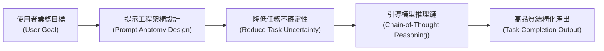
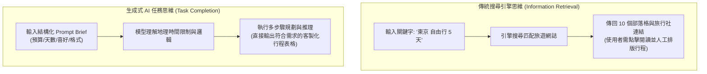
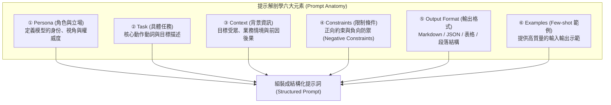
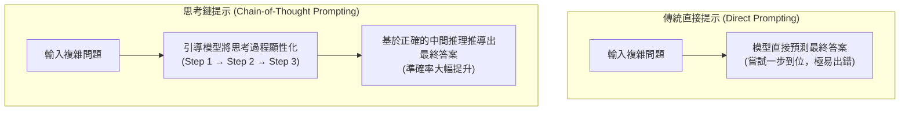
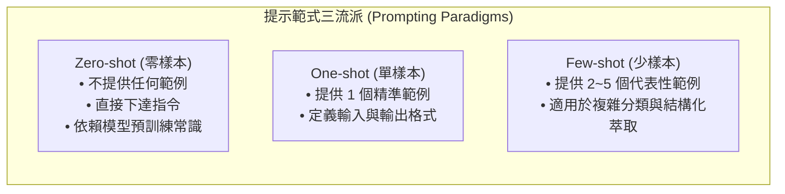
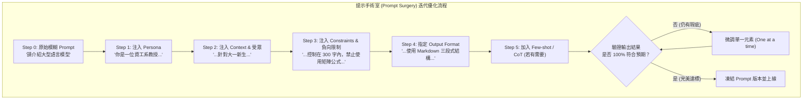
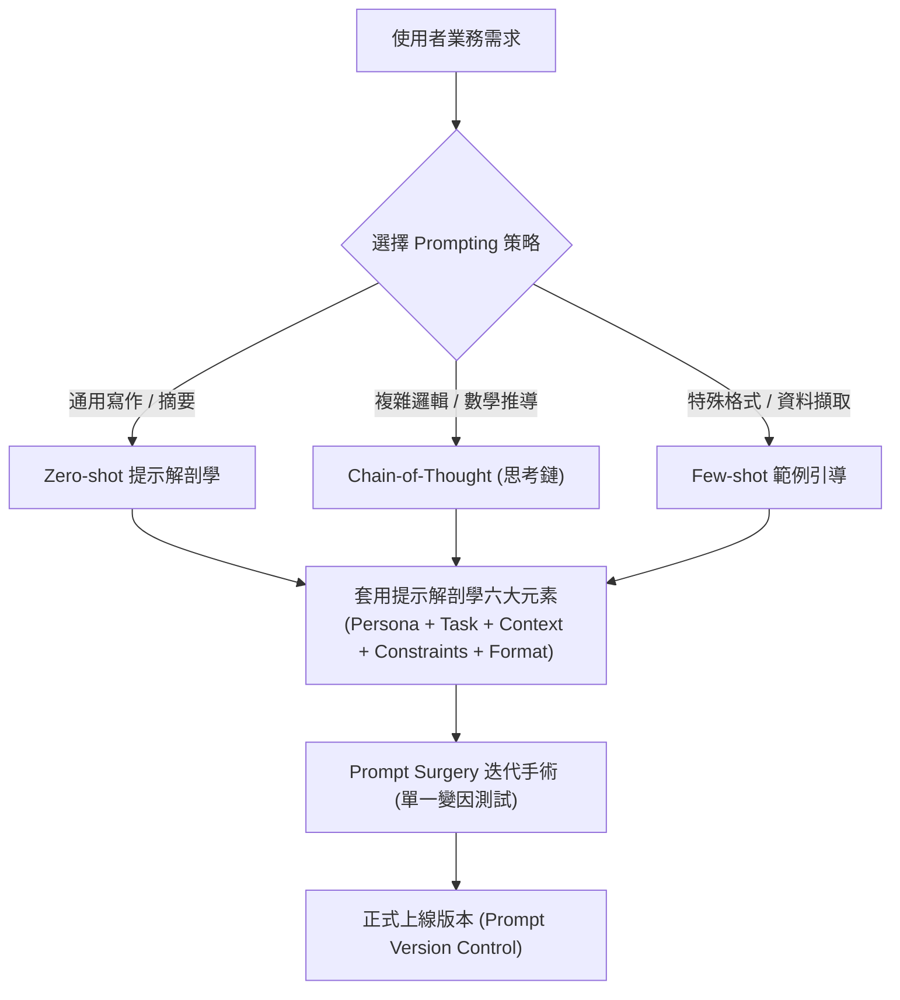

---
puppeteer:
  displayHeaderFooter: true
  headerTemplate: '<div style="font-size: 10px; margin: 0 auto;">第六章：提示工程：設計 AI 的思考流程與推理架構</div>'
  footerTemplate: '<div style="font-size: 10px; margin: 0 auto;">第 <span class="pageNumber"></span> 頁 / 共 <span class="totalPages"></span> 頁</div>'
  margin:
    top: "1.5cm"
    bottom: "1.5cm"
    left: "1.5cm"
    right: "1.5cm"
---
<style>
  h2 {
    page-break-before: always;
  }
</style>
---

# 第六章：提示工程：設計 AI 的思考流程與推理架構

## 課程導讀

在上一章中，我們深入剖析了大型語言模型（LLMs）的解碼與生成機制（Decoding & Generation Mechanism），理解了自回歸生成（Autoregressive Generation）與 Next-Token Prediction 的數學本質，並掌握了透過 Temperature、Top-k、Top-p（核取樣）與 System Prompt 精確控制模型輸出機率分佈的方法。

然而，掌握了硬體與解碼參數之後，我們面臨著更核心的軟體設計問題：**我們該如何撰寫提示詞（Prompt），才能引導神經網路展現出最高品質的邏輯推理與內容生成？**

大眾常常誤以為「提示工程（Prompt Engineering）」只是一門修飾文字、加入形容詞，或是套用網路上各種神秘「Prompt 魔法咒語範本」的技巧。事實上，在專業的 AI 工程領域，提示工程並非文字修飾，而是：

> **提示工程＝設計 AI 如何理解問題、組織上下文與完成推理任務的架構過程（Prompt Engineering = Designing AI Reasoning）。**

提示詞（Prompt）不僅僅是輸入給模型的字串，更是引導模型進行多步驟邏輯推理（Reasoning）的起點。相同的模型在面對結構不同的 Prompt 時，其輸出的品質與準確率可能產生天壤之別。

本章將帶領讀者透徹拆解 **Prompt 的六大核心元素（提示解剖學 Prompt Anatomy）**、引導模型慢思考的 **思考鏈（Chain-of-Thought，CoT）** 策略、**上下文學習（In-Context Learning）** 範式，並透過 **Prompt Surgery（提示手術室）** 迭代優化工作坊，培養讀者建構企業級提示工程架構的核心能力。



---

## 第一節：提示工程的本質：從搜尋關鍵字到任務需求說明書

### 1.1 資訊檢索 vs 任務完成

要學好提示工程，第一個必須調整的心態是：**徹底區分「搜尋引擎（Search Engine）」與「生成式 AI（Generative AI）」在互動邏輯上的根本差異。**

- **搜尋引擎的邏輯（Information Retrieval）：** 使用者的目標是「尋找預先存在的資料」。我們輸入短小的關鍵字（如 `東京 自由行 5 天 推薦`），搜尋引擎傳回一整頁旅遊部落格與旅行社連結，由人類自行點擊多個網址閱讀、比對並整理出自己的行程表。
- **生成式 AI 的邏輯（Task Completion）：** 使用者的目標是「委託模型完成一項具體任務」。模型不會直接給你網址，而是根據 Prompt 進行地理、時間與限制條件的綜合推理，即時合成一份專屬的客製化行程表。

| 比較維度 | 傳統搜尋引擎 (Search Engine) | 生成式人工智慧 (Generative AI) |
| :--- | :--- | :--- |
| **互動目標** | 資訊檢索（Information Retrieval） | **任務完成（Task Completion）** |
| **輸入形式** | 孤立關鍵字 (如 `東京 自由行 5 天`) | **結構化任務說明書 (Prompt Brief)** |
| **系統輸出** | 預先存在的網站連結與旅遊網誌 | 即時推理合成的專屬行程表 Markdown 表格 |
| **互動角色** | 使用者主動搜尋、點擊過濾與人工整理 | **使用者下達限制條件，模型執行規劃與排版** |



### 1.2 降低任務不確定性（Reduce Uncertainty）

大型語言模型擁有浩瀚的知識庫與強大的推理能力，但它並不具備讀心術。當使用者輸入一個過於簡陋的 Prompt（例如：*"請介紹人工智慧"*），模型面臨著巨大的**任務不確定性（Task Uncertainty）**。

面對簡陋指令，模型會面臨無數種可能的衍生方向：
- 是要寫給國小生看，還是給資工所研究生看？
- 是要著重於歷史演進，還是演算法數學公式？
- 篇幅是要 100 字摘要，還是 5000 字長文？
- 格式要用 Markdown 表格，還是點列清單？

當 Prompt 未能提供足夠的限制時，模型只能透過自回歸隨機採樣「替使用者做決定」，產出的結果往往偏離使用者的真實意圖。

因此，**提示工程的核心目的，就是透過提供精確的上下文與約束，最大限度地降低模型對任務的不確定性，精準指引神經網路的注意力焦點。**

### 1.3 優秀 Prompt 的五大核心特徵

一個高品質的 Prompt 絕非追求「最長的篇幅」或「最艱深的詞彙」，而是具備以下五大工程特徵：

1. **任務明確（Clear Task）：** 使用精確的動作動詞描述主要任務（如「比較」、「摘要」、「撰寫」、「重構」）。
2. **背景充分（Sufficient Context）：** 提供完成任務所需的目標讀者、業務情境與背景資料。
3. **限制清楚（Explicit Constraints）：** 明確規定長度、語言、文風與禁止事項（Negative Constraints）。
4. **輸出具體（Specific Output）：** 指定產出的結構格式（如 JSON、Markdown 表格、標準三段式）。
5. **可重複使用（Reusable）：** 架構設計模組化，方便套用至同類型的不同資料集中。

---

### 1.4 課堂探索小活動：搜尋引擎 vs 生成式 AI 指令對比

請小組成員討論並將以下原始的「搜尋關鍵字」，改寫為適合 LLM 的「任務完成型 Prompt」：

- **原始搜尋關鍵字：** `東京 自由行 5 天 推薦`
- **請思考：** 為了讓 AI 成為你的個人專屬旅遊顧問，你需要補足哪些資訊？
- **小組改寫練習：** 嘗試補齊「同行者成員（如：帶長輩/帶幼童）」、「喜好偏好（如：歷史古蹟/動漫購物/美食極致）」、「每日預算限制」與「指定輸出格式（如：包含每日交通路線的 Markdown 表格）」。

> **老師的提醒：**
> - **Prompt 是一種溝通介面，而不是命令**：把 Prompt 想像成你正在向一位剛剛報到的高智商實習生交代工作。如果你只說「幫我寫個報告」，實習生一定會一頭霧水；如果你提供了清晰的目的、範本與限制，實習生就能交出令人驚豔的成果。

---

## 第二節：提示解剖學：建構完整 Prompt 的六大核心元素

為了讓提示詞的撰寫制度化與模組化，計算機科學界歸納出了一套標準的架構方法——**提示解剖學（Prompt Anatomy）**。

一個完備的 Prompt 由六大核心元素組成。雖然簡單任務不一定需要同時使用六大元素，但在面對複雜的企業級任務時，元素越完整，模型的輸出品質與穩定度就越高。



---

### 2.1 六大元素深度拆解

#### 1. Persona（角色與立場）
- **功能：** 指定模型應採取的專業身份、對話視角與思考立場。
- **範例：**
  - *"你是一位擁有 10 年資安聯防經驗的資深 Penetration Tester。"*
  - *"你是一位親切且擅長用生活化比喻的國小自然老師。"*
- **原理：** Persona 並不是改變模型底層的知識庫，而是透過自注意力機制提升特定領域詞彙與話語體系的得分權重（Logits）。

#### 2. Task（具體任務）
- **功能：** 用明確的動作動詞描述模型需要執行的核心運算。
- **好動詞範例：** 「對比...的異同」、「將下列文字摘要為 3 個重點」、「重構以下代碼以符合 PEP 8 規範」。
- **避免模糊動詞：** 「幫我看一看」、「處理一下這個」、「隨便寫點東西」。

#### 3. Context（背景與情境）
- **功能：** 補充任務背後的業務情境、目標受眾（Target Audience）與動機。
- **範例：** *"這份簡報是為了向完全不懂技術的企業高層（C-Level）爭取明年的資安預算，因此內容必須強調商業風險與投資報酬率（ROI）。"*

#### 4. Constraints（限制條件與 Negative Constraints）
- **正向約束（Positive Constraints）：** 指定字數範圍、語言（繁體中文）、專業程度、Markdown 標題層級。
- **負向約束（Negative Constraints）：** 明確規定「禁止」事項，徹底封鎖常見錯誤：
  - *"禁止編造未出現在資料中的數據（Zero Hallucination）。"*
  - *"除了 Markdown 格式的回答外，切勿輸出任何客套寒暄（如 '好的，以下是您的答案'）。"*
  - *"禁止使用任何表情符號（Emoji）。"*

#### 5. Output Format（輸出格式）
- **功能：** 強制規定回答的結構外型，確保輸出能直接被人類閱讀或被後端程式解析。
- **範例：**
  - 指定 Markdown 結構：`## 主要觀點 \n ## 關鍵數據 \n ## 行動建議`
  - 指定程式解析格式：`請嚴格輸出符合 RFC 8259 規範的 JSON 物件，不要包裹任何 ```json 標籤`

#### 6. Examples（Few-shot 範例）
- **功能：** 提供 1 到 3 組真實的「輸入 $\to$ 輸出」範例，透過上下文學習（In-Context Learning）引導模型模仿特定的格式或風格。

---

### 2.2 從模糊單句到結構化 Prompt 的演進對比

#### ❌ 模糊單句版本（Version A）：
> *「請介紹一下 Transformer 模型。」*

#### ✅ 結構化提示解剖學版本（Version B）：

```text
[Persona]
你是一位任教於資訊科技系的資深教授，擅長將複雜的深度學習演算法講解得淺顯易懂。

[Task]
請向剛接觸 AI 的大一新生，介紹 Transformer 模型的核心原理與技術突破。

[Context]
學生已經學過基礎的 Python 程式設計，但尚未修過高階線性代數。這份介紹將作為下一週「大語言模型導論」的預習教材。

[Constraints]
1. 請全程使用繁體中文。
2. 全文字數請嚴格控制在 400 至 500 字之間。
3. 必須包含一個生活化的比喻（例如：會議室中的注意力機制）。
4. 負向限制：切勿使用複雜的矩陣導數數學公式，切勿包含任何寒暄開場白。

[Output Format]
請依照以下 Markdown 結構輸出：
# 一、什麼是 Transformer？
# 二、核心魔法：自注意力機制 (Self-Attention)
# 三、為什麼它改變了世界？

```

---

### 2.3 課堂實作活動：Prompt 結構化改寫（Prompt Completion）

請小組成員挑選以下其中一個原始單句，利用「提示解剖學六大元素」，將其重構成一份結構完整的 Prompt：

- **選題 1：** *「幫我寫一份減肥飲食計畫。」*
- **選題 2：** *「請幫我修改這封給客戶的致歉 Email。」*
- **選題 3：** *「解釋什麼是區塊鏈。」*

#### 小組演練步驟：
1. 為該任務補齊 Persona、Task、Context、Constraints、Output Format。
2. 將重構後的 Prompt 輸入 Google AI Studio，比對 Version A 與 Version B 的回答品質差異。

> **老師的提醒：**
> - **Negative Constraints（負向限制）非常強大**：在開發自動化系統時，LLM 很喜歡在輸出 JSON 之前加上 *"Here is your JSON output:"* 等親切廢話，這會導致後端 `json.loads()` 直接報錯崩潰。在 Constraints 中明確加入 *"DO NOT include any introductory or concluding text"* 是極為重要的工程習慣。

---

## 第三節：引導模型慢思考：思考鏈（Chain-of-Thought，CoT）提示策略

對於簡單的知識問答或文本摘要，提供完整的 Prompt 結構就足夠了。然而，當我們要求 LLM 解決**複雜的數學應用題、邏輯推理、多步驟決策或程式碼偵錯**時，模型往往會因為直覺式的 Next-Token 預測而給出錯誤答案。

為了解決這個問題，Google 研究團隊提出了劃時代的 **思考鏈（Chain-of-Thought，CoT）提示策略**。



### 3.1 CoT 的核心哲學：將內部推理顯性化（Explicit Reasoning）

人類在心算複雜題目（如 $37 \times 48$）時，不會直接在腦海中吐出答案 $1776$，而是會在草稿紙上寫下中間步驟：
1. $37 \times 40 = 1480$
2. $37 \times 8 = 296$
3. $1480 + 296 = 1776$

Transformer 的自回歸生成亦然。如果我們強迫模型在第一步就輸出最終數字，神經網路僅能依靠有限的注意力層數進行隱性計算；但如果**引導模型將中間的推理步驟一步步寫成文字（Tokens）**，每一個寫出來的中間步驟都會成為後續推導的上下文條件，從而指數級降低了最終答案出錯的機率。

### 3.2 零樣本思考鏈（Zero-shot CoT）

Kojima 等人發現了一個令人震驚的現象：甚至不需要提供任何範例，只需在 Prompt 的末尾加上一句簡單的**「觸發詞（Magic Trigger）」**，模型的推理能力就會顯著提升！

#### 最經典的 Zero-shot CoT 觸發詞：
> **"Let's think step by step."（讓我們一步一步地思考。）**

或者中文的：
> **"請一步一步說明你的推理過程，最後再給出結論。"**

#### 案例比對：

#### ❌ 傳統直接詢問：
> **問：** 小明有 12 顆蘋果，給了小華 4 顆，小紅又給了小明當前蘋果數量的一半，最後小明吃了 2 顆，現在小明有幾顆蘋果？
> **模型直覺回答：** 10 顆。（容易算錯）

#### ✅ Zero-shot CoT 詢問：
> **問：** 小明有 12 顆蘋果，給了小華 4 顆，小紅又給了小明當前蘋果數量的一半，最後小明吃了 2 顆，現在小明有幾顆蘋果？**請一步一步說明計算過程。**

> **模型 CoT 回答：**
> 1. 小明原本有 12 顆蘋果。
> 2. 給了小華 4 顆後，剩下 $12 - 4 = 8$ 顆。
> 3. 小紅給了小明當前數量（8 顆）的一半，即 $8 \div 2 = 4$ 顆。此時小明有 $8 + 4 = 12$ 顆。
> 4. 最後小明吃了 2 顆，剩餘 $12 - 2 = 10$ 顆。
> 5. **答案：10 顆。**

---

### 3.3 少樣本思考鏈（Few-shot CoT）

對於更加艱深的邏輯題或特定領域的分析，我們可以透過 **Few-shot CoT**，在 Prompt 中手動提供 1 到 2 個「包含完整推理步驟」的示範範例（Exemplars）：

```text
[範例]
問：工廠有 3 條生產線，甲線每小時生產 50 個零件，乙線效率是甲線的 1.5 倍，丙線比乙線少生產 10 個。三條生產線同時運作 4 小時，總共生產幾個零件？
答：
- 步驟 1：甲線每小時生產 50 個。
- 步驟 2：乙線每小時生產 50 × 1.5 = 75 個。
- 步驟 3：丙線每小時生產 75 - 10 = 65 個。
- 步驟 4：三條線每小時總產量為 50 + 75 + 65 = 190 個。
- 步驟 5：運作 4 小時總產量為 190 × 4 = 760 個。
最終答案：760 個。

[正式題目]
問：某農場有 50 只雞與兔子，共有 140 隻腳。請問雞與兔子各有幾隻？請模仿範例一步一步推理。

```

---

### 3.4 思考鏈的演進：從外顯提示到原生推理模型（Reasoning-First Models）

隨著大語言模型架構的演進，思考鏈的應用形態經歷了根本性的範式轉移：

1. **早期階段（外顯提示 CoT）：** 在早期對話模型中，模型預設傾向於快速輸出答案。開發者必須透過手動撰寫 `"Let's think step by step"` 或 Few-shot 範例，強迫模型在文字序列中顯性化其思考步驟。
2. **當代成熟階段（原生推理模型，Reasoning-First Models）：**
   - 當前主流對話模型（如 OpenAI o1 / o3、DeepSeek-R1 / V3、Gemini 3.6 / 3.7 Flash Thinking、Claude 3.7 Think）已將 Chain-of-Thought **直接內化為神經網路的核心運算架構與強化學習（RL）對齊機制**。
   - **原生 Reasoning Tokens（推理詞元）：** 當模型接到複雜任務時，會在輸出最終回答前，自動在背景的獨立隱藏區域（Reasoning Buffer）生成數千字的思考鏈進行多假設驗證與自我糾錯。
3. **推理模型時代下 Prompt Engineering 的轉型：**
   - **冗餘提示詞的淘汰：** 對於原生推理模型，手動輸入 `"Let's think step by step"` 已變得完全冗餘，甚至可能干擾模型內建的強化學習思考路徑。
   - **提示工程的新重點：** 提示工程的重心從「如何強迫模型思考」轉變為**「如何設定推理邊界（Reasoning Scope）、驗證條件、評估標準與分配推理預算（Reasoning Effort / Budget）」**。
   - **選型分流：** 在不需要深思的日常寫作或資料轉譯任務中，使用極速模型（Fast Models）；而在複雜數學、程式碼除錯或法規分析中，調用原生推理模型並專注於問題條件與限制的精確定義。

---

### 3.5 課堂實驗活動：原生 Thinking Level 控制 vs 邏輯推理對決

請各位同學開啟 Google AI Studio 控制台，體驗原生推理模型中 **Thinking Level（思考等級控制 / Reasoning Budget）** 參數設定對複雜邏輯問題的直接影響。

#### 實驗環境配置：
- **Model：** 選擇最新 `Gemini 3.6 Flash` 或 `Gemini 3.7 Flash`。
- **固定 Prompt（保持提示詞文字完全相同，不加任何額外引導）：**
  > *「一個老爺爺有三個兒子，每個兒子又有一個妹妹。請問老爺爺一共有幾個孩子？請直接給出數字。」*

#### 實驗步驟與對比：
1. **對照組（Thinking Level = Off / Low）：**
   - 在右側 Configuration Panel 控制面板中，將 **Thinking Level** 設為 `Off`（關閉原生思考鏈）或最低等級。
   - 點擊 Run，觀察模型在沒有進入深度思考運算時，是否容易掉入直覺性陷阱，誤回答 *"6 個孩子"*（$3 + 3 = 6$）。
2. **實驗組（Thinking Level = High）：**
   - 保持提示詞文字完全不變，將右側 **Thinking Level** 調整為 `High`（高強度慢思考推理）。
   - 點擊 Run，點開回答上方的 **"Thought" / "Reasoning Process"** 展開區塊，觀察模型如何在背景 Reasoning Buffer 中進行成員關係鏈的推導（分析出「三個兒子共用同一個妹妹」），並最終在主回答中輸出正確答案 *"4 個孩子"*（3 個兒子 + 1 個女兒）。

> **老師的提醒：**
> - **從「手動寫提示詞」到「控制面板原生參數」**：在早期傳統對話模型時代，開發者需要手動在 Prompt 末尾加上 *"Let's think step by step"* 來刺激模型進行文字層面的步驟運算；而在當代 API 與 Google AI Studio 中，透過控制面板的 **Thinking Level** 參數（或 API 中的 `thinking_budget`），能直接調控神經網路內建的推理神經迴路深度與 Token 算力預算，這正是當代提示工程師必備的控制能力！

---

## 第四節：示範的力量：Zero-shot 與 Few-shot 提示範式

大型語言模型具備極強的 **上下文學習能力（In-Context Learning，ICL）**。這意味著我們不需要重新訓練或微調（Fine-tuning）神經網路的權重，只需在 Prompt 中提供幾個優質的示範範例，模型就能在推論階段即時學會全新的任務格式。

依據提供範例數量的不同，提示工程劃分為三大範式：



### 4.1 提示範式三流派對比

1. **Zero-shot Prompting（零樣本提示）：**
   - 不給任何範例，直接要求模型完成任務。
   - **優點：** 最省 Token 費用，撰寫最快速。
   - **適用：** 當代強大模型（如 GPT-4o, Claude 3.5）處理通用寫作、翻譯或常見問答。
2. **One-shot Prompting（單樣本提示）：**
   - 提供 1 個完整的「輸入 $\to$ 輸出」範例。
   - **適用：** 當你需要模型嚴格遵循某種自訂的標點符號排版或特定格式時。
3. **Few-shot Prompting（少樣本提示）：**
   - 提供 2 到 5 個涵蓋不同邊界條件的代表性範例。
   - **優點：** 格式遵循率逼近 100%，大幅降低離題率。
   - **適用：** 特殊文本情緒分類、複雜 JSON 資料擷取、領域專屬專有名詞轉譯。

---

### 4.2 Few-shot 範例設計的三大黃金原則

如果在 Few-shot 中隨便提供劣質範例，反而會把模型的邏輯帶偏。撰寫優質 Few-shot 範例時應遵循以下原則：

1. **代表性與覆蓋度（Representativeness）：** 範例應涵蓋不同的輸入情況。例如做情感分析時，範例必須同時包含正評、負評與中性轉折句，切勿全部提供正評（避免引發 Label Bias）。
2. **格式嚴格一致（Format Consistency）：** 所有範例的標籤、分隔符號（如 `Input:` / `Output:`）與縮排必須保持完全一致。
3. **標記真實性（Label Quality）：** 確保範例中的答案 100% 正確，模型會極度敏銳地捕捉範例中的規律。

#### 實務範例：利用 Few-shot 進行結構化實體萃取（NER）

```text
請從輸入的客戶陳情郵件中，萃取 [客戶姓名]、[問題組件] 與 [緊急程度]。

[範例 1]
輸入：我是陳大明，今天購買的 X1 螢幕完全無法開機，明天開會要用，請立刻處理！
輸出：{"name": "陳大明", "component": "X1 螢幕", "urgency": "高"}

[範例 2]
輸入：你好，林小姐這邊，上週訂的無線滑鼠包裝有點壓到，但功能正常。
輸出：{"name": "林小姐", "component": "無線滑鼠", "urgency": "低"}

[正式測試]
輸入：張先生反映昨天收到的 K9 鍵盤 Shift 鍵卡住，希望下週前能更換。
輸出：

```

---

### 4.3 課堂實作活動：Few-shot 結構化資料擷取

請各位同學在 Google AI Studio 中，測試上述 Few-shot 實體萃取範例：
1. 觀察模型是否能精確輸出 JSON 格式 `{"name": "張先生", "component": "K9 鍵盤", "urgency": "中"}`。
2. 嘗試將所有範例刪除（改為 Zero-shot），觀察輸出格式是否開始出現波動或帶有額外的說明廢話。

> **老師的提醒：**
> - **範例數量並非越多越好**：通常 2 到 5 個範例就能達到邊際效益的最大化。提供超過 10 個範例不僅會急劇增加每輪 API 的 Token 費用，還可能擠爆模型的 Context Window，甚至讓模型過度關注範例細節而忽略了原任務指令。

---

## 第五節：提示工程的迭代優化：Prompt Surgery 與維護

在軟體工程中，沒有任何複雜程式碼是一次寫成且零 Bug 的。提示工程亦然——**真正的 Prompt Engineering 是一個持續測試（Test）、觀察（Observe）、手術修剪（Refine）的迭代過程。**



### 5.1 提示手術室（Prompt Surgery）原則：一次只改一個變因

當模型的回答不符合預期時，初學者常犯的錯誤是：**一次性重新撰寫整個 Prompt**。結果往往是舊的問題解決了，卻引發了全新的錯誤，且無法判斷究竟是哪一句話發揮了作用。

專業提示工程應遵循 **Prompt Surgery（提示手術室）** 原則：
- **單一變因原則（One Variable at a Time）：** 每輪迭代中，**只增加、修改或刪除一個 Prompt 元素**（例如僅修改 Persona，或僅增加一條 Negative Constraint）。
- **實測對比：** 運行模型，對比前後的輸出差異，確定該修改帶來的是正向還是負向影響。

---

### 5.2 課堂工作坊：Prompt Surgery 手術室實務演練

請各小組在 Google AI Studio 控制台，進行 Prompt 漸進式手術演練。

#### 手術演練步驟：

- **Step 0（基線 Prompt）：**
  > *「請介紹大型語言模型。」*
  - 記錄輸出的品質、長度與結構（通常極度發散且偏長）。
- **Step 1（手術一：植入 Persona）：**
  > *「**你是一位專攻 AI 倫理的哲學系教授**，請介紹大型語言模型。」*
  - 觀察回答的切入點是否開始轉向「社會影響、假訊息與倫理挑戰」。
- **Step 2（手術二：植入 Context & 受眾）：**
  > *「你是一位專攻 AI 倫理的哲學系教授，**請針對完全沒有科技背景的立法院法案助理**，介紹大型語言模型。」*
  - 觀察用字是否變得平易近人，專業術語是否減少。
- **Step 3（手術三：植入 Constraints & 負向限制）：**
  > *「...請針對完全沒有科技背景的立法院法案助理介紹大型語言模型。**全文請嚴格限制在 200 字內，禁止使用任何英文專有名詞，禁止開場寒暄。**」*
  - 觀察模型是否精確遵守了字數與無英文限制。
- **Step 4（手術四：指定 Output Format）：**
  > *「...請依照『1. 技術定義』、『2. 潛在風險』、『3. 立法建議』三段式 Markdown 結構輸出。」*
  - 觀察最終輸出的結構化完備度。

#### 小組演練評估紀錄表：

| 手術步驟 | 注入之 Prompt 元素 | 輸出清楚度 (1-5) | 任務契合度 (1-5) | 觀察到的主要變革 |
| :---: | :--- | :---: | :---: | :--- |
| **Step 0** | 無（原始基線） | 2 | 2 | 內容發散，缺乏焦點與結構。 |
| **Step 1** | Persona (哲學教授) | 3 | 3 | 語意切入角度顯著改變，關注倫理面。 |
| **Step 2** | Context (立委助理受眾) | 4 | 4 | 專有名詞被轉化為通俗漢語比喻。 |
| **Step 3** | Constraints (200字/無英文) | 4 | 5 | 篇幅極致精簡，完全無英文雜訊。 |
| **Step 4** | Output Format (三段結構) | **5** | **5** | 產出可直接提交給法案會商的報告！ |

> **老師的真心話：**
> - **把寫好的 Prompt 當作程式碼進行版本控制**：在真實企業應用中，提示詞就是軟體的一部分。建議使用 Git 將提示詞範本（Prompt Templates）進行版本管理（如 `v1.0_prompt.txt` $\to$ `v1.1_prompt.txt`），每次變動均記錄修訂日誌（Changelog），確保系統變更可追溯。

---

## 本章小結與思考問題

### 核心觀念回顧

1. **提示工程的本質（Designing Reasoning）：** Prompt Engineering 並非單純的文字修飾，而是設計 AI 如何理解問題、組織 Context 與進行多步驟邏輯推理的架構過程。
2. **任務思維的轉變：** 生成式 AI 的互動本質是「任務完成（Task Completion）」而非簡單的關鍵字搜尋；好的 Prompt 目的在於最大限度地**降低模型對任務的不確定性（Reduce Uncertainty）**。
3. **提示解剖學（Prompt Anatomy）：** 一個完備的 Prompt 包含六大元素：Persona（角色）、Task（任務）、Context（背景）、Constraints（限制/負向限制）、Output Format（輸出格式）與 Examples（Few-shot 範例）。
4. **思考鏈策略（Chain-of-Thought）：** 對於複雜的數理、邏輯與程式碼任務，透過 "Let's think step by step" 或手動範例引導模型將中間推理過程顯性化，能顯著提升回答的正確率。
5. **上下文學習與範式（In-Context Learning）：** Zero-shot 適合通用任務，Few-shot 透過 2 到 5 個高品質範例能大幅提高格式遵循率與結構化資料擷取的精準度。
6. **提示手術室（Prompt Surgery）：** Prompt 的優化是遵循單一變因原則（One variable at a time）進行「測試 $\to$ 觀察 $\to$ 修剪」的持續迭代過程。

---

### 提示工程架構整合圖



---

### 課後思考題

請同學們在進入下一章之前，深入思考以下三個問題：

1. **Negative Constraints 的局限：** 在實務中，為什麼有時候向模型強調 *"千萬不要提到『蘋果』這個詞"*，模型反而更容易說出 *"蘋果"*？（提示：從自注意力機制的詞向量關注與 Softmax 概率的角度思考，並討論如何透過「正向替代語句」來優化指令。）
2. **Few-shot 範例的潛在偏誤：** 如果在進行「新聞政治傾向分類」的 Few-shot 任務時，你提供的 3 個範例全部都是偏向某一特定立場的新聞，這會對模型的評測產生什麼影響？該如何設計無偏見的範例集？
3. **推理模型時代的 Prompt 變革：** 像 OpenAI o1/o3 與 DeepSeek-R1 這類內部已經內建龐大 Chain-of-Thought 的慢思考模型問世後，傳統提示工程中的 *"Let's think step by step"* 提示詞是否還有存在的必要？提示工程師的角色會發生什麼樣的演變？
