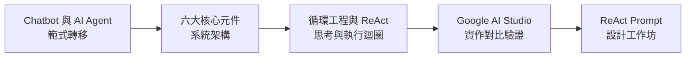
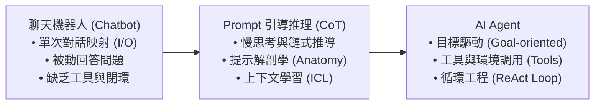
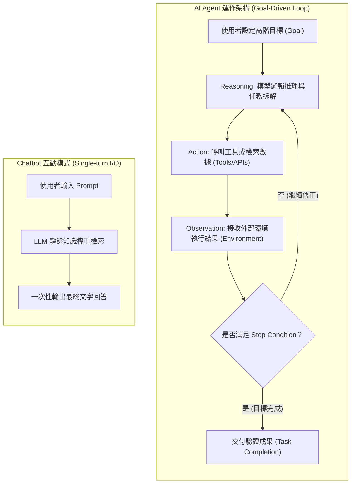
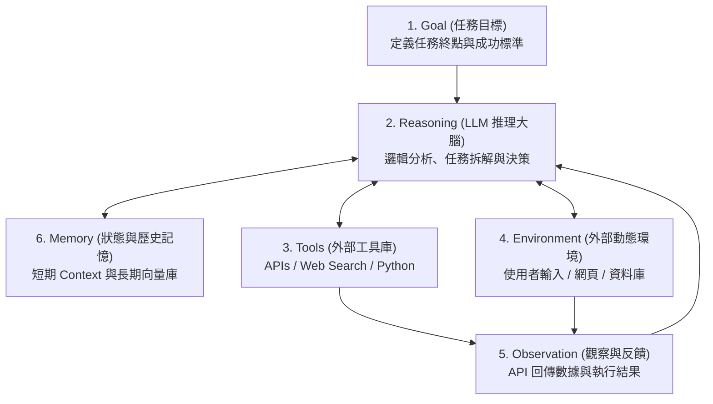
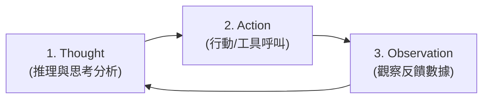
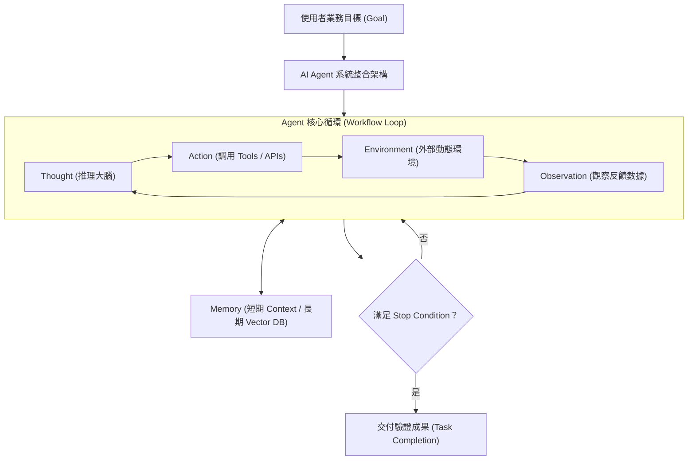

---
puppeteer:
  displayHeaderFooter: true
  headerTemplate: '<div style="font-size: 10px; margin: 0 auto;">第七章：AI Agent 與 ReAct 循環工程架構</div>'
  footerTemplate: '<div style="font-size: 10px; margin: 0 auto;">第 <span class="pageNumber"></span> 頁 / 共 <span class="totalPages"></span> 頁</div>'
  margin:
    top: "1.5cm"
    bottom: "1.5cm"
    left: "1.5cm"
    right: "1.5cm"
---
<style>
  h2 {
    page-break-before: always;
  }
</style>
---

# 第七章：AI Agent 與 ReAct 循環工程架構

## 課程導讀

在第六章中，我們深入剖析了提示工程（Prompt Engineering）的六大核心元素（Prompt Anatomy）、思考鏈（Chain-of-Thought，CoT）以及原生推理模型（Reasoning-First Models）的控制機制，學習了如何透過精確的 Prompt 降低模型的不確定性（Reduce Uncertainty），引導模型進行高品質的單次邏輯推理與內容生成。

然而，掌握了單次 Prompt 設計之後，我們在真實世界的企業級應用中面臨著更嚴峻的工程挑戰：**當業務任務需要跨越數十個步驟、調用外部 API 檢索即時數據、或根據中途發生的錯誤進行動態自我修正時，單次 Prompt 的對話模式該如何突破？**

大眾常將 AI 停留在「聊天機器人（Chatbot）」的印象，以為 AI 只是拿來問答或寫文案。然而在當代 AI 工程領域，發展焦點已徹底從「單次問答」轉向「自主任務完成」：

> **AI Agent＝大語言模型推理大腦（LLM Reasoning Engine）＋記憶系統（Memory）＋外部工具庫（Tools）＋動態環境感知（Environment）＋循環工程控制（Loop Engineering）。**

本章將帶領讀者透徹拆解 **Chatbot 與 AI Agent 的範式轉移（Paradigm Shift）**、**AI Agent 系統架構的六大核心元件**、**循環工程（Loop Engineering）** 與經典的 **ReAct (Reason + Action + Observation) 思考與執行迴圈**，並透過 **Google AI Studio 實作對比驗證** 與 **ReAct Prompt 設計工作坊**，培養讀者建構企業級 AI Agent 系統的核心工程能力。



---

## 第一節：從 Chatbot 到 AI Agent：自主任務執行的範式轉移



### 1.1 資訊對答 vs 任務完成 (Answer Questions vs. Task Completion)

要邁入 AI Agent 的領域，第一個必須調整的核心心態是：**徹底區分「被動對話機器人（Chatbot）」與「AI Agent」在運作邏輯上的根本差異。**

- **Chatbot 模式（Single-turn I/O）：** 使用者的目標是「獲得一個解答」。使用者輸入 Prompt，模型根據靜態訓練權重進行內部的自回歸生成，一次性輸出最終文字。如果資訊不足，Chatbot 往往只能透過隨機猜測來替使用者填補空白。
- **AI Agent 模式（Autonomous Task Completion）：** 使用者的目標是「委託完成一項複雜專案」。Agent 接收高階目標（Goal）後，會將其拆解為子任務、主動發現缺少的變數、呼叫外部 API 檢索即時資料，並在發現錯誤時進行自我修正（Self-Correction），直到目標達成。

> **AI Agent 的學術定義：**  
> **An AI Agent is an AI system that can reason, take actions, observe outcomes, and iteratively work toward a goal.**

| 比較維度 | 傳統聊天機器人 (Chatbot) | AI Agent (Autonomous Agent) |
| :--- | :--- | :--- |
| **核心目標** | 著重於**回答問題（Answer Questions）** | 著重於**完成任務（Complete a Task）** |
| **互動模式** | 單次輸入與輸出（Single-turn I/O） | **多輪推理、多步驟執行與動態循環 (Loop)** |
| **數據來源** | 僅仰賴模型的靜態預訓練記憶 | **即時調用外部 Tools / APIs 與動態環境** |
| **自我修正** | 無法檢查輸出品質，單次輸出即結束 | **透過 Observation 評估結果並自動調整策略** |
| **狀態保存** | 仰賴對話 Context，狀態易流失 | **具備短期與長期 Memory 系統記錄狀態** |



### 1.2 案例剖析：旅行規劃任務（Case Study）

比較處理「幫我規劃東京五天自由行」任務時，兩種模式的執行差異：

#### ❌ Chatbot 模式：
- **使用者：** 「請幫我規劃東京五天自由行。」
- **Chatbot：** 立即輸出預設的五天行程草案。然而該草案並不知道使用者的航班時間、每日預算、同行成員（長輩或幼童）或偏好的住宿區域，且無法驗證景點當天是否開門或交通是否順路。

#### ✅ AI Agent 模式：
1. **分析需求（Reasoning）：** 分析已知資訊，發現缺少「出發日期」、「預算」與「同行者需求」。
2. **對話確認（Action 1）：** 向使用者提出針對性發問。
3. **資訊檢索（Action 2）：** 收到預算後，呼叫 Flights API 與 Weather API 取得即時航班與天氣。
4. **動態規劃（Action 3）：** 呼叫 Hotel API 篩選符合預算的飯店，並規劃順路景點。
5. **合規審查（Observation）：** 發現第三天景點休館，自動將該景點調整至第二天。
6. **交付成果（Task Completion）：** 輸出經過驗證無誤的客製化行程方案。

> **老師的提醒：**
> - **Agent 會主動思考，而不是倉促給出答案**：Chatbot 著重於「立即給出答案（Immediate Answer）」，哪怕答案是靠猜測的；而 Agent 則著重於「思考如何正確完成任務（Task Completion）」，寧可暫停下來呼叫工具或向使用者發問，也絕不給出未經驗證的垃圾產出。

### 1.3 AI Agent 的三大核心特性

1. **目標導向（Goal-oriented）：** 聚焦於達成最終任務目標（如產出一份市場競品分析報告），而非單純回答字面問題。
2. **自主決策（Autonomous）：** 能自行決定下一步行動（搜尋資料、計算數值或驗證結果），無需人類每一步手動下達指令。
3. **迭代循環（Iterative）：** 具備 Loop 循環機制，能在執行過程中持續檢視結果、發現錯誤並主動修正。

---

### 1.4 課堂探索小活動：Chatbot 與 Agent 應用場景劃分

請小組成員檢視下列常見業務任務，評估其屬於「單次 Chatbot」還是「多輪 Agent」範疇，並說明判定理由：

| 應用情境與任務 | Chatbot | Agent | 判定關鍵依據與工程細節 |
| :--- | :---: | :---: | :--- |
| **解釋 Transformer 的 Self-Attention 機制** | ■ | □ | 單次概念說明，無需外部工具或長流程。 |
| **翻譯一段 200 字的英文新聞稿** | ■ | □ | 直譯任務，一次性自回歸映射即可完成。 |
| **幫大學生規劃四天三夜京都自由行** | □ | ■ | 需考慮預算、即時交通、行程銜接與自我修正。 |
| **撰寫競品市場分析與聲量報告** | □ | ■ | 需要多源 Web 搜尋、資料交叉比對與報告整理。 |
| **自動化整理並寄送每週科技新聞週報** | □ | ■ | 需要定時抓取、摘要、格式化與 Email API 寄送。 |
| **設計一套完整的 Python 基礎教學課程** | □ | ■ | 需要單元規劃、難易度審查與範例程式編寫驗證。 |

---

## 第二節：AI Agent 系統架構與六大核心元件

大型語言模型（LLM）本質上是 Agent 的「推理大腦（Reasoning Engine）」，但一個能於真實世界運作的 Agent，必須整合記憶、工具與外部環境：

> **AI Agent 系統公式：**  
> **AI Agent System = LLM (Reasoning Engine) + Memory + Tools + Environment + Workflow Loop**



---

### 2.1 六大核心元件深度拆解

#### 1. Goal（任務目標）
- **功能：** 定義 Agent 執行的終點條件（Termination Condition）與品質標準。明確的 Goal 讓 Agent 能評估任務完成度，避免無限循環。
- **工程範例：** *"完成一份包含競品價格、聲量與優缺點比較的 Markdown 市場分析報告。"*

#### 2. Reasoning（推理與規劃）
- **功能：** LLM 根據目前狀態、Goal 與歷史記憶，進行邏輯分析、任務拆解（Task Decomposition）與下一步行動評估。
- **核心運作：** 決定「目前缺什麼資訊？」、「該調用哪一個 Tool？」或「目前的成果是否合理？」。

#### 3. Tools（外部工具庫）
- **功能：** 擴充 LLM 能力邊界的外部介面（APIs, Calculators, Python Interpreter, Web Search, Database Query）。
- **工程價值：** LLM 負責邏輯推理，Tools 則提供精準運算與即時真實數據。
- **呼叫範例：**
  ```mermaid
  flowchart LR
      User["問題: 台北今日降雨機率？"] --> Reasoning["LLM 識別需要即時氣象數據"]
      Reasoning --> CallAPI["Call WeatherAPI(city='Taipei')"]
      CallAPI --> ReturnData["Return JSON: {rain_prob: 80%}"]
      ReturnData --> Response["生成最終回答: '台北今日降雨機率為 80%'"]
  ```

#### 4. Environment（外部動態環境）
- **功能：** Agent 所處的動態上下文世界。環境包含使用者輸入、網頁狀態、資料庫更新或 API 回傳狀態。
- **動態特性：** 環境變數可能隨時間改變（如飯店被訂滿、機票調漲），Agent 必須持續感知並調整策略。

#### 5. Observation（觀察與反饋）
- **功能：** Agent 執行 Action 後，從 Environment 或 Tools 獲得的即時執行結果（Execution Result）。
- **工程價值：** Observation 為下一輪 Reasoning 提供新的輸入，使 Loop 具備自我修正（Self-Correction）的能力。

#### 6. Memory（狀態與歷史記憶）
- **短期記憶（Short-term Memory）：** 利用 Prompt Context 保存當前的對話歷史、中間思考軌跡與工具執行結果。
- **長期記憶（Long-term Memory）：** 結合向量資料庫（Vector DB / RAG），保存使用者個人偏好、歷史專案經驗與領域知識。

---

### 2.2 專題實驗：拆解 Agent 系統架構（Architectural Blueprint）

**小組任務：** 請針對任務「產出一份生成式 AI 對高等教育影響的研究報告」，拆解其 Agent 系統元件配置：

| 系統元件 | 具體設計與實作規劃 |
| :--- | :--- |
| **Goal** | 產出一份包含高教現況、衝擊評估、教學轉型案例與倫理挑戰的 2000 字結構化報告。 |
| **Reasoning** | 1. 拆解子章節主題。<br>2. 檢查各章節是否具備權威文獻支持。<br>3. 評估文章結構連貫性。 |
| **Tools** | Web Search Tool (arXiv/Google Scholar API)、Summarizer Tool、PDF Parser。 |
| **Environment** | 外部學術資料庫、搜尋引擎結果頁、使用者反饋指示。 |
| **Observation** | 檢查搜尋結果的權威性與年份、確認 PDF 是否解析成功、比對報告字數。 |
| **Memory** | 記錄已讀取的 DOI 文獻列表、報告大綱草案、使用者指定的引用格式偏好。 |

---

## 第三節：循環工程（Loop Engineering）與 ReAct 思考架構

### 3.1 什麼是循環工程（Loop Engineering）？

傳統 Prompt 是一次性運算（Forward Pass），而 Agent 的靈魂在於 **Loop（循環執行）**。循環工程並不是指訓練新模型，而是**設計一套自動化的 Workflow 控制結構**，讓 LLM 能在「思考 ──> 執行 ──> 觀察 ──> 修正」的閉環中運行。

### 3.2 ReAct（Reason + Action）經典架構

由 Princeton 與 Google 團隊提出的 **ReAct** 架構，是當前 Agent 工程中應用最廣泛的思維模式：

$$ \text{ReAct Cycle} = \text{Reason (Thought)} \longrightarrow \text{Action} \longrightarrow \text{Observation} \longrightarrow \text{Next Thought} $$



#### ReAct 三大步驟剖析：

1. **Step 1: Reason (Thought / 思考)：** 分析當前狀態、已知資訊與目標距離，決定下一步策略。
2. **Step 2: Action (行動)：** 觸發具體的工具呼叫（Tool Execution）或向使用者提問。
3. **Step 3: Observation (觀察)：** 接收工具執行後的客觀回傳結果（JSON/Error/Text）。

---

### 3.3 ReAct 完整執行軌跡案例（Execution Trace）

以規劃東京行程為例，Agent 內部的 ReAct 執行紀錄如下：

```text
[Goal]: 規劃東京自由行行程

Thought 1: 使用者未提供預算與偏好，需要先進行對話確認。
Action 1: AskUser("請問您的每日住宿與餐飲預算上限是多少？")
Observation 1: 使用者回覆：「每日住宿預算 4,000 台幣以內，偏好上野或新宿區。」

Thought 2: 已取得預算與區域限制，下一步呼叫飯店搜尋工具檢索上野與新宿符合條件的住宿。
Action 2: HotelSearchAPI(location=["Ueno", "Shinjuku"], max_price=4000)
Observation 2: 傳回 2 家飯店資訊（新宿燦路都飯店 3,800 元/晚，上野寶石飯店 3,200 元/晚）。

Thought 3: 住宿已檢索完成，接著評估五天交通路線與景點順路度。
Action 3: RoutePlannerAPI(destination="Tokyo", days=5)
Observation 3: 成功產出上野、淺草、秋葉原延伸至箱根的五日交通票卷組合。

Thought 4: 檢查所有細節均符合預算且行程順路，任務已完成。
Action 4: Finish("交付完整行程規劃表")
```

---

### 3.4 停止條件（Stop Condition）工程設計

若無合理的停止機制，Agent 容易陷入無限死迴圈（Infinite Loop）。常見的停止條件包含：

1. **Goal Achieved：** 任務顯式完成（如產出最終文件或回傳 Finish 訊號）。
2. **Max Iterations：** 設定最大循環代次限制（如 `max_steps = 10`），防止 Token 消耗暴增。
3. **Threshold Reached：** 結果品質評分達標（如文獻覆蓋率 > 90%）。
4. **User Interrupted：** 使用者主動下達終止指令。

> **老師的提醒：**
> - **一定要設定 Max Iterations！** 在開發 Agent 時，若忘記設定 `max_steps`，一旦工具回傳 404 錯誤，LLM 可能會陷入「重試 ──> 失敗 ──> 再重試」的死迴圈，導致 API 費用在一夜之間暴增數百美元！

---

## 第四節：課堂實戰：ReAct 提示工程對比驗證（The ReAct Lab）

本實驗將帶領大家進入 **Google AI Studio**，透過編寫兩種不同結構的 Prompt，實測 LLM 在「一般單次回答」與「ReAct 循環引導」下的行為差異。

### 4.1 實驗配置（Environment Setup）
- **測試平台：** Google AI Studio (`aistudio.google.com`)
- **測試模型：** Gemini 3.6 Flash（或 Gemini 3.7 Flash）
- **System Instructions：** 預設空白
- **Temperature：** 0.2
- **Thinking Level：** 建議設定為 `Low` 或 `Off`

> **老師的提醒：**
> - **為什麼實驗 ReAct 提示時建議將 Thinking Level 設為 Low/Off？**  
>   原生推理模型（如 Gemini 3.6 / 3.7）在 `Thinking Level = High` 時會在背景 Buffer 自動進行深度推理。本實驗的目的是為了測試**透過 Prompt 規範讓模型在對話文本中顯性輸出 `Thought ──> Action ──> Observation` 軌跡**，因此將 Thinking Level 調低或關閉，能避免背景原生思考干擾我們對對話文字層面 ReAct 機制的觀察與對比！

---

### 4.2 實驗階梯一：一般 Prompt 測試（Version A）

* **輸入 Prompt：**
```text
請替第一次到京都旅行的大學畢業生，規劃四天三夜自由行。
```

---

### 4.3 實驗階梯二：ReAct 結構化 Prompt 測試（Version B）

* **輸入 Prompt：**
```text
你是一位嚴謹的 AI 旅行 Agent。請不要直接一次性給出答案。

請嚴格遵循 ReAct (Reason ──> Action ──> Observation) 流程完成「京都旅行規劃」任務：

[規範指令]
1. 每一輪思考必須先輸出 Thought：分析目前已知資訊、還缺少哪些關鍵變數。
2. 接著輸出 Action：決定下一步要進行的分析或詢問。
3. 如果已知資訊不足（如預算、季節、住宿偏好），請不要自行假設，請在 Action 中提出問題並停止生成，等待使用者輸入 Observation。
4. 重複 Thought ──> Action ──> Observation 循環，直到資訊完整且行程經過合規檢查後，再輸出 [Finish] 與最終完整行程。

請開始第一輪思考。
```

---

### 4.4 實驗對比報告（Evaluation Report）

| 評估維度 | Version A (一般 Prompt) | Version B (ReAct Prompt) |
| :--- | :--- | :--- |
| **回答生成方式** | 單次直接輸出全部內容 | 分段思考（Thought/Action） |
| **主動捕捉資訊缺失** | 否（直接替使用者假設情境） | 是（主動發問確認變數） |
| **邏輯推導透明度** | 低（無法得知規劃依據） | 高（清晰展現思考軌跡） |
| **自我檢查與修正** | 無 | 具備（於 Observation 後修正） |
| **產出結果實用性** | 泛泛而談的範本行程 | 高度客製化且嚴謹的方案 |

---

## 第五節：小組討論與 ReAct Prompt 設計實務工作坊

### 5.1 實作任務說明

請各小組選擇以下其中一項複雜任務，設計一套專屬的 **ReAct System Prompt**，並於 Google AI Studio 上驗證其執行效果：

1. **主題 A：筆記型電腦選購評估 Agent**
2. **主題 B：大學生畢業專題企畫書草擬 Agent**
3. **主題 C：企業 RWD 官網前端架構設計 Agent**
4. **主題 D：Python 爬蟲與資料分析課程教案 Agent**

---

### 5.2 實作步驟指南

1. **Step 1：定義 Task 與變數限制：** 明確標示任務範疇、必須蒐集的參數（如預算、技術棧、受眾）與終止條件。
2. **Step 2：撰寫 ReAct Prompt 結構：** 套用標準模組格式（Thought ──> Action ──> Observation）。
3. **Step 3：壓力測試與優化（Stress Testing）：** 在 Google AI Studio 中輸入模糊需求，測試 Agent 是否能按照 ReAct 規範進行引導與迭代修正。

---

## 本章小結與思考問題

### 核心觀念回顧

1. **從 Prompt 到 Autonomous Task Completion：** Prompt Engineering 不再只是優化單次回答文字，而是設計讓 AI 能**自主規劃、呼叫工具、自我檢查與持續循環**的工作流程（Workflow）。
2. **AI Agent 的六大元件架構：** 完整的 Agent 由 **Goal (目標)**、**Reasoning (推理)**、**Tools (工具)**、**Environment (環境)**、**Observation (觀察)** 與 **Memory (記憶)** 組合而成。
3. **ReAct 思考模型 (Reason + Action)：** 透過 `Thought ──> Action ──> Observation` 的三元組循環，賦予 LLM 逐步排錯與動態修正能力。
4. **循環工程 (Loop Engineering)：** Agent 的關鍵在於 Workflow Loop 與明確的 **Stop Condition (停止條件)**，確保任務在品質與資源消耗之間達到最佳平衡。

---

### 系統架構整合圖



---

### 課後思考題

請同學們在進入下一章之前，深入思考以下三個問題：

1. **ReAct 與 Chain-of-Thought (CoT) 的本質差別：** CoT 僅在文字序列中進行「隱性/外顯思考」，而 ReAct 導入了 `Action` 與 `Observation`。這對於解決幻覺（Hallucination）與時效性問題帶來了什麼關鍵突破？
2. **Memory 洩漏與 Context 暴增問題：** 當 Agent 在 ReAct 迴圈中運行了 20 輪之後，對話 Context 變得極長，該如何設計 Memory 機制（如摘要壓縮或 Vector RAG 檢索）以避免超過 Token 限制與費用爆表？
3. **Multi-Agent 協同的演進：** 如果單一 Agent 處理包含前端、後端、測試與維運的整個專案過於複雜，該如何將任務拆解給多個專精不同 Persona 的 Sub-Agents 協同完成？
