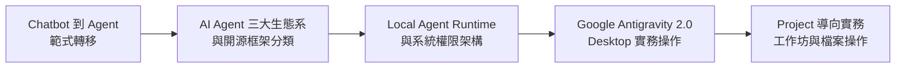
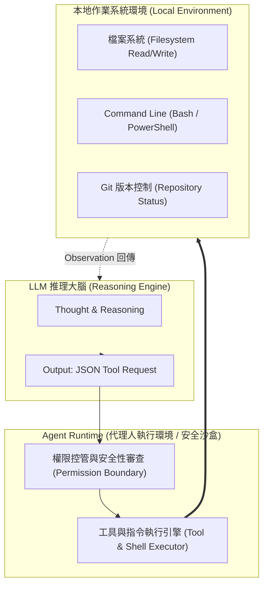
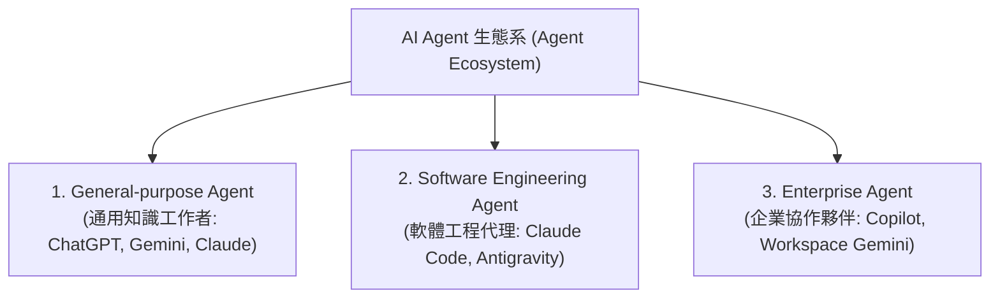
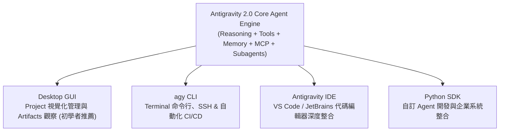
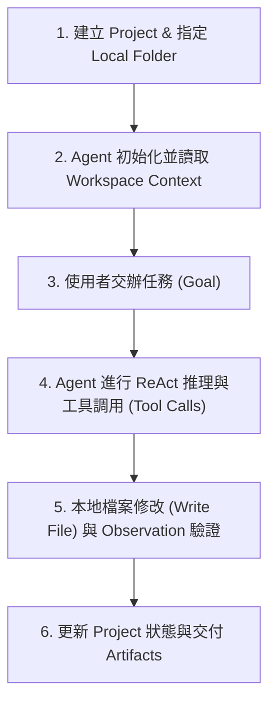
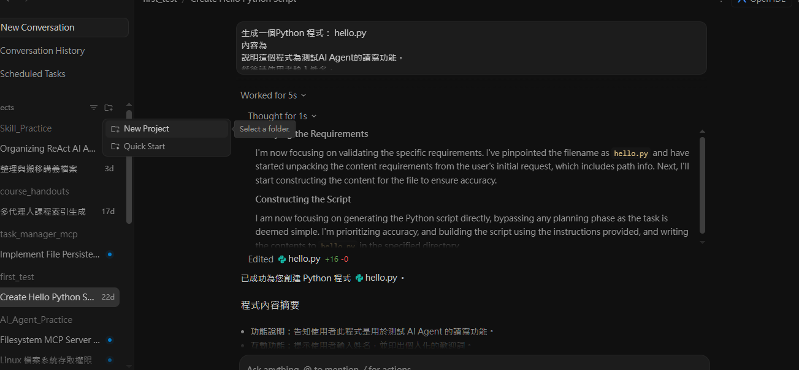
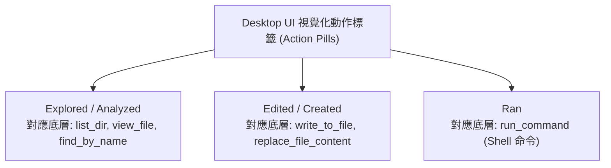
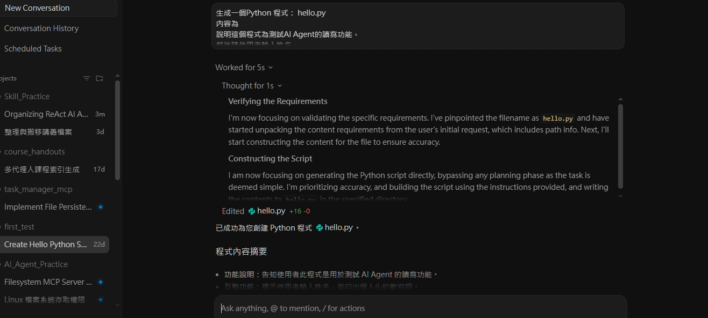
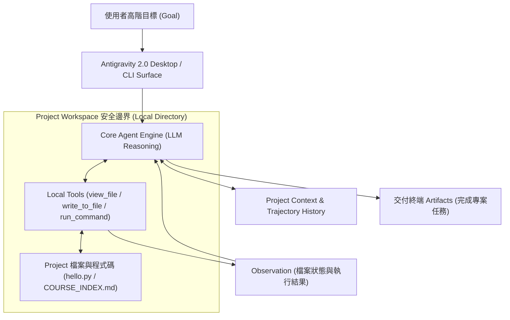

---
puppeteer:
  displayHeaderFooter: true
  headerTemplate: '<div style="font-size: 10px; margin: 0 auto;">第九章：AI Agent 生態系與執行環境：Local Agent 與 Runtime 架構</div>'
  footerTemplate: '<div style="font-size: 10px; margin: 0 auto;">第 <span class="pageNumber"></span> 頁 / 共 <span class="totalPages"></span> 頁</div>'
  margin:
    top: "1.5cm"
    bottom: "1.5cm"
    left: "1.5cm"
    right: "1.5cm"
---
<style>
  h2 {
    page-break-before: always;
  }
</style>
---

# 第九章：AI Agent 生態系與執行環境：Local Agent 與 Runtime 架構

## 課程導讀

在第八章中，我們透徹解構了 Tool Use 與 Function Calling 運作機制，理解了 AI Agent 如何透過 JSON Schema 標準協議將語意意圖轉化為真實 API 呼叫，並透過自癒防禦網進行錯誤處理與自我修正（Self-Correction）。

然而，在前八章的學習中，我們的互動大多停留在瀏覽器或雲端 API 的視窗對話介面中。當 AI Agent 具備了 Reasoning（邏輯推理）與 Tool Use（工具調用）能力後，我們面臨著全新的工程範式轉移：**AI Agent 究竟應該在何種 Runtime 環境下運行？如何從被動的雲端 Chatbot 跨越到具備受控本地檔案系統操作權限的 Local AI Agent？**

在當前 AI 工程領域，發展焦點已徹底從「雲端單次問答」轉向「本地/企業自動化任務完成」：

> **AI Agent 生態系＝LLM 推理大腦（Reasoning Engine）＋本地/雲端執行環境（Agent Runtime）＋生態系擴充協議（MCP / Skills / Subagents）。**

本章將帶領讀者透徹拆解 **Chatbot 與 AI Agent 的執行範式轉移**、**AI Agent 三大應用生態系三分法**、**商業授權與開源框架之區別**、**Google Antigravity 2.0 多介面架構（Surfaces）**，並透過 **Antigravity 2.0 Desktop 本地 Project 實作驗證** 與 **多檔案專案整理工作坊**，培養讀者駕馭本地 AI Agent 完成真實軟體專案的實戰能力。



---

## 第一節：從對話視窗到本地執行：Agent Runtime 的範式轉移

### 1.1 Chatbot vs. AI Agent 執行範式

要理解 Local AI Agent，第一個必須調整的工程思維是：**徹底區分「雲端對話視窗（Chatbot）」與「代理人執行環境（Agent Runtime）」的宿主環境差異。**

- **Chatbot 模式（Web Dialog Window）：** 運行於瀏覽器沙盒中，輸入 Prompt 後模型返回文字解答。模型無法直接讀取使用者電腦上的檔案、無法自動建立資料夾、亦無法在本地執行 Shell 指令。真正的寫檔與執行工作完全依賴人類複製貼上。
- **AI Agent 模式（Agent Runtime Workspace）：** 運行於具備權限管控的 **Agent Runtime** 中。Agent 接收高階目標（Goal）後，可以直接閱讀專案目錄下的所有檔案、發起寫檔操作（Write File）、執行 Bash / PowerShell 命令，並在發現語法錯誤時自動進行 Self-Correction。

| 比較維度 | 傳統聊天機器人 (Chatbot) | AI Agent System |
| :--- | :--- | :--- |
| **核心目標** | 回答問題（Answer Questions） | 完成任務（Complete Tasks） |
| **主要介面** | 瀏覽器 Single-turn 視窗 | **Agent Runtime / Desktop / CLI / IDE** |
| **執行權限** | 雲端隔離沙盒、無法操控本地檔案 | **受控本地檔案系統、Git、Shell & APIs** |
| **工作環境** | 無狀態 Session / Context 易流失 | **Project 導向 Context & 本地資料夾** |
| **自動化程度** | 人類手動複製貼上與執行 | **Agent 自主多步驟推理與自動寫檔** |

---

### 1.2 什麼是 Agent Runtime（代理人執行環境）？

**Agent Runtime（代理人執行環境）** 是指介於大型語言模型與作業系統之間的受控執行層。LLM 本質上只提供邏輯推理（Brain），而 Runtime 則提供了「雙手與腳」——負責接收 LLM 發出的 Tool Call 請求，並安全地呼叫作業系統的檔案系統（FS）、命令列（Shell）或網路介面（Network）。



> **老師的提醒：**
> - **Runtime 是安全防護網**：讓 Agent 能夠讀寫本地檔案並不等於「把電腦完全交給 AI」。一個優秀的 Agent Runtime（如 Google Antigravity）具備嚴格的 Workspace 邊界限制與 Human-in-the-loop 人機確認機制，防止 Agent 誤刪資料夾以外的系統檔案。

---

## 第二節：AI Agent 三大應用分類與開源生態系

自從 LLM 具備 Reasoning、Planning 與 Tool Use 能力後，業界推出了多元定位的 Agent 系統。理解這些系統的差異，有助於工程師在不同業務場景中選擇最適工具。

### 2.1 主流應用場景三分法 (Ecosystem Triad)

從主要應用目的與工作情境來看，當前主流的 AI Agent 可以劃分為三大部分：



---

### 2.2 三大 Agent 分類深度剖析

#### 1. General-purpose Agent（通用知識助理）
- **定位：** 面向廣泛知識工作的通用型 AI 助理。
- **特點：** 通常透過 Web 或 Desktop 提供服務，擅長文章撰寫、翻譯、文獻摘要與初階程式解說。近年逐步加入 Deep Research、Web Search 與多模態生成能力。
- **代表產品：** OpenAI ChatGPT、Google Gemini Web、Anthropic Claude Web。

#### 2. Software Engineering Agent（軟體工程代理人）
- **定位：** 專為軟體開發、代碼重構與系統維護設計的高階 Agent。
- **特點：** 不僅產生程式碼片段，而是能夠閱讀整個代碼庫（Repository）、理解專案架構、修改多個檔案、執行單元測試、操作 Git 及運行 Shell 指令。
- **代表產品：** Anthropic Claude Code、OpenAI ChatGPT Codex、Google Antigravity。

#### 3. Enterprise Agent（企業級協作系統）
- **定位：** 深度整合企業內部知識庫與業務流程的 AI 協作者。
- **特點：** 強調權限隔離、資安稽核、合規性，並與企業 ERP、CRM、Email 及文件管理系統串接。
- **代表產品：** Microsoft 365 Copilot、Google Workspace Gemini、Claude for Enterprise。

---

### 2.3 商業授權 (Commercial) vs. 開源專案 (Open Source)

除了應用場景，我們亦可從開發與授權模式進行分類：

| 開發生態 | 代表產品 / 框架 | 核心優勢與適用場景 | 工程挑戰與注意事項 |
| :--- | :--- | :--- | :--- |
| **商業產品 (Commercial)** | ChatGPT, Claude, Gemini, Antigravity, Copilot | 雲端開箱即用、模型能力極強、官方支援與持續維護。 | 數據隱私合規疑慮、訂閱費用與 API 成本。 |
| **開源專案 (Open Source)** | OpenHands (OpenDevin), OpenClaw, MetaGPT | 程式碼 100% 可控、可本地部署（Ollama）、自訂架構。 | 需要自行維護 Runtime、模型推理能力受限於本地硬體。 |

---

### 2.4 課堂探索小活動：適配最佳 AI Agent 類型

請小組成員檢視下列工作情境，評估其最適合選用哪一類型的 AI Agent，並說明工程理由：

| 工作情境 | General-purpose | Software Engineering | Enterprise | Open Source | 判定關鍵依據與工程細節 |
| :--- | :---: | :---: | :---: | :---: | :--- |
| **撰寫期末通識課程報告** | ■ | □ | □ | □ | 一般文字整理與 Web Search 即可完成。 |
| **重構 Python Flask 專案並通過 CI/CD 測試** | □ | ■ | □ | □ | 需讀取全專案、修改多個檔案並執行 Shell。 |
| **檢索企業內部跨部門會議紀錄與財務簡報** | □ | □ | ■ | □ | 需結合企業內部 IAM 權限與 Workspace 數據。 |
| **自建具備私有數據隔離的本地 Agent 框架** | □ | □ | □ | ■ | 需 100% 開源可控且本地部署（Local LLM）。 |
| **研究 Multi-Agent 多角色協同之學術論文** | □ | □ | □ | ■ | 需要修改 Agent 內部 Loop 程式碼與通訊協議。 |

---

## 第三節：Google Antigravity 2.0 多介面架構與核心機制

### 3.1 Antigravity 2.0 四大 Surface (操作介面) 定位

**Google Antigravity 2.0** 是一個以 **Agent（代理人）** 為核心的開放平台。平台底層採用統一的 Agent Engine（具備 Reasoning、Tool Calling、MCP 協議、Skills 與 Subagents），並針對不同工作場景提供了四大 **Surfaces（操作介面）**：



| Surface | 介面型態 | 主要工程用途與適用情境 |
| :--- | :--- | :--- |
| **Antigravity Desktop** | GUI 視覺化視窗 | 建立與管理 Project、觀察 Agent 執行流程與產出物（Artifacts），初學者首選。 |
| **agy CLI** | Terminal 命令行 | 適合純文字終端操作、SSH 遠端伺服器或 CI/CD 自動化腳本。 |
| **Antigravity IDE** | 代碼編輯器插件 | 將 Agent 整合至編輯器，提供即時 Code Completion 與檔內重構。 |
| **Antigravity SDK** | Python 程式庫 | 供開發者編寫自訂 Agent 邏輯或介接企業內部 API 系統。 |

---

### 3.2 Project 導向運作模式

與傳統「開啟新聊天室」不同，Antigravity 以 **Project（專案）** 作為 Agent 的工作邊界。一個 Project 會綁定本地電腦上的一個特定資料夾（Folder）。



#### Project 運作三大工程原則：
1. **Workspace Boundary：** Agent 預設將該資料夾視為獨立世界，絕不跨越資料夾操作無關檔案。
2. **Context Persistence：** Agent 的對話與思考軌跡會持續累積於 Project 生命週期中，不會因關閉視窗而遺失。
3. **Artifact Generation：** 複雜任務的產出（如分析報告或代碼變更）會獨立保存為 **Artifacts**，方便人類進行審查與版本對比。

---

## 第四節：課堂實戰：Antigravity 2.0 Project 實作驗證 (The Local Agent Lab)

本實驗將帶領大家啟動 **Google Antigravity 2.0 Desktop**，體驗 Local AI Agent 如何真正閱讀本地專案、建立檔案並進行多檔案重構。

### 4.1 實驗配置（Environment Setup）
- **測試平台：** Google Antigravity 2.0 Desktop / agy CLI
- **測試模型：** Gemini 3.6 Pro / Gemini 3.7 Pro（或 Flash）
- **Thinking Level / 推理深度：** 建議設定為 **`High`**（或 `Medium`）
- **採樣參數控制：** 由 Antigravity Core Agent Engine 動態掌管，無需手動微調 Temperature 數值。

> **老師的提醒：為什麼在 Antigravity 中建議採用 High/Medium Reasoning？**  
> - 單純的 API 對比實驗（如 第四章/第八章在 AI Studio 中測試 Prompt）是為了觀察文字層面單次 Request 的生成速度與簡短 JSON Request，因此常建議將 Thinking Level 設低。  
> - 但在 **Antigravity 2.0 等軟體工程代理平台（Software Engineering Agent）** 中，Agent 必須面對真實本地檔案寫入、自動修復語法錯誤與多步驟指令，設定較高等級的 **`High` / `Medium` Reasoning** 才能提供 Agent 足夠的推理深度來精確規劃與執行本地工具！

---

### 4.2 實作任務一：建立 Project 與單一程式碼增修 (Single-File Refactoring)

1. 啟動 Antigravity Desktop，點選 **New Project**。



2. 點選 **Add Folder**，指定本地資料夾：`C:\Users\<帳號>\Documents\AI-Agent-Practice`。
3. **對 Agent 下達指令：**
   ```text
   請建立一個 Python 檔案 hello.py。
   內容要求：先詢問使用者姓名，接著輸出：
   Hello, <name>! Welcome to AI Agent Practice.
   ```
4. **進階指令（測試增修能力）：**
   ```text
   請修改 hello.py，加入一個印出當前系統時間的函式，並保留原本的問候邏輯。
   ```
5. **觀察重點：** Agent 是否重新讀取 `hello.py` 內容？是否僅進行局部增修（Diff Edit）而非整檔覆寫？

---

### 4.3 實做任務二：多檔案專案分析與索引生成 (Multi-File Codebase Indexing)

1. 在 Antigravity 中新建第二個 Project，並將 `LLM_Course` 講義資料夾加入 Workspace。
2. **對 Agent 下達高階目標（Goal）：**
   ```text
   請閱讀目前 Project 中所有的 Markdown 講義檔案，並建立一份 COURSE_INDEX.md。
   內容需包含：
   1. 所有 Markdown 檔案清單與檔名連結。
   2. 每份講義約 50 字的核心摘要。
   3. 建議的學習閱讀順序。
   4. 整理出本課程的整體知識地圖 (Mindmap)。
   ```
3. **觀察重點：** Agent 是否先掃描全資料夾、逐一讀取各個 `.md` 檔、進行語意整合，最後一次性寫入 `COURSE_INDEX.md`？

---

### 4.4 實作對比與觀察報告（Evaluation Report）

| 觀察項目 | 任務一 (單檔增修 hello.py) | 任務二 (多檔索引 COURSE_INDEX.md) |
| :--- | :--- | :--- |
| **檔案讀取模式** | 讀取單一目標檔案 `hello.py` | 批次掃描並閱讀全資料夾多個檔案 |
| **工具呼叫行為** | 調用 `view_file` 與 `replace_file_content` | 調用 `list_dir`、`view_file` 與 `write_to_file` |
| **Context 保存狀況** | 保存既有代碼結構進行 Patch 修改 | 跨檔案整合語意並產出結構化 Markdown |
| **ReAct 閉環表現** | 檢查修改後的語法正確性 | 驗證所有 `.md` 檔案均已被摘要涵蓋 |

---

## 第五節：小組討論與 Local Agent 工作流程觀察工作坊

### 5.1 觀察 Agent 執行軌跡 (Trajectory) 運作機制

在完成第四節的實作後，我們該如何觀察 Agent 在背景發起的 ReAct 思考與 Tool 調用過程？

在 **Antigravity 2.0 Desktop** 介面中，系統為了提升 UI 可讀性與教學流暢度，會將底層的 `view_file`、`write_to_file` 或 `run_command` 等程式碼層級函數呼叫，自動抽象包裝為直觀的 **高階動作標籤（Action Pills & Foldouts）**：



#### 視覺化動作標籤對照表：
- **`Explored` / `Analyzed`** ── 表示 Agent 正在探測專案目錄或閱讀檔案內容（對應底層 `list_dir`, `find_by_name`, `view_file`）。
- **`Edited` / `Created`** ── 表示 Agent 正在建立新檔案或局部修改程式碼（對應底層 `write_to_file`, `replace_file_content`）。
- **`Ran`** ── 表示 Agent 正在執行 Terminal 終端控制台命令（對應底層 `run_command`）。

在 Desktop 介面中，點擊展開這些標籤卡片，即可直觀檢視 Agent 在背景所執行的目標檔案路徑、操作歷程與 ReAct 思考脈絡。



> **老師的提醒：進階開發除錯 ── 底層 Trajectory Log 檔案**  
> - 除了在 Desktop UI 直接點選動作標籤卡片外，Antigravity 平台亦會在本地系統自動備份最完整的原生對話與 Tool 執行日誌（JSON Lines 格式）：  
>   - **Windows:** `C:\Users\<帳號>\.gemini\antigravity\brain\<conversation-id>\.system_generated/logs/transcript.jsonl`  
>   - **Mac / Linux:** `~/.gemini/antigravity/brain/<conversation-id>/.system_generated/logs/transcript.jsonl`  
> - 當未來進行高級 Agent 開發或寫程式讀取日誌除錯時，可至此路徑解析 `transcript.jsonl` 檔案。但在日常課堂教學中，建議學生**直接觀察 Desktop UI 上的 Explored / Edited / Ran 卡片**，即可達到最佳且最流暢的觀察效果！

---

### 5.2 工作流程觀察問題網

完成實作後，請小組成員觀察 Desktop UI 上的標籤卡片與思考區塊，針對以下 5 個工程問題進行深入剖析：

1. **專案 Context 分析：** Agent 在收到任務後，是否先主動發起 `Explored` / `Analyzed` 探測資料夾結構？
2. **步驟自動規劃：** Agent 是否先在 `Thought` 中將高階目標拆解為可執行的子步驟？
3. **動態策略調整：** 當 Agent 發現某個檔案路徑不正確時，是否能根據 Error Observation 自動調整讀檔策略？
4. **權限審查機制：** Agent 在進行檔案執行或修改（`Created` / `Edited`）時，在哪些情況下會提示 Human-in-the-loop 確認？
5. **跨檔案關聯理解：** Agent 是否展現出同時分析多個檔案間相依性（Dependencies）的能力？

---

### 5.3 實作步驟與觀察指南

1. **Step 1：檢視 Desktop 動作標籤：** 觀察對話卡片上出現的 `Explored` / `Edited` / `Ran` 卡片。
2. **Step 2：追蹤 ReAct 軌跡：** 點開卡片，標註出每一次 `Thought` ──> `Action (Explored/Edited/Ran)` ──> `Observation` 的時間點。
3. **Step 3：分析 Tool 選用邏輯：** 評估 Agent 選擇建立新檔或局部修改代碼的工程考量。

---

## 本章小結與思考問題

### 核心觀念回顧

1. **從 Web Dialog 到 Local Runtime：** AI Agent 的核心突破在於從「瀏覽器問答視窗」走向具備受控本地檔案與 Shell 操控權限的 **Agent Runtime**。
2. **AI Agent 生態系三分法：** 包含 **General-purpose Agent (通用知識助理)**、**Software Engineering Agent (軟體工程代理)** 與 **Enterprise Agent (企業協作系統)**。
3. **Google Antigravity 2.0 架構：** 以 Project 為工作邊界，透過 Desktop、CLI、IDE 與 SDK 四大 Surfaces 共享同一套 Agent Engine。
4. **ReAct 在本地系統的實踐：** 本地 Agent 的 Action 不再只是網路 API 呼叫，而是實實在在地對本地檔案系統進行讀寫與重構。

---

### Agent Runtime 系統架構整合圖



---

### 課後思考題

請同學們在進入下一章之前，深入思考以下三個問題：

1. **Local Agent 的資安防護與路徑逃逸 (Directory Traversal)：** 當 Local Agent 具備本地寫檔與 Command 執行權限時，該如何設計 Sandbox 隔離，避免惡意 Prompt 指令讓 Agent 讀寫 Workspace 之外的系統敏感資料（如 `C:\Windows` 或 `~/.ssh`）？
2. **大型 Codebase 的 Context Window 爆表問題：** 當專案包含數萬行程式碼與數百個檔案時，Agent 無法一次將所有檔案放入 Context 中。如何結合 Vector Indexing (RAG) 與 AST (抽象語法樹) 來精準篩選 Agent 應該閱讀的檔案？
3. **Multi-Agent 在本地專案的工工串接：** 若要建立一個自動化軟體開發小組，如何設計 Coder Agent、Tester Agent 與 Reviewer Agent 在同一個 Local Project 中的檔案讀寫鎖（File Lock）與權限交接機制？
