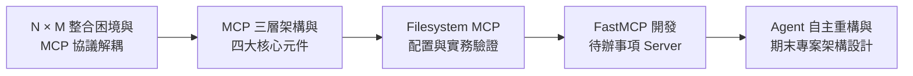
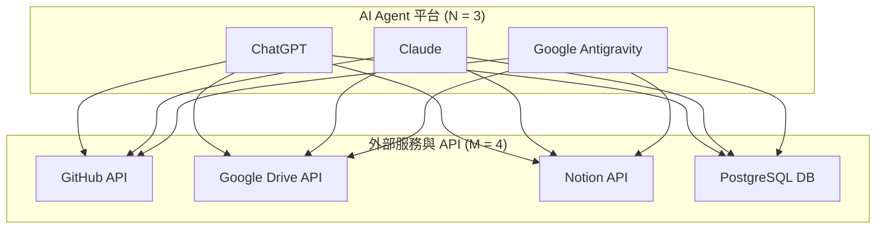
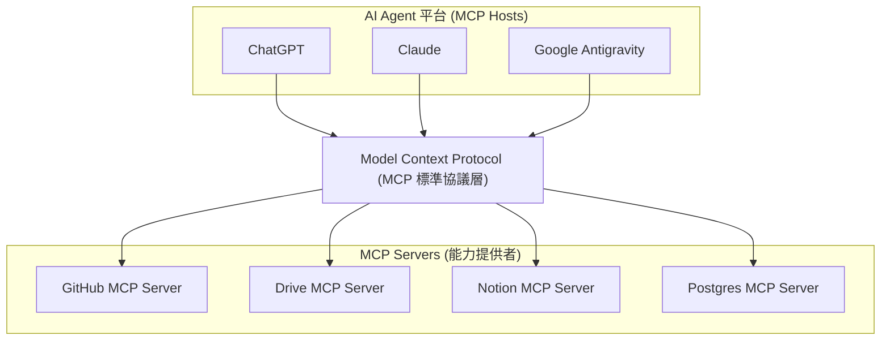
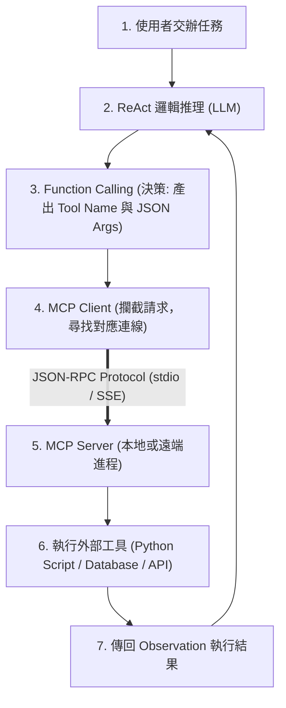
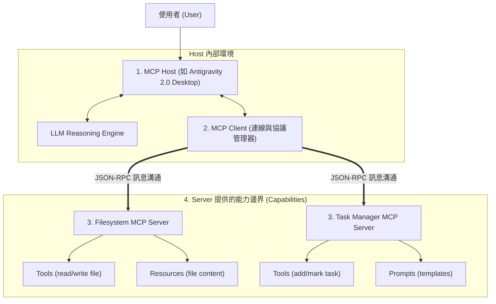
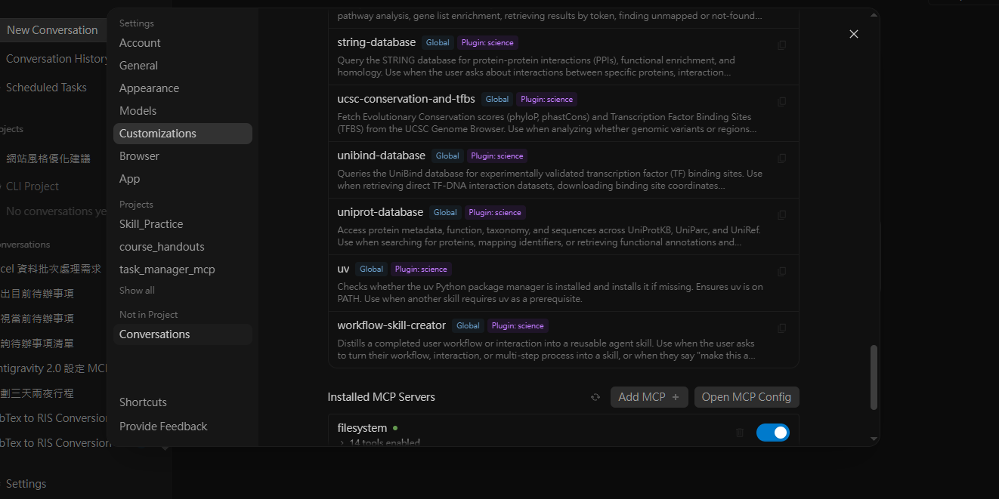
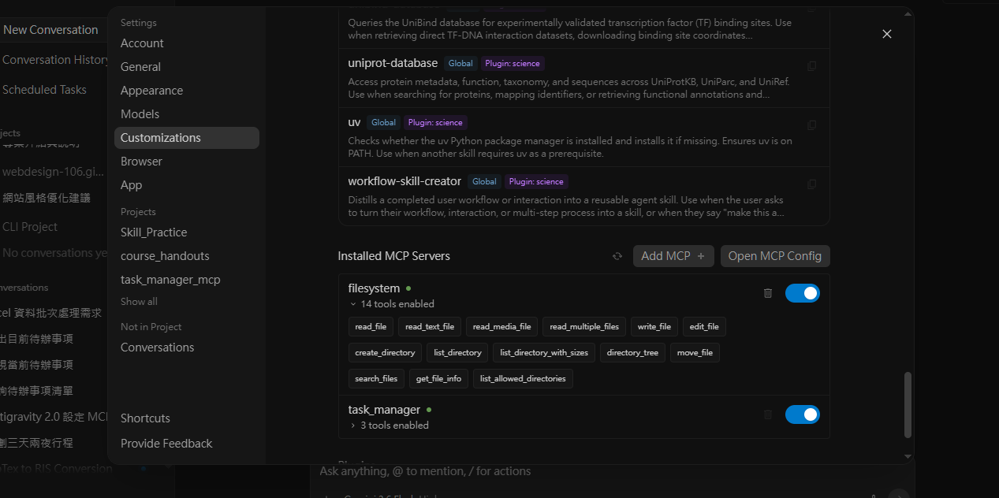
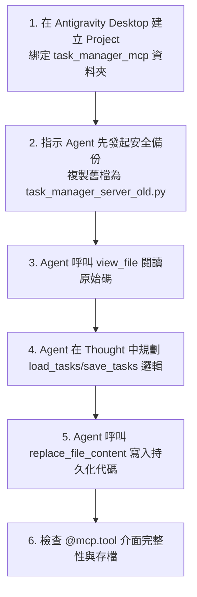
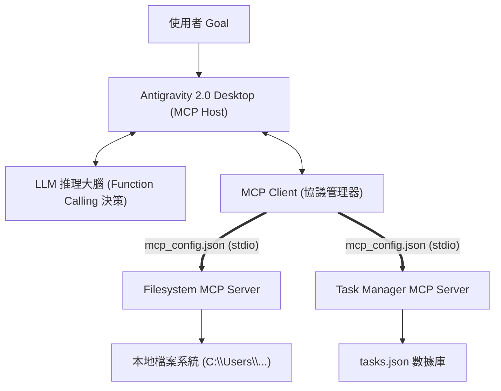

---
puppeteer:
  displayHeaderFooter: true
  headerTemplate: '<div style="font-size: 10px; margin: 0 auto;">第十章：標準協議與生態擴充：Model Context Protocol (MCP) 機制與開發</div>'
  footerTemplate: '<div style="font-size: 10px; margin: 0 auto;">第 <span class="pageNumber"></span> 頁 / 共 <span class="totalPages"></span> 頁</div>'
  margin:
    top: "1.5cm"
    bottom: "1.5cm"
    left: "1.5cm"
    right: "1.5cm"
---
<style>
  h2 {
    page-break-before: always;
  }
</style>
---

# 第十章：標準協議與生態擴充：Model Context Protocol (MCP) 機制與開發

## 課程導讀

在第九章中，我們解構了 Local Agent Runtime 與 Workspace 安全邊界，理解了 AI Agent 如何從雲端對話視窗跨越到具備本地檔案與 Shell 操控權限的本地工程代理。

然而，當我們希望 AI Agent 協助更複雜的真實業務時，很快便會遇到能力邊界的擴充瓶頸：如果希望 Agent 能存取 GitHub 專案庫、讀取 Google Drive 文件、搜尋 Notion 筆記、存取 PostgreSQL 資料庫，甚至對接企業內部的 ERP / CRM 系統，我們必須讓 Agent 具備串接外部服務的能力。

在過去，每一項外部服務都有其獨特的 REST API、認證機制與資料格式。若缺乏統一標準，每個 AI 平台都必須為每種服務重寫整合程式，導致巨大的 $N \times M$ 重複開發與維護成本。為了解決這一產業痛點，由 Anthropic 發起並迅速獲得 Google、OpenAI 等社群支持的 **Model Context Protocol（MCP，模型上下文協議）** 應運而生：

> **MCP（Model Context Protocol）＝ AI Agent 世界的 USB-C 標準協議，解耦 LLM 宿主（Host）與外部工具（Server），實現一處開發、全網通用的生態擴充能力。**

本章將帶領讀者透徹拆解 **MCP 的設計理念與 N × M 解耦架構**、**MCP 與 Function Calling 的層級差異**、**Host/Client/Server 四大核心元件**、**Filesystem MCP Server 實務配置**，並透過 **Python FastMCP 開發 Task Manager Server** 與 **請 Agent 自主重構持久化 MCP 工具**，培養讀者開發並擴充自訂 AI Agent 工具鏈的頂尖工程實戰力。



---

## 第一節：為什麼需要 MCP？解耦工具整合的 N × M 困境

### 1.1 N × M 重複開發困境

假設市場上有 3 種主流 AI Agent 平台（ChatGPT, Claude, Google Antigravity），且我們希望它們都能連接 4 種外部服務（GitHub, Google Drive, Notion, PostgreSQL）。

在沒有統一協定的傳統模式下，系統呈現高度耦合的 $N \times M$ 網狀結構：



#### 傳統密耦合架構的工程痛點：
1. **重複開發（Duplicate Development）：** 每個 Agent 團隊都必須手動為 GitHub 或 Notion 撰寫專屬的 API Wrapper 程式。
2. **極高維護成本：** 當 GitHub API 修改驗證規範時，所有 Agent 平台的後端程式碼均需同步修復。
3. **生態系無法共用：** 社群開發的高品質工具無法直接跨平台移植，阻礙了 AI 工具生態的繁榮。

---

### 1.2 MCP 的核心設計理念：USB-C 協議解耦

MCP 的核心思想是 **「介面與實作分離（Interface-Implementation Separation）」**。MCP 規範了工具如何向 Agent 宣告能力，以及兩者之間如何交換訊息，但不限制工具內部的邏輯或模型的推理細節。



#### 概念比喻：AI 世界的 USB-C 標準
正如 USB-C 介面不關心插入的是隨身碟、滑鼠還是螢幕，只要符合 USB-C 物理與電路規範即可通訊；**MCP 亦不限制外部工具是用 Python、TypeScript 或 Go 語言寫成，只要符合 MCP JSON-RPC 協議，任何 Agent 均能立即調用。**

| 比較維度 | 傳統點對點 API 硬編碼 | MCP 標準協議架構 |
| :--- | :--- | :--- |
| **架構複雜度** | $N \times M$ 密耦合網狀結構 | $N + M$ 星狀解耦結構 |
| **工具重用性** | 零（僅能限於單一 Agent 平台使用） | 100%（一次開發，全網 Agent 通用） |
| **工具擴充性** | 需要修改 Agent 平台核心代碼 | 動態載入設定檔即可擴充能力 |
| **維護責任劃分** | 平台商負擔所有 API 開發責任 | 服務商維護單一 MCP Server 即可 |

---

### 1.3 MCP 與 Function Calling 的層級差異

初學者常問：*「前八章已經學過 Function Calling，模型已經會選工具了，為什麼還要 MCP？」*

答案是：**兩者位於完全不同的技術分層，彼此互補而不是競爭！**

- **Function Calling（推理決策層）：** 解決「**模型如何做決策**」。LLM 讀取工具 description 後，推理判斷是否要調用工具，並輸出 JSON Request。
- **MCP Protocol（傳輸與管理協定層）：** 解決「**工具如何被管理、發現與連線執行**」。MCP 負責在 Agent Runtime 與 MCP Server 之間傳遞訊息，處理建立連線、列出工具與執行本地/遠端 code。



---

## 第二節：MCP 系統架構與四大核心元件深度解構

### 2.1 MCP 三層實體架構

一個完整的 MCP 生態系由四大核心元件協同運作：



---

### 2.2 四大核心元件職責拆解

1. **MCP Host（宿主應用）：**  
   - 系統入口與使用者介面（如 Google Antigravity 2.0 Desktop、Claude Desktop）。
   - 負責管理 Workspace、與 LLM 進行對話，並包含內建的 MCP Client。
2. **MCP Client（連線與協議管理器）：**  
   - 存在於 Host 內部，讀取 `mcp_config.json` 配置文件。
   - 負責啟動 MCP Server 進程、建立連線通道（stdio 或 SSE）、獲取工具清單，並將 Function Call 請求轉發為 MCP 協議訊息。
3. **MCP Server（能力提供者進程）：**  
   - 獨立運行的輕量級伺服器進程（Python / Node.js）。
   - 不包含 LLM 推理邏輯，專心提供 Tools、Resources 或 Prompts。
4. **Capabilities（Server 宣告之三大能力）：**
   - **Tools（工具）：** 可被 Agent 主動執行的操作（如寫檔、發送 Email、查詢資料庫），**會對外部世界產生影響（Side Effects）**。
   - **Resources（資源）：** 唯讀的資料來源（如 API 文件、靜態報告、日誌檔），**提供 Agent 思考時需要的 Context**。
   - **Prompts（提示詞範本）：** 可重複使用的預設 Prompt 模板，協助使用者快速發起標準工作流程。

| 能力類型 (Capability) | 執行權限與屬性 | 典型應用範例 |
| :--- | :--- | :--- |
| **Tools** | 可動態執行、會修改系統狀態（Read/Write） | `write_file()`, `add_new_task()`, `git_commit()` |
| **Resources** | 唯讀資訊存取、補充上下文Context（Read Only） | `file://README.md`, `db://schema/users` |
| **Prompts** | 預設指令模板、加速流程發起（Template） | `review_code_template`, `summarize_meeting_prompt` |

---

### 2.3 動態工具發現機制 (Dynamic Tool Discovery)

MCP 與傳統硬編碼工具最大的不同，在於其**動態工具發現機制**。Agent 不需要事先手動將工具 JSON Schema 寫死在 Prompt 中：

1. 當 Antigravity 2.0 啟動時，MCP Client 讀取 `mcp_config.json` 並啟動進程。
2. Client 發送 JSON-RPC 請求 `tools/list` 給 MCP Server。
3. MCP Server 自動回傳其註冊的所有 Tools 與 Schema。
4. Host 自動將這些 Tools 注入當前 Agent 的能力選單中。

---

## 第三節：課堂實戰：使用官方 Filesystem MCP Server 擴充 Agent 能力

本實驗將帶領讀者體驗從「定位與開啟 MCP 配置文件」到「修改設定檔並重啟驗證」的完整實務流程，讓 AI Agent 動態取得操作本地檔案系統的能力。

### 3.1 定位與開啟 MCP 設定檔

Antigravity 2.0 Desktop 並不是直接在視覺化 UI 中設定 MCP 工具的程式邏輯，而是透過讀取本地全域 JSON 設定檔（`mcp_config.json`）來動態管理與連接所有的 MCP Servers。

#### 1. 設定檔檔案路徑與定位：
Antigravity Desktop 啟動時會自動讀取目前使用者的 MCP 設定檔：
- **Windows:** `C:\Users\<帳號>\.gemini\config\mcp_config.json`
- **Mac / Linux:** `~/.gemini/config/mcp_config.json`

#### 2. 開啟設定檔操作步驟：
開啟 Antigravity 2.0 Desktop 介面，進入：
```text
Settings ──> Customizations ──> Installed MCP Servers ──> Open MCP Config
```
點選 **`Open MCP Config`** 即可在系統預設的文字編輯器中開啟 `mcp_config.json`。



---

### 3.2 修改與重啟 MCP 設定檔

在開啟 `mcp_config.json` 後，即可填入由官方提供的 **Filesystem MCP Server** 服務設定。

#### 1. 編輯與寫入 Filesystem MCP Server JSON 設定：
在 `mcpServers` 頂層物件中加入 `"filesystem"` 設定：

```json
{
  "mcpServers": {
    "filesystem": {
      "command": "npx",
      "args": [
        "-y",
        "@modelcontextprotocol/server-filesystem",
        "C:\\Users\\<帳號>\\Documents\\AI_Agent_Practice"
      ]
    }
  }
}
```

##### 關鍵欄位解析：
- **`mcpServers`：** 宣告所有 MCP Server 的設定字典。
- **`command`：** 啟動 Server 的執行檔指令（如 `npx`）。
- **`args`：** 傳入該執行檔的參數陣列（`-y` 表示自動同意安裝 `@modelcontextprotocol/server-filesystem` 套件，後續路徑指定允許 Agent 存取的本地目錄邊界）。

#### 2. 重啟 Antigravity Desktop 並驗證連線：
1. **儲存並關閉設定檔**。
2. **完全關閉 Antigravity Desktop 並重新啟動**：Antigravity 在啟動時會依據 `mcp_config.json` 動態建立連線與通道（stdio）。
3. **進入 UI 驗證工具發現**：再次開啟 **Settings ──> Customizations ──> Installed MCP Servers**，確認 `filesystem` 狀態顯示為 **Connected**，並可展開檢視其動態宣告的 Tools（如 `read_file`, `write_file`, `list_directory` 等）。



---

## 第四節：開發第一個 MCP Server：待辦事項管理工具 (Task Manager MCP)

在體驗過官方 Server 後，我們將使用 Python 官方 SDK（內建 `FastMCP` 模組）親自開發一個 **Task Manager MCP Server**。

### 4.1 實作環境準備

1. 開啟 Terminal 命令列，建立 Python 3.11 虛擬環境並安裝 MCP SDK：
   ```bash
   conda create -n mcp python=3.11 -y
   conda activate mcp
   pip install mcp
   ```
2. 在本地 `AI_Agent_Practice` 目錄下建立專案資料夾 `task_manager_mcp`，並新建檔案 `task_manager_server.py`。

---

### 4.2 完整程式碼與 @mcp.tool() 裝飾器解析

請將下列 Python 程式碼寫入 `task_manager_server.py`：

```python
import json
from mcp.server.fastmcp import FastMCP

# 1. 初始化 FastMCP 物件，設定 Server 識別名稱
mcp = FastMCP("Local_Task_Manager")

# 2. 記憶體中的資料結構（簡化示範）
TASKS = [
    {"id": 1, "title": "批改期末作業講義", "completed": False},
    {"id": 2, "title": "更新下學期 Agent 大綱", "completed": True}
]
NEXT_ID = 3

# 3. 使用 @mcp.tool() 宣告可供 Agent 調用的工具

@mcp.tool()
def get_all_tasks() -> str:
    """
    獲取目前系統中所有的待辦事項清單與其完成狀態。
    """
    return json.dumps(TASKS, ensure_ascii=False, indent=2)

@mcp.tool()
def add_new_task(title: str) -> str:
    """
    新增一個待辦事項到系統中。
    
    參數:
        title: 待辦事項的標題或內容描述。
    """
    global NEXT_ID
    new_task = {"id": NEXT_ID, "title": title, "completed": False}
    TASKS.append(new_task)
    NEXT_ID += 1
    return json.dumps({"status": "success", "added_task": new_task}, ensure_ascii=False)

@mcp.tool()
def mark_task_completed(task_id: int) -> str:
    """
    將指定的待辦事項標記為「已完成」。
    
    參數:
        task_id: 欲標記的待辦事項唯一 ID (整數)。
    """
    for task in TASKS:
        if task["id"] == task_id:
            task["completed"] = True
            return json.dumps({"status": "success", "message": f"任務 ID {task_id} 已成功標記為完成。"}, ensure_ascii=False)
            
    return json.dumps({"status": "error", "message": f"找不到 ID 為 {task_id} 的任務。"}, ensure_ascii=False)

# 4. 設定以 stdio 傳輸模式啟動 Server
if __name__ == "__main__":
    mcp.run(transport="stdio")
```

> **老師的提醒：FastMCP 如何自動產生 JSON Schema？**  
> - 注意到我們完全沒有寫任何 JSON Schema 嗎？`FastMCP` 會自動讀取 Python 函式的 **型態標註（Type Hints，如 `title: str`, `task_id: int`）** 與 **Docstring 註解**，並自動轉換為標準的 MCP Tool Schema！因此，編寫清晰的 Docstring 就是在寫給 LLM 看的 Prompt！

---

### 4.3 將自訂 MCP Server 註冊至 Antigravity Desktop

開啟 `mcp_config.json`，將 `task_manager` 接在先前設定的 `filesystem` 之後，寫入完整設定檔：

```json
{
  "mcpServers": {
    "filesystem": {
      "command": "npx",
      "args": [
        "-y",
        "@modelcontextprotocol/server-filesystem",
        "C:\\Users\\<帳號>\\Documents\\AI_Agent_Practice"
      ]
    },
    "task_manager": {
      "command": "python",
      "args": [
        "C:\\Users\\<帳號>\\Documents\\AI_Agent_Practice\\task_manager_mcp\\task_manager_server.py"
      ]
    }
  }
}
```

儲存後重新啟動 Antigravity Desktop，即可在 **Installed MCP Servers** 中看到 `filesystem` 與 `Local_Task_Manager` 同時顯示為 **Connected**！

> **老師的提醒：如何正確在 JSON 設定檔中加入多個 MCP Server？**
> 
> 1. **不可覆寫原有內容：** `mcpServers` 是一個 JSON 物件 (Object)，可以同時註冊多個 MCP Server。新增 `task_manager` 時，應接在 `filesystem` 後方，切勿直接替換覆寫原本的設定！
> 2. **注意 JSON 逗點規範 (Comma Separation)：** 在 JSON 語法中，當 `mcpServers` 包含多個服務區塊時，**除了最後一個區塊外，前方的每個 MCP Server 設定區塊末端都必須加逗點 (`,`) 分隔**！否則 JSON 語法解析失敗將導致 MCP Client 無法啟動任何工具。

---

### 4.4 實務演練與測試

在 Antigravity Desktop 對話框中輸入下列指令，觀察 Agent 的 `Explored` / `Edited` 動作標籤與工具呼叫：

1. **查詢測試：** *「請幫我查看目前有哪些待辦事項還沒有完成？」*  
   ── Agent 自動調用 `get_all_tasks()` 並整理輸出。
2. **新增測試：** *「請新增一筆待辦事項：完成 MCP 期末專案報告。」*  
   ── Agent 自動調用 `add_new_task(title=...)` 並回傳新 ID。
3. **錯誤處理測試：** *「請將 ID 99 的待辦事項標記為完成。」*  
   ── Agent 讀取 MCP Server 回傳的 `status: error` Observation，並親切回答查無此任務。

---

## 第五節：小組討論與 Agent 自主重構 MCP Server 工作坊

### 5.1 持久化記憶體挑戰：從 Memory 到 JSON 檔案

在完成第四節的測試後，若我們**完全關閉 Antigravity Desktop 並重新啟動**，再次詢問待辦事項時，會發現剛才新增的任務**全數遺失了**！

- **問題根源：** 原本的 `TASKS` 是存在 Python 記憶體變數中，進程關閉重啟後變數歸零。
- **解決方案：** 必須重構 MCP Server，使其自動讀寫本地的 `tasks.json` 檔案。

---

### 5.2 請 Antigravity Agent 自動重構 MCP Server

在前面的章節中，我們是以程式開發者的角色手動撰寫 `task_manager_server.py`。然而，在擁有 **Google Antigravity 2.0 Desktop** 這類 Local Agent 工具後，我們不再需要自己逐行撰寫程式，而是可以將重構工作**交辦給 Agent 自主完成**！



#### 實作演練步驟與 Prompt 下達：

1. **Step 1：開啟重構專屬 Agent 專案：**  
   開啟 Antigravity 2.0 Desktop，點選 **New Project**，綁定剛才建立的工具資料夾：`C:\Users\<帳號>\Documents\AI_Agent_Practice\task_manager_mcp`。
2. **Step 2：下達備份與重構 Prompt 指令：**  
   在對話框中複製並輸入下列交辦指令：

   ```text
   請協助完成 task_manager_server.py 的持久化重構任務：

   步驟 1：先將 task_manager_server.py 複製一份備份檔，檔名為 task_manager_server_old.py。
   步驟 2：修改 task_manager_server.py 程式碼：
     1. 啟動時自動從 tasks.json 讀取資料；若 tasks.json 不存在，則自動建立空陣列 [] 並存檔。
     2. 當呼叫 add_new_task 新增任務時，自動同步更新寫入 tasks.json。
     3. 當呼叫 mark_task_completed 修改狀態時，自動同步更新寫入 tasks.json。
     4. 嚴格保持所有 @mcp.tool() 的函式名稱 (get_all_tasks, add_new_task, mark_task_completed) 與參數型態標註完全不變，確保 MCP 介面相容。
   ```

3. **Step 3：觀察 Agent 的 ReAct 執行軌跡：**  
   - 觀察 Agent 是否先調用 `view_file` 閱讀原程式碼？
   - 觀察 Agent 是否在 `Thought` 中正確設計了 `load_tasks()` 與 `save_tasks()` 輔助函式？
   - 觀察 Agent 是否僅採用 `replace_file_content` 進行增修，而非暴力覆寫整個檔案？

4. **Step 4：切換回原本專案驗證持久化能力：**  
   重構完成並重新啟動 Antigravity 2.0 Desktop 後，切換回到原本的練習專案（如 `AI_Agent_Practice`），再次對 Agent 下達查詢或新增待辦事項指令。

> **老師的提醒：為什麼要先開啟新 Project 修改 task_manager_server.py，完成後再切換回原本專案？**
> 
> 下圖展示了這兩個專案之間的工作邊界、Agent 角色分工與後端實體檔案的互動關係：
> 
> ```mermaid
> flowchart TD
>     subgraph ProjectA["【專案 A】原始應用練習專案 (AI_Agent_Practice)"]
>         direction TB
>         AgentUser["AI Agent (角色: Tool User 工具使用者)"]
>         MCPClient["MCP Client (stdio 連線通道)"]
>         AgentUser <--> MCPClient
>     end
> 
>     subgraph ProjectB["【專案 B】工具重構專案 (task_manager_mcp)"]
>         direction TB
>         AgentDev["AI Agent (角色: Developer 軟體工程師)"]
>         FileTools["File Tools (view_file / replace_file_content)"]
>         AgentDev <--> FileTools
>     end
> 
>     subgraph SharedServer["共享之 MCP Server 實體檔案與資料庫"]
>         ServerScript["task_manager_server.py<br/>(MCP Server 程式碼)"]
>         JSONDB["tasks.json<br/>(持久化數據庫)"]
>         ServerScript <--> JSONDB
>     end
> 
>     FileTools ==>|"重構與寫入程式碼"| ServerScript
>     MCPClient ==>|"JSON-RPC 傳輸 (@mcp.tool 呼叫)"| ServerScript
> ```
> 
> 1. **工程隔離與 Context 邊界 (Workspace Boundary)：**  
>    在 Antigravity Desktop 中，每個 Project 都綁定特定資料夾作為工作邊界。`task_manager_server.py` 是一個獨立的 Python 程式檔。開啟專門綁定 `task_manager_mcp` 資料夾的新 Project，能讓 Agent 專注於程式碼修改，避免無關檔案的 Context 雜訊干擾。
> 2. **角色切換與「介面–實作分離」驗證 (Interface–Implementation Separation)：**  
>    - **在重構 Project 中（角色：Software Engineering Developer）：** Agent 扮演「程式開發者」，任務是修改 `task_manager_server.py` 加入 JSON 讀寫邏輯。  
>    - **切換回原始 Project 中（角色：Tool User）：** 重構完畢並重啟 Antigravity 後，切換回原本的練習專案。此時 Agent 恢復為「工具使用者」，透過 MCP Protocol 調用 `get_all_tasks()`。  
> 3. **核心價值：** 學員將親自體驗到——**即使後端 MCP Server 進行了大改版（從 Memory 變更為 JSON 檔案），原本專案中的 Agent 在使用該 Tool 時，對話介面與呼叫方式 100% 完全不用修改！** 這正是 MCP 標準化解耦架構最珍貴的工程價值。

---

### 5.3 觀察重構結果與架構解耦價值

開啟 Agent 修改完成的 `task_manager_server.py`，我們會發現 Agent 自動新增了 `load_tasks()` 與 `save_tasks()`，並在 `add_new_task` 與 `mark_task_completed` 中加入寫檔邏輯。

#### 重新啟動驗證持久化：
1. 完全重啟 Antigravity 2.0 Desktop。
2. 新增一筆任務後再次重啟。
3. 再次查詢時，任務數據成功從 `tasks.json` 載入並保留！

> **老師的提醒：介面與實作分離（Interface-Implementation Separation）**  
> - 從使用者的角度來看，不論 MCP Server 後端是存在記憶體、JSON 檔還是 PostgreSQL 資料庫，**Agent 調用 `get_all_tasks()` 的自然語言對話流程 100% 完全相同**！這正是 MCP 標準化協議帶來的龐大工程效益。

---

## 本章小結與期末專案設計

### 核心觀念回顧

1. **MCP 的解耦價值：** 將外部工具開發從 $N \times M$ 的密耦合網狀結構，簡化為 $N + M$ 的標準協議架構。
2. **Function Calling vs. MCP Protocol：** Function Calling 是 LLM 的推理決策層；MCP 是 Agent Runtime 的連線、傳輸與工具管理協定層。
3. **MCP 四大元件：** 包含 Host (如 Antigravity Desktop)、Client (連線管理器)、Server (能力提供者) 與 Capabilities (Tools, Resources, Prompts)。
4. **FastMCP 開發範式：** 利用 Python `FastMCP` 與 `@mcp.tool()`，可自動將 Type Hints 與 Docstring 轉譯為標準 MCP Schema。

---

### MCP 系統架構整合圖



---

### 期末作業方向：設計你的專用 AI Agent 與 MCP 架構

請各小組進行討論，選擇一個真實應用場景（例如：校園行政助理、課程學習助手、智慧專案管理 Agent），並完成下列表格規劃：

| 設計項目 | 團隊設計內容與規範說明 |
| :--- | :--- |
| **Agent 名稱** | *(例如：Campus_Admin_Agent)* |
| **核心目標與使用者需求** | *(例如：協助學生查詢課表、請假與預約討論室)* |
| **預計開發之 MCP Tools** | *(例如：`query_course()`, `submit_leave_request()`, `book_room()`)* |
| **Tools 功能與权權限控管** | *(區分哪些是 Read-Only 查詢，哪些是 Write 操作與 Side Effects)* |
| **數據持久化方案** | *(選擇採用 SQLite、JSON 檔案或外部 REST API)* |
| **安全與防禦機制** | *(如何防止 Prompt Injection 與越權預約)* |
