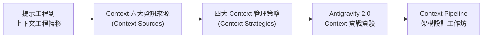
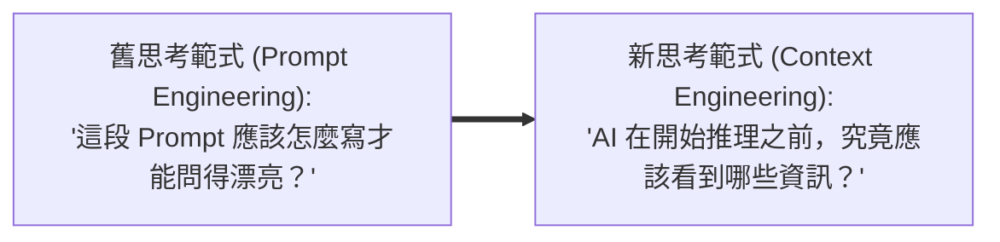
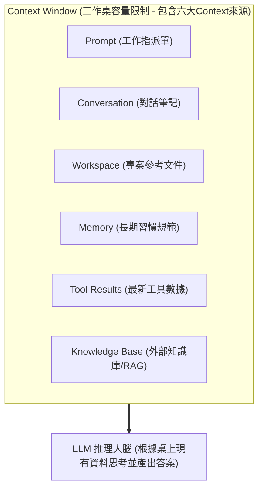
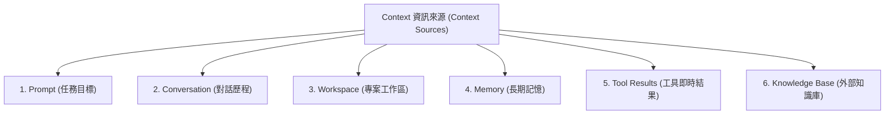
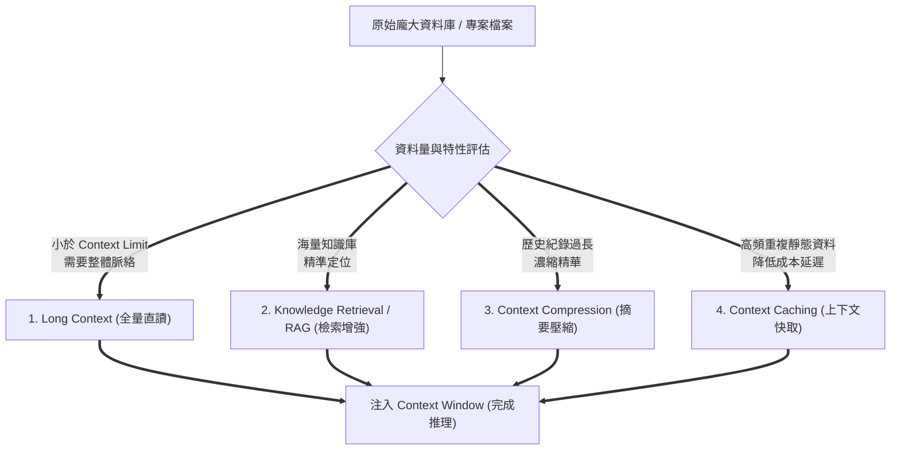
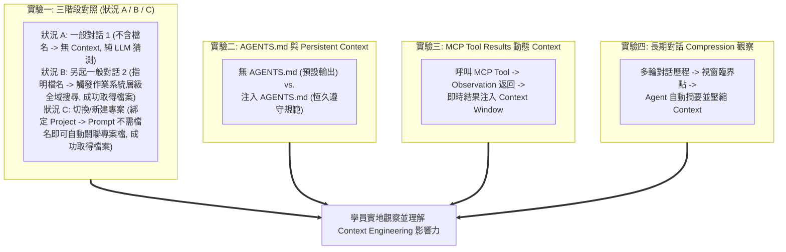
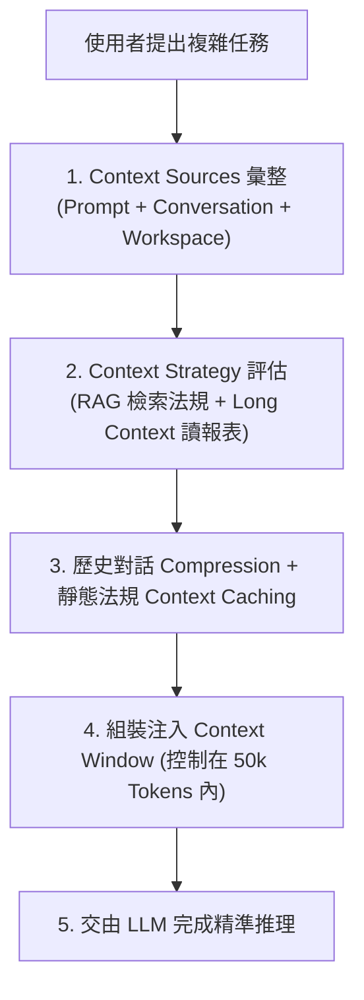
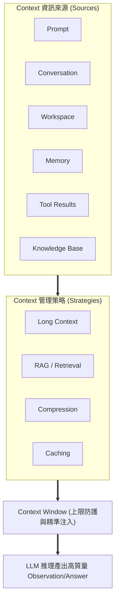

---
puppeteer:
  displayHeaderFooter: true
  headerTemplate: '<div style="font-size: 10px; margin: 0 auto;">第十一章：上下文工程與知識建構：Context Engineering 架構與實務</div>'
  footerTemplate: '<div style="font-size: 10px; margin: 0 auto;">第 <span class="pageNumber"></span> 頁 / 共 <span class="totalPages"></span> 頁</div>'
  margin:
    top: "1.5cm"
    bottom: "1.5cm"
    left: "1.5cm"
    right: "1.5cm"
---
<style>
  h2 {
    page-break-before: always;
  }
</style>
---

# 第十一章：上下文工程與知識建構：Context Engineering 架構與實務

## 課程導讀

在第十章中，我們解構了 **Model Context Protocol（MCP）** 的 USB-C 標準協議架構，實現了 AI Agent 與外部 API、資料庫與本地工具的無限擴充。

然而，當 AI Agent 具備了強大的工具呼叫能力後，一個全新的核心挑戰隨之浮現：如果我們將一本 300 頁的 PDF、數十份 Markdown 講義、一個完整的 Python 專案，以及數十輪的對話紀錄一次性塞給 AI Agent，它真的能夠精準理解並做出正確判斷嗎？為什麼 ChatGPT 或 Claude 有時回答得極其精準，有時卻會遺漏關鍵細節甚至產生幻覺？

過去，許多人直覺認為 AI 的表現完全取決於模型本身的參數大小（Model Size）。然而，包括 Google Cloud、Anthropic 與 LangChain 等頂尖 AI 團隊的研究均指出：**真正決定 AI Agent 推理品質的，往往不是模型本身，而是模型在推理當下究竟看見了哪些資訊！**

大型語言模型並非從其永久記憶中回答問題，而是基於每一次推理時傳入的 **Context（上下文）** 進行思考。因此，AI 應用的開發重鎮正經歷一場深遠的範式轉移（Paradigm Shift）：從早期的 **Prompt Engineering（提示工程）** 演進至現代的 **Context Engineering（上下文工程）**：

> **Context Engineering（上下文工程）＝ AI Agent 的大腦認知架構，決定了 LLM 在推理時「看見什麼、記住什麼、檢索什麼與忽視什麼」，是決定 AI Agent 智慧品質的底層金鑰。**

本章將透徹拆解 **Prompt Engineering 與 Context Engineering 的範式轉移**、**Context 六大資訊來源（Sources）**、**四大 Context 注入與管理策略（Strategies）**，並對照 **Antigravity 2.0 Desktop 的 Project, Workspace, AGENTS.md 與 MCP 實體機制**，培養讀者建構頂尖 AI Agent 認知架構的系統工程能力。



---

## 第一節：從 Prompt Engineering 到 Context Engineering：範式轉移

### 1.1 單一提示詞的瓶頸與範式轉移

在 Generative AI 發展初期，**Prompt Engineering（提示工程）** 被視為最核心的 AI 技能。使用者花費大量時間研究 Prompt 的措辭、角色扮演（Role-Play）、輸出格式與 Chain-of-Thought（思维鏈）步驟。例如：

```text
請以大學生可以理解的方式，介紹什麼是人工智慧，字數約 300 字，最後請整理三個重點。
```

然而，當 AI Agent 開始執行真實世界複雜的工程任務時（例如：擔任 Antigravity 2.0 課程助教、自動審查專案程式碼），一段簡單的 Prompt 很快便顯得力不從心。AI Agent 在推理時需要參考：

- 本學期完整的課程大綱與講義文件
- Workspace 中的專案程式碼與歷史 Markdown 筆記
- 使用者偏好的回覆語言與格式規範
- 先前對話中的決策歷程與 MCP Tool 回傳結果

如果每次提問都必須手動複製所有背景資料至 Prompt 中，不僅操作繁瑣，更會瞬間超出模型的處理上限。因此，核心問題已徹底改變：



| 比較維度 | 提示工程 (Prompt Engineering) | 上下文工程 (Context Engineering) |
| :--- | :--- | :--- |
| **核心目標** | 設計清楚、完整的單次指令文字 | 建立並持續管理模型推理的完整資訊環境 |
| **時間跨度** | 著重於單次問答（Single-shot Prompt） | 著重於長跨度、多輪任務（Multi-turn Workflow） |
| **輸入組成** | 單一的自然語言 Prompt | 整合 Prompt, Conversation, Workspace, Memory, Tools, RAG |
| **適用場景** | 簡單的文字生成、翻譯、單一問題查詢 | 複雜的 AI Agent、自動化工程與企業級應用 |

---

### 1.2 什麼是 Context？LLM 推理的核心工作桌

在大型語言模型中，**Context（上下文）** 指的是模型在開始產生下一個 Token 時，系統傳入給模型的**全部資訊集合**。

#### 工作桌比喻（The Desk Metaphor）：
可將 **Context Window（上下文視窗）** 想像成一張實體工作桌：



- **工作桌很大：** 可以同時攤開許多書籍、程式碼與報告。
- **工作桌很小：** 必須把暫時用不到的資料收起來，否則新的文件放不進去。

---

### 1.3 Lost in the Middle 與 Context 質量守恆原則

許多開發者誤以為「Context Window 越大越好（如 1M~2M Tokens），把所有檔案塞進去就對了」。然而，學界與業界研究顯示：

1. **Lost in the Middle（長文本中段迷失）：** 模型對於長文本的 **開頭（Beginning）** 與 **結尾（End）** 關注度最高，位於中段的細節資訊極易被忽視。
2. **Noise-to-Signal Ratio（噪訊比惡化）：** 傳入過多無關背景資料（Noise），會顯著降低模型的注意力集中度，增加推理延遲與成本，甚至誘發幻覺（Hallucination）。

> **Context 質量守恆原則：**  
> Context Engineering 的目標**絕非追求塞滿 Context Window**，而是在有限的容量限制下，精準提供「最具價值、最適當且最符合當前任務」的資訊。

---

## 第二節：Context 六大資訊來源 (Context Sources) 深度解構

在現代 AI Agent Runtime 中，Context 絕非單一文字，而是由以下 **六大 Context Sources（資訊來源）** 動態組合而成：



---

### 2.1 六大 Context 資訊來源細節拆解

1. **Prompt（任務目標）：**  
   - 使用者當前輸入的自然語言指令（如 *「請幫我修改 hello.py 加入錯誤處理」*）。
   - 屬性為**一次性（Single-shot）**，提供當前 Task 的目標，但不包含背景知識。
2. **Conversation（對話歷程）：**  
   - 當前對話視窗中累積的歷史對話紀錄。
   - 作用是維持**任務的連續性**，讓 Agent 了解前面的推理階段與已完成的工作。
3. **Workspace（專案工作區）：**  
   - 目前綁定專案目錄下的程式碼、Markdown 講義與設定檔。
   - 提供 AI Agent 處理該專案時所需的**領域專屬知識與基礎檔案**。
4. **Memory（長期記憶）：**  
   - 跨對話、長時間保存的使用者偏好、語言習慣與持續性背景（Google Cloud 稱之為 **Semi-persistent Memory**）。
   - 避免每次新建對話時都必須重新交代個人偏好。
5. **Tool Results（工具即時結果）：**  
   - Agent 呼叫 MCP Tool 或本地命令（如 `read_file`, `get_all_tasks`）後回傳的最新數據。
   - 具備高時效性與真實世界狀態（Observation）。
6. **Knowledge Base（外部知識庫）：**  
   - 企業知識庫、大型 PDF 講義、法規資料庫或向量資料庫（Vector DB）。
   - 透過檢索機制（RAG）將最相關的段落動態抽取出並注入 Context。

| Context 資訊來源 | 時效與持久性 | 權限與範疇 Scope | 典型應用範例 |
| :--- | :--- | :--- | :--- |
| **Prompt** | 一次性 (Single-shot) | 當前單一請求 | *「請將本章總結為三個重點」* |
| **Conversation** | 中期 (Session Level) | 當前對話視窗歷史 | 前 5 輪的程式碼重構對話 |
| **Workspace** | 專案級 (Project Scope) | 本地專案資料夾 | `hello.py`, `README.md` |
| **Memory** | 長期 (Cross-session) | 全域使用者偏好 | *「永遠使用繁體中文與 Markdown 輸出」* |
| **Tool Results** | 即時動態 (Real-time) | 外部 API / 系統 state | MCP 傳回的 `tasks.json` 內容 |
| **Knowledge Base** | 靜態大容量 (Enterprise) | 企業全域知識庫 | 300 頁的產品規格書與法規庫 |

---

### 2.2 課堂討論：大學課程助理 AI Agent 的 Context 來源歸類

請與組員討論，判斷下列 6 種資訊最適合歸類為哪一種 Context Source：

| 實務場景資訊 | Prompt | Conversation | Workspace | Memory | Tool Results | Knowledge Base |
| :--- | :---: | :---: | :---: | :---: | :---: | :---: |
| 1. 學生當前輸入的提問：*「什麼是 ReAct？」* | **✓** | | | | | |
| 2. 前三輪關於 Prompt 設計的問答紀錄 | | **✓** | | | | |
| 3. 本專案目錄下的 `Week11_handout.md` | | | **✓** | | | |
| 4. 教師要求的排版偏好：*「程式碼必須附註釋」* | | | | **✓** | | |
| 5. 呼叫 Calendar MCP 取得的今日課表 JSON | | | | | **✓** | |
| 6. 包含全校 4 年課程大綱的 Vector DB 檢索庫 | | | | | | **✓** |

---

## 第三節：Context 注入與管理四大策略 (Context Strategies)

知道了 Context 資訊來源後，下一個核心問題是：**「這些資訊應該如何被送到 LLM 的工作桌上？」** 這正是 **Context Strategies（上下文策略）** 的職責。



---

### 3.1 四大 Context 管理策略深度剖析

#### 1. Long Context（長上下文直讀）：
- **運作機制：** 利用超大 Context Window（如 Gemini 1.5/2.0 的 1M-2M Tokens），直接將整個專案或數萬行程式碼完整傳入。
- **優點：** 保留完整的結構與上下文脈絡，無遺漏風險。
- **適用場景：** 程式碼庫重構（Codebase Refactoring）、整本書籍綜合分析。

#### 2. Knowledge Retrieval / RAG（檢索增強生成）：
- **運作機制：** 「需要時才取得」。先將大量文件切碎（Chunking）並建立向量索引，當提問發生時，先搜尋 Top-K 最相關的段落，再填入 Context。
- **優點：** 節省 Token 成本，突破 Context Window 實體限制。
- **適用場景：** 企業級知識庫搜尋、客服系統、全校法規查詢。

#### 3. Context Compression（上下文壓縮與摘要）：
- **運作機制：** 對於長跨度對話或多次 Tool 執行結果，利用 LLM 將過往細節壓縮為高濃縮摘要（Summarization），替換掉原始的冗長 Token。
- **優點：** 大幅降低 Token 消耗，防止 Context 溢位。
- **適用場景：** 長時間對話歷史管理、複雜 ReAct 軌跡壓縮。

#### 4. Context Caching（上下文快取）：
- **運作機制：** 將固定不變的大型 Context（如系統指令、大型 API 規範）在 LLM 端快取。後續請求只需傳送快取 Hash 引用，無需重複計算 Token。
- **優點：** 顯著降低 API 費用（最高節省 75%）並大幅降低首字延遲（Latency）。
- **適用場景：** 靜態系統提示詞、固定參考規範、多輪大型文件對話。

| Context 策略 | 核心精神 | 優勢與效益 | 潛在限制與成本 |
| :--- | :--- | :--- | :--- |
| **Long Context** | 全部一次直讀 | 完整保留脈絡結構，無搜尋遺漏 | 計算成本高，可能受 Lost in Middle 影響 |
| **Knowledge Retrieval (RAG)** | 需要時再搜尋 | 突破容量上限，極低 Token 成本 | 依賴 Chunk 切割與搜尋精準度 |
| **Context Compression** | 保留重點摘要 | 節省空間，維持長期對話連續 | 抹平部分細節，有資訊損失風險 |
| **Context Caching** | 重複利用快取 | 大幅降低 API 費用與回應延遲 | 僅適用於長時間靜態不變的 Context |

---

## 第四節：課堂實戰：Antigravity 2.0 Desktop 中的 Context 工程實驗與觀察

在瞭解了理論後，我們透過 4 個具體的課堂實驗，利用 **Antigravity 2.0 Desktop** 實地體驗 Context Sources 的動態注入過程與 Context Strategies 的實質影響：



---

### 4.1 實驗一：Workspace 邊界與 Long Context 直讀三階段對照實驗

#### 實驗目的：
透過三種不同的操作情境（狀況 A、狀況 B、狀況 C），實地觀察 Antigravity 2.0 Desktop 在「作業系統層級全域搜尋工具（狀況 B）」與「專案 Workspace 自動關聯（狀況 C）」兩種不同情境下，如何成功取得 `11_context_engineering.md` 講義內容並動態注入為 **Long Context**。

#### 準備工作：
請將講義檔案 `11_context_engineering.md` 複製並儲存到本地的「我的文件」目錄下，建立專屬資料夾路徑：  
`Documents/Context_Engineering_Practice/11_context_engineering.md`

> 💡 **提示重點：** 於下方所有狀況演練中，Prompt 均**不需要加入「請搜尋」**等指令文字，讓 Agent 大腦自動判斷如何解答與呼叫工具！

#### 操作步驟與三階段演練：

1. **狀況 A（一般 Conversation 1 ── Prompt 不含檔名、未開啟專案）：**
   - 開啟 Antigravity Desktop，在一般的 Conversation（未綁定 `Context_Engineering_Practice` 專案）中輸入 Prompt：  
     *「請問『Context 質量守恆原則』的具體定義為何？」*
   - **觀察結果與機制：** 由於 Context Window 中尚無講義 Token，且 Prompt 未提及檔名，LLM 無法獲知專案私有定義，僅能根據預訓練知識給出泛化的推測或表示無法解答。

2. **狀況 B（另起全新 Conversation 2 ── Prompt 指明檔名，未綁定特定專案）：**
   - **操作步驟：** 點選新增對話按鈕，**開啟一個全新的 Conversation 視窗**（務必另起全新對話，避免狀況 A 的歷史對話 Context 產生殘留干擾）。保持在未綁定 `Context_Engineering_Practice` 專案的環境中，輸入 Prompt：  
     *「請問在 `11_context_engineering.md` 中，『Context 質量守恆原則』的具體定義為何？」*
   - **觀察結果與機制（成功取得檔案）：**
     - **OS 層級全域工具搜尋：** Antigravity Desktop 配備了系統級檔案檢索工具（如 `find_by_name` 與 PowerShell `run_command`），支援傳入絕對路徑（如 `C:\Users\<帳號>\Documents`），可直接呼叫作業系統層級的檔案搜尋。
     - **Context 注入：** 畫面顯示 **`Explored`** 成功於全域磁碟中找到 `Documents/Context_Engineering_Practice/11_context_engineering.md`，並發起 **`Analyzed`** (`view_file`) 將內容讀入 Context Window，順利產出精準答覆！

3. **狀況 C（新增/切換 Project ── 綁定 Context_Engineering_Practice 資料夾）：**
   - **操作步驟：** 點選 **New Project**，將專案資料夾設定為：`Documents/Context_Engineering_Practice`。
   - 在該 Project 內新增 Conversation，輸入完全**不帶檔名**的 Prompt：  
     *「請問『Context 質量守恆原則』的具體定義為何？」*
   - **觀察結果與機制（成功取得檔案）：**
     - **專案自動關聯（Workspace Auto-Indexing）：** 注意！此時 Prompt **完全沒有提及 `11_context_engineering.md` 檔名**，但因為目前視窗已綁定至 `Context_Engineering_Practice` 專案，Agent Runtime 會自動將 Workspace 內的檔案納入優先上下文來源。
     - **Long Context 注入：** Agent 自動識別並讀取專案內的講義，將全文注入至 Context Window，無需使用者提供檔名或「請搜尋」指令，便能產出 100% 精準答覆！

> **老師的提醒：狀況 A、B、C 帶給我們的工程啟示**  
> - **狀況 A：** 證實 LLM 推理高度依賴傳入的 Context，缺乏背景 Token 時無法回答專案私有知識。  
> - **狀況 B（必須另起 Conversation）：** 證實 Antigravity 2.0 具備作業系統層級的全域搜尋工具能力（System-level Search），只要 Prompt 中包含了檔案特徵，Agent 便能透過全域路徑成功找到並注入檔案。同時，另起新對話可確保舊的對話 Context 不會產生跨境殘留干擾。  
> - **狀況 C：** 證實 **Project Workspace** 的自動關聯效益：一旦設定好專案資料夾，即便使用者 Prompt **完全不寫檔名**，Agent 大腦依然會自動檢索 Workspace 檔案並注入為 **Long Context**！

---

### 4.2 實驗二：AGENTS.md 與 Persistent System Context 實驗

#### 實驗目的：
驗證放置於 Project 根目錄下的 `AGENTS.md` 如何作為跨對話、恆久生效的 **Persistent System Context**。

#### 操作步驟：

1. **建立專案規則檔：**
   - 在專案根目錄下建立名為 `AGENTS.md` 的檔案，寫入以下規範：

     ```markdown
     # Project AI Agent Rules

     - 語言規範：必須嚴格使用繁體中文答覆。
     - 格式規範：輸出 Markdown 表格時，表頭欄位必須包含粗體與 Emoji（如：【📌 項目】）。
     - 程式碼規範：所有 Python 程式碼必須在開頭加上 `# Author: Antigravity Agent` 註釋。
     ```

2. **發起全新對話演練：**
   - 新建一個 Conversation 視窗（不要在 Prompt 中提及上述規則），直接下達任務：*「請幫我寫一個計算兩數相加的 Python 函式，並用表格整理輸入參數。」*
3. **觀察 Agent 執行細節：**
   - 觀察 Agent 在 `Thought` 推理階段自動載入並閱讀了 `AGENTS.md`。
   - 檢查產出的程式碼開頭是否包含了 `# Author: Antigravity Agent`？
   - 檢查 Markdown 表格的表頭是否自動帶有【📌 項目】格式？
   - **結論：** `AGENTS.md` 成功發揮了 **Persistent System Context** 的約束力，無需使用者每次重複撰寫 Prompt！

---

### 4.3 實驗三：MCP Tool Results 動態 Context 注入實驗

#### 實驗目的：
觀察 Agent 呼叫 MCP Tool 後，回傳的 JSON Observation 如何作為即時 **Tool Results Source** 動態注入 Context Window。

#### 操作步驟：

1. **下達依賴外部工具的任務 Prompt：**
   - 輸入：*「請幫我查詢目前系統中有哪些待辦事項，並統計尚未完成的任務數量。」*
2. **觀察 ReAct 與 Observation 注入歷程：**
   - **Action Phase：** Agent 發起 `Ran` 標籤，透過 stdio 連線呼叫 `task_manager` MCP Server 的 `get_all_tasks()` 工具。
   - **Observation Phase：** MCP Server 執行 Python 代碼，回傳 JSON 字串（如 `[{"id": 1, "title": "...", "completed": false}]`）。
   - **Context Injection：** 此 JSON 數據被 MCP Client 自動包裹並**動態注入當前 Context Window**。
   - **Inference Phase：** LLM 讀取注入的 JSON Observation 後，計算未完成數量並輸出自然語言摘要。

---

### 4.4 實驗四：Context Window 限制與對話摘要（Compression）觀察

#### 實驗目的：
觀察長時間多輪對話中，Agent 如何進行 **Context Compression** 以維持 Context Window 不溢位。

#### 操作步驟：

1. **進行 5~10 輪連續問答與程式修改：**
   - 依次發起：*「建立 hello.py」* ──> *「修改 hello.py 加入輸入姓名」* ──> *「加入年齡判斷」* ──> *「改用 class 封裝」* ──> *「撰寫單元測試」*。
2. **觀察 Context 歷程變化：**
   - 觀察 Agent 在第 6 輪之後，依然能夠準確知道 `hello.py` 目前的最新版本與前幾輪的重構目標。
   - **背後機制：** 當早期歷史 Token 逐漸累積時，Agent Runtime 在背景自動將早期細節進行 **Summarization 壓縮**，保留「核心變更歷程」至 Context 中，精準防止 Context Window 超出容量上限！

---

## 第五節：小組討論與 Context Pipeline 架構設計工作坊

### 5.1 企業級 AI 助理 Context Pipeline 設計

請各小組選擇一個企業應用場景（例如：**企業財務報表審查 Agent** 或 **智慧校園選課諮詢 Agent**），設計其 Context Pipeline：



---

### 5.2 小組實作規劃表

| 設計項目 | 小組架構規劃說明 |
| :--- | :--- |
| **Agent 名稱** | *(例如：Enterprise_Financial_Review_Agent)* |
| **包含哪些 Context Sources？** | *(例如：Prompt, 歷史對話, 財報 Excel, 稅務法規庫, MCP 匯率 Tool)* |
| **選用的 Context Strategies** | *(例如：法規庫採用 RAG，財報採用 Long Context，歷史對話採用 Compression)* |
| **AGENTS.md 規範設計** | *(例如：要求所有財務數字均需標註幣別，重大異常需警示)* |
| **Context Window 控制目標** | *(例如：單次推理控制於 30,000 Tokens 內，確保高精準度與低成本)* |

---

## 本章小結與思考問題

### 核心觀念回顧

1. **Context Engineering 的核心轉移：** 焦點從「如何寫 Prompt」轉移至「推理當下模型應該看到哪些資訊」。
2. **Context 六大來源 (Sources)：** 包含 Prompt, Conversation, Workspace, Memory, Tool Results 與 Knowledge Base。
3. **Context 四大策略 (Strategies)：** 包含 Long Context, Knowledge Retrieval (RAG), Context Compression 與 Context Caching。
4. **Antigravity 2.0 實體映射：** Project 定義邊界、Workspace 提供檔案 Context、AGENTS.md 提供 Persistent 規範、MCP 提供 Tool Results。

---

### Context Engineering 系統整合圖



---

### 本章思考問題

1. **技術思考題：** 為什麼「Context Window 越大」並不等於「AI Agent 越聰明」？請結合 **Lost in the Middle** 與 **噪訊比（Noise-to-Signal Ratio）** 說明 Context Engineering 的重要性。
2. **策略比較題：** 請比較 **Long Context** 與 **RAG** 在處理一個 500 頁技術專案時的優缺點，並說明在何種情況下應混合使用這兩種策略？
3. **架構設計題：** 在 Antigravity 2.0 中，`AGENTS.md` 與單次 `Prompt` 的差異為何？為什麼將長期規範放入 `AGENTS.md` 屬於 Persistent Context 的實踐？
