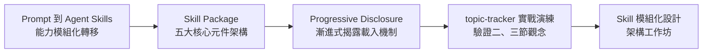
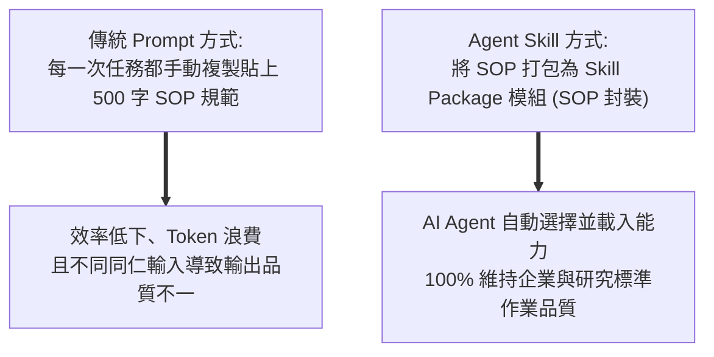
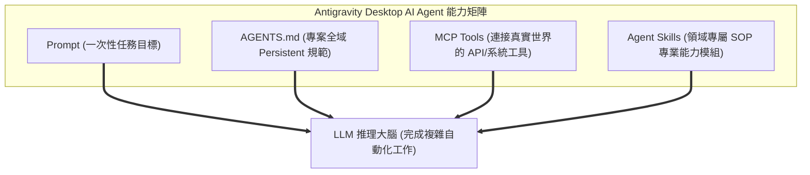
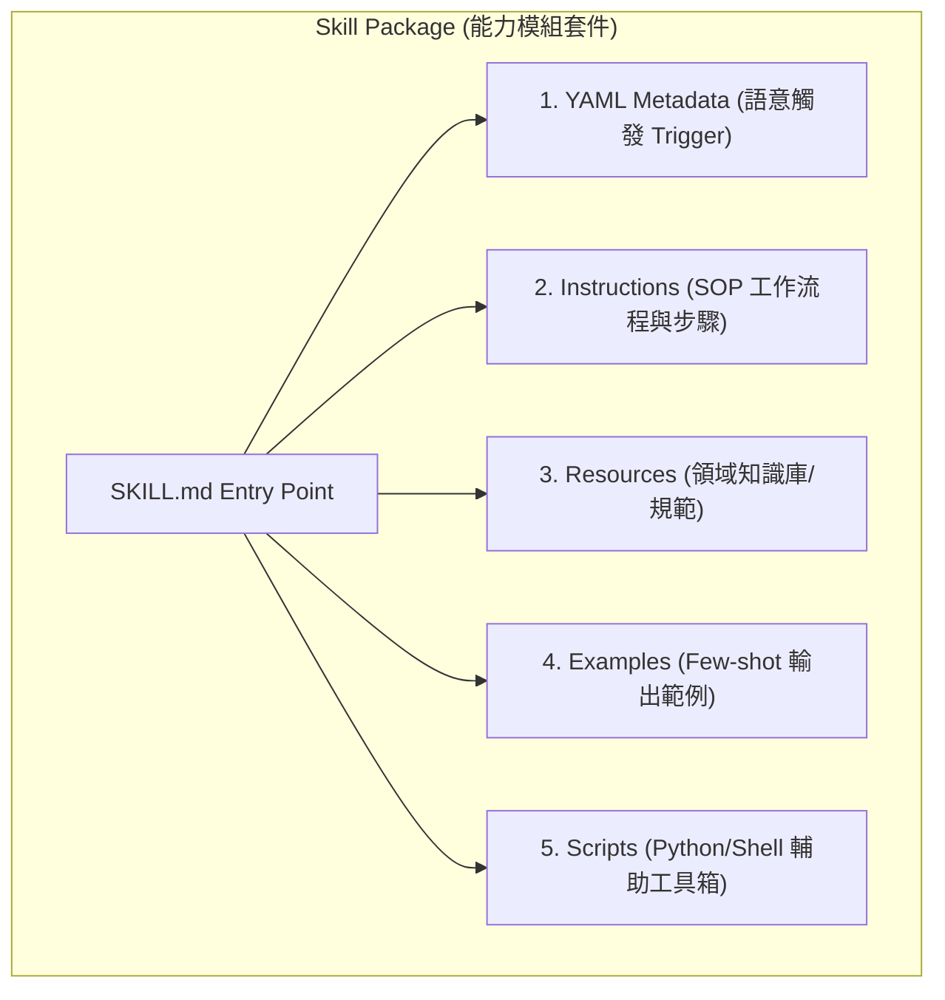
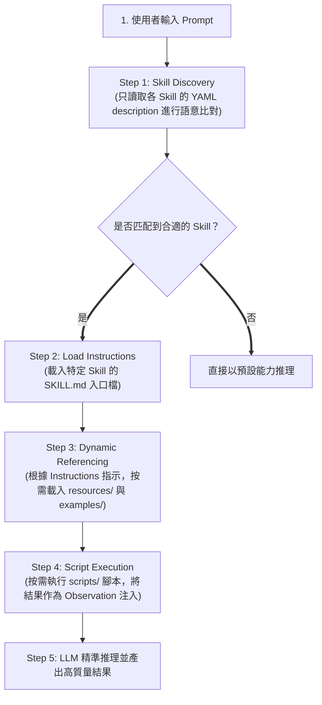
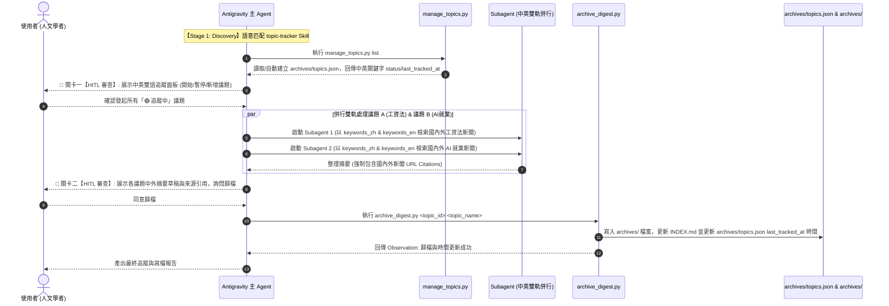
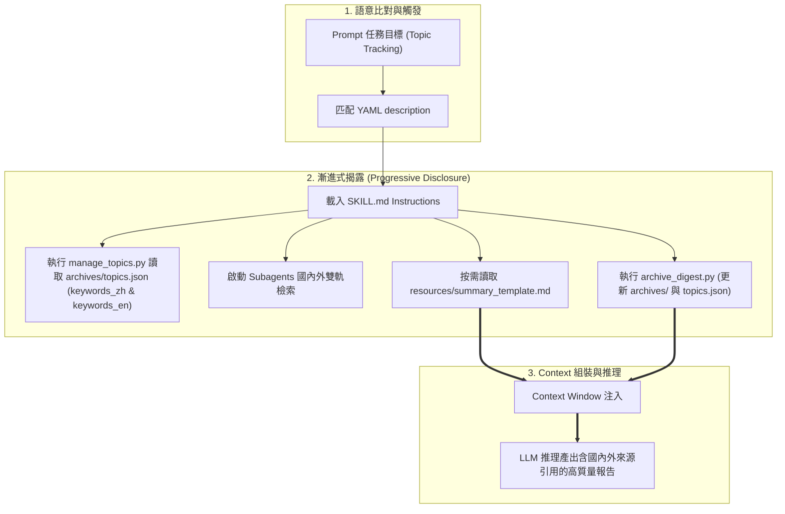

---
puppeteer:
  displayHeaderFooter: true
  headerTemplate: '<div style="font-size: 10px; margin: 0 auto;">第十二章：專業能力模組與封裝：Agent Skills 架構與開發實務</div>'
  footerTemplate: '<div style="font-size: 10px; margin: 0 auto;">第 <span class="pageNumber"></span> 頁 / 共 <span class="totalPages"></span> 頁</div>'
  margin:
    top: "1.5cm"
    bottom: "1.5cm"
    left: "1.5cm"
    right: "1.5cm"
---
<style>
  h2 {
    page-break-before: always;
  }
</style>
---

# 第十二章：專業能力模組與封裝：Agent Skills 架構與開發實務

## 課程導讀

在第十一章中，我們解構了 **Context Engineering（上下文工程）** 的大腦認知架構，學習了如何調控 Context 六大資訊來源（Sources）與四大管理策略（Strategies），確保 LLM 在推理時能精準看見最具價值的資訊。

然而，當我們將專案檔案、記憶與 MCP 工具準備就緒後，在真實企業營運中很快會面臨另一個嚴峻的工程挑戰：**「如果團隊每天都需要 AI Agent 執行相同的標準作業流程（SOP）──例如 Code Review、撰寫 API 文件、產生單元測試或追蹤社會議題，我們難道每次都要手動輸入數百字的詳細 Prompt 嗎？」**

如果每一次任務都要求使用者重新撰寫整套規範與步驟，不僅耗時費力，更會因為不同使用者的描述風格差異，導致 AI Agent 產出的品質忽高忽低。

為了解決「工作流程無法跨任務複用」與「SOP 品質不一致」的痛點，現代 AI Agent 架構引入了 **Agent Skills（專業能力模組）** 機制：

> **Agent Skill（專業能力模組）＝ AI Agent 的標準作業程序（SOP）與可複用知識封裝。它將領域專家經驗、作業流程、知識庫與程式工具打包為模組化套件，讓 AI Agent 具備「自動載入專業能力、精準執行標準流程」的高階認知能力。**

本章將深入解構 **Prompt 到 Agent Skills 的範式轉移**、**Skill Package 五大核心架構元件（YAML Metadata, Instructions, Examples, Resources, Scripts）**、**Progressive Disclosure（漸進式揭露）載入機制**，並以專為人文社會學科設計的 **`topic-tracker`（多議題中英雙語縱向追蹤與 Subagent 併行處理 Skill）** 作為實作貫穿案例，深入驗證第二節與第三節的核心理論觀念。



---

## 第一節：從 Prompt 到 Agent Skills：專業能力的模組化轉移

### 1.1 重複性工作流程的工程挑戰

在企業軟體開發或學術研究場景中，AI Agent 每天都會接收到大量性質相似的任務需求，例如：

- 進行 Python 程式碼審查（Code Review）
- 每日追蹤多個社會重大議題、政策草案或學術概念
- 撰寫 RESTful API 規格文件
- 將課堂筆記整理為正式大學教材

這些任務的特定輸入（如不同的新聞題材或程式碼檔案）雖然每天改變，但其背後的**工作流程（Workflow）與品質標準（Quality Standard）** 卻是完全固定且高度重複的。

如果每次執行多議題追蹤都需要在 Prompt 中重複交代「先讀取議題 JSON 紀錄檔、請我選擇操作、啟動 Subagent 併行中英文檢索、按格式附上國內外來源引用、最後詢問寫檔與更新時間戳記」，這將帶來極大的維護負擔。



---

### 1.2 Prompt vs. Agent Skills 核心差異

許多初學者容易將 Agent Skill 誤認為「比較長的 Prompt」。事實上，兩者在生命週期與職責上存在本質差異：

- **Prompt（任務指令）：** 描述的是 **「這一次任務要完成什麼（What to do today）」**。生命週期極短，隨每次特定需求而動態撰寫。
- **Agent Skill（專業能力）：** 描述的是 **「遇到某一類工作時，應該如何完成它（How to solve this class of problems）」**。生命週期長，可供無數不同的 Prompt 跨對話重複調用。

| 比較維度 | Prompt (任務指令) | Agent Skill (專業能力模組) |
| :--- | :--- | :--- |
| **核心問題** | 「今天這一次要處理哪個檔案？」 | 「這類型的標準作業程序 (SOP) 為何？」 |
| **生命週期** | 單次任務即結束 (Single-shot) | 長期保存，跨任務與跨視窗重複調用 |
| **內容組成** | 當前輸入參數與一次性指示 | YAML 觸發詞、SOP 步驟、範例、知識庫與腳本 |
| **比喻關係** | 主管今天交代的「工作派單」 | 公司的「標準作業程序手冊 (SOP Manual)」 |

---

### 1.3 Antigravity Desktop 的四大能力 Primitive 對比

在 Antigravity Desktop 中，我們學習過 Prompt, AGENTS.md, MCP Tools 與 Agent Skills。這四者共同構成了 AI Agent 的能力矩陣：



| 元素名稱 | 角色定位 | 作用範疇 Scope | 載入時機與機制 |
| :--- | :--- | :--- | :--- |
| **Prompt** | 當前任務目標 | 單次對話輪次 | 使用者即時輸入 |
| **AGENTS.md** | 專案全域通用規範 | 整個 Project 全域 | 開啟 Project 時自動常駐 Context |
| **MCP Tools** | 實體執行與資料讀取工具 | 外部 API / 磁碟系統 | Agent 根據 ReAct 推理發起 `Action` |
| **Agent Skill** | 特定領域 SOP 專業能力包 | 觸發該能力時局部注入 | 語意匹配 YAML description 後動態載入 |

---

## 第二節：Agent Skill 核心定義與五大架構元件

### 2.1 什麼是 Agent Skill Package？

從軟體工程角度看，**Agent Skill 是 AI Agent 能力的模組化封裝（Modularization）**。

一個 Skill 絕非單一 Markdown 檔案，而是一個具備完整結構的**模組資料夾（Skill Package）**。Antigravity 2.0 遵循開放標準，將 Skill 規範為包含 YAML 前言（Frontmatter）、Instructions 指引、Resources 參考文件、Examples 範例與 Scripts 執行腳本的標準目錄。

---

### 2.2 Skill Package 的目錄結構

一個標準的 Skill Package 目錄結構如下所示：

```text
skills/
└── topic-tracker/
    ├── SKILL.md                 # 核心入口：包含 YAML Metadata、雙語多議題 SOP 與 HITL
    ├── resources/               # 靜態知識庫：中英雙語摘要報告模板 (含來源引用)、演變分析指南
    │   ├── summary_template.md
    │   └── trend_analysis_guide.md
    ├── examples/                # Few-shot 示範：雙語單日摘要示範 (含出處 URL)、縱向趨勢報告
    │   ├── daily_summary_example.md
    │   └── longitudinal_analysis_example.md
    └── scripts/                 # 程式工具箱：雙語議題 JSON 讀寫與摘要寫檔歸檔腳本
        ├── manage_topics.py
        └── archive_digest.py
```

---

### 2.3 五大核心元件深度解構



#### 1. YAML Metadata（語意觸發器）：
- 位於 `SKILL.md` 頂部的 Frontmatter。
- 包含了 `name` 與 **`description`**。`description` 是整個 Skill 的靈魂，Agent 透過此處進行**語意比對（Semantic Matching）**，決定是否啟用此 Skill！

#### 2. Instructions（SOP 工作流程）：
- 位於 `SKILL.md` 正文，定義了完成該項專業工作時，AI Agent 必須恪守的思考步驟與品質標準。

#### 3. Resources（領域知識庫）：
- 放置於 `resources/` 資料夾中。提供領域專有名詞表（Glossary）、寫作規範或排版模板。**僅在 Instructions 指示時動態載入 Context**。

#### 4. Examples（Few-shot 示範案例）：
- 放置於 `examples/` 資料夾中。提供高質量的成果範例，利用 Few-shot Learning 讓 LLM 自動擬真排版與寫作風格。

#### 5. Scripts（程式工具箱）：
- 放置於 `scripts/` 資料夾中。包含 Python 或 Shell 腳本，負責執行資料清理、PDF 轉檔、統計計算與 JSON 目錄讀寫等 LLM 不擅長或消耗高 Token 的決定性（Deterministic）任務。

---

## 第三節：Progressive Disclosure（漸進式揭露）與 Context Pipeline 載入機制

如果一個 Agent 系統安裝了 100 個 Skills，若每次提問都將所有 Skills 的完整內容全部載入 Context，Context Window 會瞬間暴增甚至溢位。

為解決此問題，Antigravity 2.0 Desktop 採用了 **Progressive Disclosure（漸進式揭露）** 設計架構：



---

### 3.1 四階段載入 Pipeline 詳細剖析

1. **Stage 1: Discovery（語意匹配）：**  
   - Agent 收到 Prompt 時，**僅讀取所有 Skill 的 YAML `description`**（只消耗極少 Tokens）。透過語意比對尋找最符合當前任務的 Skill。
2. **Stage 2: Instructions Ingestion（載入 SOP 手冊）：**  
   - 匹配成功後，Agent 才將對應的 `SKILL.md` 正文讀入 Context Window。
3. **Stage 3: Dynamic Resource Referencing（動態按需引用）：**  
   - Agent 閱讀 Instructions 後，若發現需要參考 `resources/summary_template.md` 或 `examples/daily_summary_example.md`，才發起讀檔注入 Context。
4. **Stage 4: Script Execution & Observation Injection（執行腳本與 Observation 注入）：**  
   - 若 Instructions 要求維護議題 JSON 紀錄，Agent 呼叫 `scripts/manage_topics.py` 或 `scripts/archive_digest.py` 執行程式，將寫入結果作為 Observation 注入 Context Window。

---

## 第四節：課堂實戰：以多議題『topic-tracker』驗證第二、三節核心觀念

本節我們將以專為人文社會學科設計的 **`topic-tracker`（多議題中英雙語縱向追蹤與 Subagent 併行處理 Skill Package）** 為實作案例，親自拆解並驗證第二節的「五大元件結構」與第三節的「Progressive Disclosure 載入流程」。

---

### 4.1 實作準備：建立獨立專案與 `topic-tracker` 套件目錄

為了確保練習環境乾淨獨立，請在 Antigravity 2.0 Desktop 中**另開一個全新的 Project**，將專案目錄指定在本地「我的文件」下的 `AI_Agent_Practice/Social_Topic` 資料夾：

- **專案路徑：** `Documents/AI_Agent_Practice/Social_Topic`

開啟專案後，請在 `Social_Topic` 專案根目錄下建立 `archives` 與 `skills` 目錄結構：
- **`archives/`**：用於儲存每日議題摘要、全域索引 `INDEX.md`，以及**由 `scripts/manage_topics.py` 自動建立與維護的 `archives/topics.json` 議題紀錄檔（含中英雙語關鍵字）**。
- **`skills/`**：用於存放 `topic-tracker` 等 Agent Skill 模組。

> 💡 **課堂教材發放說明：**  
> 課堂上發放的 `topic-tracker` 練習套件（完整範例檔保存在 `skill_example` 中），請同學依照下列目錄結構建立相對應的子資料夾，並將發放的檔案複製存放到對應的目錄中：

```text
Social_Topic/
├── archives/                                 # 儲存每日議題摘要、全域索引與 topics.json 紀錄檔
│   ├── topics.json                           # 由 manage_topics.py 自動建立與管理的雙語議題紀錄檔
│   ├── INDEX.md                              # 全域索引檔
│   └── YYYY-MM-DD_<topic>.md                 # 各議題每日摘要檔
└── skills/
    └── topic-tracker/
        ├── SKILL.md                          # 第二節元件 1 & 2: YAML + 雙語 SOP + 雙 HITL
        ├── resources/                        # 第二節元件 3: 靜態參考知識 (含中外來源引用規範)
        │   ├── summary_template.md
        │   └── trend_analysis_guide.md
        ├── examples/                         # 第二節元件 4: Few-shot 示範案例 (含中外出處 URL)
        │   ├── daily_summary_example.md
        │   └── longitudinal_analysis_example.md
        └── scripts/                          # 第二節元件 5: 程式工具箱
            ├── manage_topics.py              # 雙語議題 JSON 讀寫與狀態切換腳本
            └── archive_digest.py             # 摘要寫檔歸檔與時間戳記更新腳本
```

---

### 4.2 對照解構：多議題 `topic-tracker` 如何體現第二節的五大元件？

我們將 `topic-tracker` 套件中的各個檔案，與**第二節所學的五大架構元件**進行精準對照：

#### 1. YAML Metadata（語意觸發器）── `SKILL.md` 標頭
```markdown
---
name: topic-tracker
description: >
  Tracks, searches, summarizes, and archives daily news on MULTIPLE social topics using archives/topics.json
  with BILINGUAL (Chinese & English) keyword matrices and Subagent execution with Human-in-the-Loop review.
  Use this skill when the user requests Topic Tracking, 議題追蹤, bilingual news tracking, or topic registry management.
---
```
- **解構說明：** 包含明確的語意觸發詞（`Topic Tracking`, `議題追蹤`, `bilingual news tracking`），使 Agent 能在第一時間比對 Prompt 並決定啟用。

#### 2. Instructions（SOP 工作流程）── `SKILL.md` 正文
```markdown
# Instructions: 多議題中英雙語縱向追蹤與 Subagent 併行處理 SOP

1. **第一階段：讀取議題紀錄檔**（執行 `manage_topics.py list` 讀取 `archives/topics.json` 中英雙語關鍵字）
2. **關卡一【HITL 審查】：** 向使用者展示雙語面板，詢問「開始追蹤」、「暫停/恢復」或「新增議題」。
3. **第二階段：Subagent 中英雙軌併行追蹤**（針對各追蹤議題發起 Subagent，分別以 `keywords_zh` 與 `keywords_en` 檢索國內與國際最新新聞）
4. **第三階段：摘要生成與中外來源標註**（引用 `resources/summary_template.md`，**強制包含國內外新聞 URL**）
5. **關卡二【HITL 審查】：** 展示草稿與中外來源引用，請使用者確認歸檔意願。
6. **第四階段：寫入 archives/ 與更新 JSON**（執行 `scripts/archive_digest.py` 更新 `archives/topics.json` 時間）
```
- **解構說明：** 正文詳細定義了結合 **中英雙語檢索矩陣**、**`archives/topics.json` 多議題管理**、**Subagent 國內外雙軌檢索** 與 **雙重 HITL 審查** 的完整 SOP。

#### 3. Resources（領域知識庫）── `resources/` 資料夾
- **`summary_template.md`**：定義包含「檢索時間區間」、「國內外立場對比」與「強制中外資料來源引用標籤（URL Citations）」的 Markdown 報告模板。
- **`trend_analysis_guide.md`**：提供多議題跨主題分析、跨國論述比較與生命週期框架。
- **解構說明（概念分離原則）：** `resources/` 專門存放**靜態的寫作規範與分析理論**；動態生成的每日歷史檔案與 `topics.json` 議題紀錄檔則歸檔於 **`archives/`** 資料夾中。

#### 4. Examples（Few-shot 示範）── `examples/` 資料夾
- **`daily_summary_example.md`**：提供一份同時包含國內新聞與國際英文報導出處網址（URL Citations）的單日範例報告。
- **`longitudinal_analysis_example.md`**：提供包含 Mermaid 甘特圖的多議題交叉演變報告示範。

#### 5. Scripts（程式工具箱）── `scripts/` 資料夾
- **`manage_topics.py`**：負責自動建立與維護支援中英關鍵字 (`keywords_zh`/`keywords_en`) 的 `archives/topics.json`。
- **`archive_digest.py`**：負責將摘要寫入 `archives/YYYY-MM-DD_<topic>.md`、更新 `archives/INDEX.md`，並將 `archives/topics.json` 中的 `last_tracked_at` 時間同步更新為當前時間。

---

### 4.3 歷程演練：`topic-tracker` 如何體現第三節的四階段 Pipeline 與 Subagent 雙軌併行？

現在我們透過真實對話，觀察 Antigravity Desktop 執行多議題中英雙語 `topic-tracker` 時的完整流程：

#### 觸發 Prompt：
```text
請進行議題追蹤，看看最近有哪些國內外重要動態。
```



#### UI Action Pills 觀察重點：
1. **Stage 1 (Discovery)**：畫面顯示啟用了 `skills/topic-tracker/SKILL.md`。
2. **Stage 2 (Registry & HITL 1)**：標記 `Ran` (`manage_topics.py`) 讀取 `archives/topics.json`，顯示中英雙語面板等待使用者選擇。
3. **Subagent Parallel Execution & Stage 3**：使用者確認後，畫面平行發起 Subagents 分別執行國內外新聞檢索，標記 `Analyzed` (`summary_template.md`) 產出含中外 URL 的草稿，觸發 HITL 2 等待歸檔授權。
4. **Stage 4 (Archiving & JSON Update)**：使用者同意歸檔後，標記 `Ran` (`archive_digest.py`)，同時完成 `archives/` 寫檔與 `archives/topics.json` 的 `last_tracked_at` 時間戳記更新！

---

## 第五節：小組討論與 Skill 模組化架構設計工作坊

### 5.1 企業級 AI Agent Skill 模組設計

請各小組選擇一個實務場景，設計一個標準的 Skill Package 目錄架構與 YAML Metadata：

```text
範例場景選擇：
1. topic-tracker (多議題中英雙語縱向追蹤與 Subagent 併行處理 Skill)
2. python-code-reviewer (自動審查 Python 程式碼安全性與 PEP 8 規範)
3. api-doc-generator (自動掃描 FastAPI 程式碼並產出 OpenAPI 規範文件)
```

---

### 5.2 小組實作規劃表

| 設計項目 | 小組架構規劃說明 |
| :--- | :--- |
| **Skill 名稱 (name)** | *(例如：topic-tracker)* |
| **YAML description 設計** | *(必須包含 Topic Tracking, 議題追蹤, bilingual news tracking, 讀取 archives/topics.json 與 Subagent 觸發詞)* |
| **Instructions 步驟劃分** | *(例如：1. 讀取 JSON 2. HITL 選擇 3. Subagent 雙軌檢索 4. 中外來源引用摘要 5. HITL 歸檔 6. 更新 JSON)* |
| **resources/ 放置內容** | *(例如：summary_template.md, trend_analysis_guide.md)* |
| **scripts/ 放置內容** | *(例如：manage_topics.py, archive_digest.py)* |

---

## 本章小結與思考問題

### 核心觀念回顧

1. **Prompt 到 Agent Skill 的轉移：** Prompt 回答「今天做什麼」，Skill 封裝「這類工作如何做（SOP）」。
2. **Skill Package 五大元件：** YAML Metadata (Trigger), Instructions (`SKILL.md`), Resources (知識庫), Examples (Few-shot), Scripts (程式工具)。
3. **Progressive Disclosure（漸進式揭露）：** 遵循 Discovery -> Load Instructions -> Read Resources -> Run Scripts 4 階段 Pipeline，精準控管 Context Window 消耗。
4. **多議題與 Subagent 架構：** 結合中英雙語檢索矩陣、JSON 狀態持久化與 Subagent 併行處理，展現高級 AI Agent 認知網絡的能力。

---

### Agent Skill 系統整合圖



---

### 本章思考問題

1. **技術思考題：** 為什麼在多議題追蹤場景中，同時設計 `keywords_zh` 與 `keywords_en` 雙語檢索矩陣，比單一語言搜尋能更全面捕捉議題的全球發展與在地政策落差？
2. **架構比較題：** 請說明 Subagent 併行處理多個議題的中英文檢索時，相較於在單一對話視窗中依序處理，在 Context Window 管理與推理品質上有何好處？
3. **設計實作題：** 為什麼在 `summary_template.md` 中強制要求標註國內外資料來源（URL Citations）對於學術研究 Agent 至關重要？
