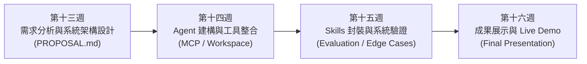
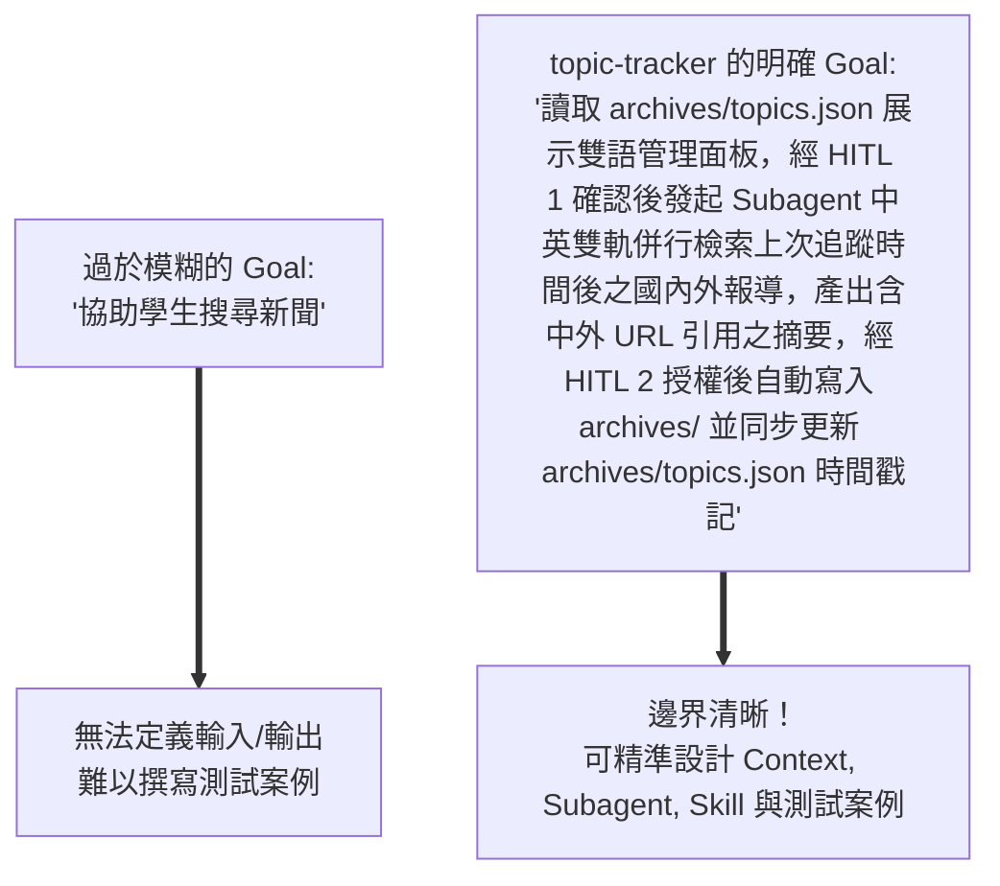
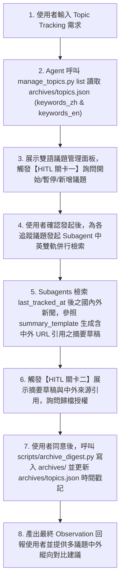
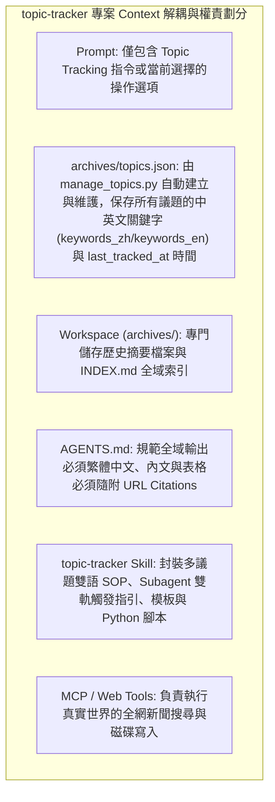
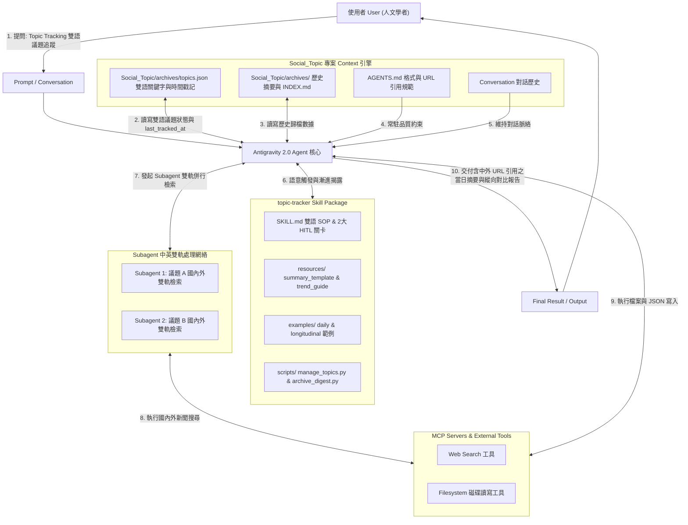
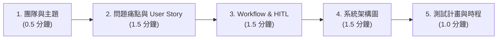

---
puppeteer:
  displayHeaderFooter: true
  headerTemplate: '<div style="font-size: 10px; margin: 0 auto;">第十三章：AI Agent 專案實務（一）：需求分析、系統架構設計與提案</div>'
  footerTemplate: '<div style="font-size: 10px; margin: 0 auto;">第 <span class="pageNumber"></span> 頁 / 共 <span class="totalPages"></span> 頁</div>'
  margin:
    top: "1.5cm"
    bottom: "1.5cm"
    left: "1.5cm"
    right: "1.5cm"
---
<style>
  h2 {
    page-break-before: always;
  }
</style>
---

# 第十三章：AI Agent 專案實務（一）：需求分析、系統架構設計與提案

## 課程導讀

在前面十二週的課程中，我們建立了一套完整的 AI Agent 技術基礎：從 **Prompt Engineering** 的基礎指令撰寫、**Tool Calling** 的動作執行，到 **Model Context Protocol（MCP）** 的標準化工具與資料連線；再進一步解構 **Context Engineering** 的大腦認知架構，以及將領域 SOP 封裝為 **Agent Skills** 的專業能力模組。

從本週開始，課程將邁入最具實戰價值的**學期專案階段（Capstone Project）**。我們將不再以全新的技術概念為主要學習目標，而是將前十二週所學的技術元件融會貫通，實際設計並實作一個具備真實應用價值的 AI Agent 系統。

本學期專案共為期四週，構成一個完整的軟體開發生命週期：



第十三週並不是「開始撰寫程式碼」的一週，而是要回答一個更根本的工程問題：**「我們究竟要讓 AI Agent 幫使用者解決什麼真實問題？這個系統應該如何被架構與設計？」**

為使概念具體化，本章（以及後續第 14、15 週）將全面以第 12 週所升級的 **`topic-tracker`（多議題中英雙語縱向追蹤與 Subagent 併行處理 Agent）** 作為貫穿全課程的實作示範案例！

> **AI Agent 專案設計（System Architecture Design）＝ 從「技術功能展示」邁向「真實問題解決」的架構升華。好的 Agent 系統絕非把多種工具與超長 Prompt 隨意堆疊，而是讓 Prompt, Workspace, AGENTS.md, Skills 與 MCP Tools 各司其職，形成高協同、低耦合的完美認知架構。**

本章將引導各小組定義明確的 **Problem Domain（問題領域）**、拆解 **User Story 與 Agent Workflow**、繪製 **Antigravity 2.0 系統架構圖**，並撰寫標準的 **`PROPOSAL.md`** 專案提案規格書，為後續三週的實作奠定堅實的架構藍圖。

---

## 第一節：從問題邊界開始：AI Agent 專案的 Problem Domain 與 Goal

### 1.1 為什麼「全能 Chatbot」不是一個好的 AI Agent 專案？

在學期專案發想初期，許多同學容易陷入「試圖建立一個全知全能的通用智慧助理」的陷阱。例如：*「我們要打造一個可以回答任何問題、寫程式、排行程又能算帳的超強 AI」*。

然而，在 AI 工程實務中，能力邊界越模糊，需求就越難以被精準定義，系統驗證也越不可能完成。一個看似全能的 Chatbot，通常只是一個掛載了預設提示詞的聊天視窗，缺乏對特定專案背景、歷史脈絡與專業 SOP 的深度掌控力。

相反地，本專案鼓勵採取 **「小而完整（Small & Complete）」** 的設計策略：與其宣稱建立一個能夠處理所有雜務的通用 Chatbot，不如聚焦於一個特定的專業領域，打造一個能夠精準完成完整工作流程的 **Domain-specific AI Agent**（如：多議題中英雙語 `topic-tracker` Agent）。

| 比較維度 | 通用型 AI Chatbot (不建議) | 領域專用 AI Agent (`topic-tracker` 多議題中英雙語案例) |
| :--- | :--- | :--- |
| **目標範疇** | 全知全能，回答任何問題 | 聚焦特定多個社會議題與國內外政策新聞之縱向追蹤 |
| **輸入與 Context** | 僅依賴當前對話輸入 | 整合 `Social_Topic/archives/topics.json` 中英關鍵字、`archives/` 歷史庫與 `AGENTS.md` |
| **工作方法** | 單次 Prompt 推理猜測 | 套用 `topic-tracker` Skill (含 Subagent 中英雙軌併行與 2 個 HITL 審查關卡) |
| **驗證標準** | 難以衡量良莠（主觀感覺） | 能否自動檢索 `last_tracked_at` 後國內外新聞、附帶中外 URL 引用、寫入 `archives/` 並更新 `topics.json` |
| **典型範例** | *「隨喜回答問題的 AI 機器人」* | *「多議題中英雙語縱向脈絡追蹤與 Subagent 歸檔 Agent」* |

---

### 1.2 以 `topic-tracker` 為例定義 Problem Domain 與使用情境

**Problem Domain（問題領域）** 描述的不是「使用了什麼技術」，而是「要解決什麼真實問題」。

- **錯誤的描述（技術導向）：** *「我們這組要使用 Web Search 工具、Subagent 與 Python 腳本。」*（這只是手段，不是問題）
- **錯誤的描述（功能堆疊）：** *「我們要做一個具備搜尋、Subagent 和自動寫檔功能的 AI。」*（這只是規格，不是情境）
- **正確的描述（`topic-tracker` 多議題案例）：**  
  > *「身為人文社會學科的研究者，在進行畢業論文或專題研究時，需要同時每日追蹤多個重要社會議題（如最低工資法修法、生成式 AI 就業影響、社會住宅政策）。然而，手動搜尋各議題最新報導極為耗時，單一中文檢索易遺漏國際觀點與英文文獻，且缺乏精準紀錄上次追蹤時間 (`last_tracked_at`) 與多議題 Subagent 併行處理的資料庫歸檔工具。」*

明確的問題領域能幫我們鎖定**目標使用者（User Persona：人文社會學者與研究生）**與**核心痛點（痛點：多議題手動蒐集耗時、國際視角遺漏、時間區間難以紀錄、缺乏 Subagent 雙軌併行與縱向資料庫）**，讓隨後的技術選型有了正當性。

---

### 1.3 定義 Goal（專案目標）與 Capability Boundary（能力邊界）

當問題領域確定後，下一步是定義 Agent 的 **Goal（目標）** 與 **能力邊界**。

一個合格的 Agent Goal 必須符合 **可觀察（Observable）** 與 **可驗證（Verifiable）** 的原則。



#### 提案前必須明確回答的三個核心問題（以 `topic-tracker` 答覆）：
1. **誰是使用者（Who）？** 人文社會學科研究生與專題學者。
2. **遇到什麼痛點（Problem）？** 需同時追蹤多個議題、新聞繁瑣、國際立場視角易遺漏、缺乏時間區間紀錄與 Subagent 併行歸檔機制。
3. **Agent 最終交付什麼成果（Outcome）？** 在 `archives/topics.json` 中管理中英議題清單，並於 `archives/` 目錄中自動產生含明確國內外資料來源 URL 的 Markdown 摘要檔，更新 `INDEX.md` 與 `last_tracked_at` 時間。

---

## 第二節：從需求到 ReAct 流程：工作流拆解與 Context 解耦設計

### 2.1 將使用者需求轉換為 Agent Workflow

在確定了問題與目標後，我們必須將使用者的高階需求（High-level Request），拆解為 AI Agent 在背景執行的 **Multi-step Agent Workflow（多步驟工作流）**。

假設使用者在對話視窗中輸入簡單的一句話：
```text
請進行議題追蹤，看看最近有哪些國內外重要動態。
```

對人類而言這是一句簡單指令，但對多議題 `topic-tracker` Agent 而言，背後包含了一系列不同性質的子任務、Subagent 雙軌併行處理與 **Human-in-the-Loop（HITL）** 人機審查關卡：



---

### 2.2 不要把所有功能都塞進 Prompt：Context 解耦設計原則

在專案設計中最常見的架構反模式（Anti-pattern），就是 **「超長 Prompt 萬能論」**──把專案規範、歷史紀錄、API 說明與寫作範例全部硬塞進單一 Prompt 中。

這不僅會瞬間引發 **Lost in the Middle（中段迷失）** 與 Token 暴增，更破壞了模組化原則。

好的 AI Agent 架構講求 **Context 解耦（Decoupling）**，以多議題 `topic-tracker` 為例，各 Primitive 權責清晰劃分如下：



---

## 第三節：Antigravity 2.0 AI Agent 系統架構圖與全方位技術串聯

### 3.1 Antigravity 2.0 專案架構解構

本學期前十二週所學的技術元件，並非孤立的工具，而是共同構成了 Antigravity 2.0 Desktop 的全方位認知架構。

Agent 位於整個系統的中央推理核心，向上承接使用者的對話與 Prompt，向左讀取 Workspace、`archives/topics.json` 與 `AGENTS.md` 的常駐 Context，向右選擇適當的 Agent Skill 並啟動 Subagents，向下透過 MCP 與工具連接實體系統。

---

### 3.2 `topic-tracker` 專案全方位系統架構圖

每一組在 `PROPOSAL.md` 中都必須繪製一張屬於自己專案的 **Mermaid 系統架構圖**。以下以多議題中英雙語 `topic-tracker` 為例：



---

### 3.3 架構裁切與適應性原則（Architecture Adaptability）

> **老師的提醒：架構圖並非越複雜越好！**  
> 評分標準絕非看誰畫了最多方塊或使用了最多 MCP Server。以多議題 `topic-tracker` 為例，它精準地使用了 Web Search 與 Filesystem 工具，搭配 `archives/topics.json` 中英雙語關鍵字與 Subagent 併行，便完美實現了目標。**每一個出現在架構圖中的元件，都必須在提案中給出充分的技術正當性理由（Technical Justification）。**

---

## 第四節：前十二週技術實體映射與 PROPOSAL.md 規格書撰寫

### 4.1 技術元素對照矩陣（以多議題中英雙語 `topic-tracker` 專案示範）

在撰寫專案提案時，請對照下表，確認你的專案如何回應 Antigravity 2.0 的各個核心 Primitive：

| 系統 Primitive | 專案設計必須回答的核心問題 | `topic-tracker` 多議題中英雙語專案的具體規劃與實踐 |
| :--- | :--- | :--- |
| **Problem Domain** | 專案要解決什麼真實領域的問題？ | 多項人文社會議題與國內外政策新聞之縱向追蹤、Subagent 雙軌併行與質性歸檔 |
| **Agent Goal** | Agent 完成任務的可驗證產出為何？ | 自動以中英關鍵字檢索 `last_tracked_at` 後新聞，產生含中外 URL 引用之摘要寫入 `archives/` 並更新 `archives/topics.json` |
| **Workspace** | 專案目錄下保存哪些原始與產出檔案？ | 建立 `Social_Topic/archives/` 保存 `topics.json`、歷史檔與索引 |
| **AGENTS.md** | 哪些專案全域規範需要 Agent 恆久遵守？ | 要求回答必須使用繁體中文、內文與表格必須隨附國內外 URL Citations |
| **Agent Skills** | 哪些 SOP 與領域知識值得打包為 Skill？ | 打包 `topic-tracker` 包含 `manage_topics.py`、Subagent 雙軌觸發與 HITL 兩大關卡 |
| **MCP Tools** | Agent 需要連接哪些外部 API 或實體工具？ | 使用 Web Search 工具與 Filesystem 工具 |
| **Evaluation Plan**| 如何驗證 Agent 是否真的完成任務？ | 設計 Happy Path 測試與 2 個 Corner Cases 例外處理 |

---

### 4.2 `PROPOSAL.md` 標準模板與完整實例（以多議題 `topic-tracker` 示範）

完成討論後，各組必須在 Antigravity 2.0 專案根目錄下建立 **`PROPOSAL.md`** 檔案。以下提供以多議題中英雙語 `topic-tracker` 填寫的完整官方範例規格書：

```markdown
# Project Proposal: 多議題中英雙語縱向追蹤與 Subagent 併行處理 Agent (topic-tracker)

## 1. Project Overview (專案概述)
- **專案名稱：** Multi-Topic Bilingual Longitudinal Tracking Agent
- **團隊成員與分工：** 張同學（需求、topics.json 中英雙語與 Skill 設計）、李同學（Subagent 與 MCP 工具腳本整合）

## 2. Problem Domain & Background (問題領域與背景)
- **領域背景：** 人文社會學科研究者在進行專題與畢業論文時，需要同時長期觀察多個社會議題（如最低工資法修法、生成式 AI 就業衝擊、社會住宅政策）。
- **使用者痛點：** 手動每日搜尋多個議題極為耗時，單一中文檢索易遺漏國際視野，無法紀錄上次追蹤時間，且缺乏 Subagent 併行與時間序列資料庫工具。

## 3. Target Users & User Story (目標使用者與 User Story)
- **Target User Persona：** 人文社會學科大學生、研究生與政策研究員。
- **User Story：** 身為一位社會學研究生，我希望輸入 Topic Tracking 後，Agent 能讀取 `archives/topics.json` 中的中英文關鍵字請我選擇操作，對啟用議題發起 Subagent 雙軌檢索 `last_tracked_at` 後之國內外新聞並產出含中外 URL 引用之摘要，經我確認後自動歸檔至 `archives/` 並更新 `archives/topics.json` 時間戳記。

## 4. Agent Goal & Capability Boundary (Agent 目標與能力邊界)
- **Agent Goal：** 管理 `archives/topics.json` 雙語議題清單，經 HITL 1 確認後發起 Subagent 中英雙軌併行檢索，產出含中外 URL 引用之摘要，經 HITL 2 授權後寫入 `archives/YYYY-MM-DD_<topic>.md` 並更新 `archives/topics.json` 的 `last_tracked_at`。
- **能力邊界：** 
  - *In-Scope：* `archives/topics.json` 雙語關鍵字讀寫、HITL 1 議題選擇、Subagent 中英雙軌併行檢索、國內外資料來源 URL 引用、HITL 2 歸檔確認、磁碟寫入與時間戳記更新。
  - *Out-of-Scope：* 不進行即時電視新聞影音剪輯、不取代人類研究者的最終論文寫作。

## 5. Main Workflow & HITL Checkpoints (主要工作流與人機協同)
- **工作流步驟：** 讀取 `archives/topics.json` (中英關鍵字) $\rightarrow$ **【HITL 關卡一】議題管理與執行選擇** $\rightarrow$ 發起 Subagents 中英雙軌併行檢索 $\rightarrow$ 生成含中外 URL 引用之摘要草稿 $\rightarrow$ **【HITL 關卡二】摘要審查與歸檔授權** $\rightarrow$ 執行 `archive_digest.py` 寫檔並更新 `archives/topics.json` 時間。

## 6. System Architecture (系統架構圖)
```mermaid
graph TD
    User[使用者 (人文學者)] -->|Topic Tracking 需求| Prompt[Prompt / Conversation]
    Prompt --> Agent[Antigravity 2.0 Agent 核心]
    Agent <-->|讀寫狀態| TopicsJSON[Social_Topic/archives/topics.json]
    Agent <-->|讀寫檔案| Workspace[Social_Topic/archives/]
    Agent <-->|語意觸發 SOP| Skill[topic-tracker Skill Package]
    Agent <-->|發起雙軌併行處理| Subagents[Subagents 雙軌網絡]
    Subagents <-->|執行國內外新聞搜尋| Tools[Web Search & Filesystem Tools]
    Agent -->|交付當日摘要與索引| Result[Final Result]
```

## 7. Context Design (Context 工程設計)
- **Workspace 檔案規劃：** 建立 `Social_Topic/archives/topics.json` 記錄議題狀態與中英文關鍵字，建立 `Social_Topic/archives/` 保存每日 Markdown 摘要與全域 `INDEX.md`。
- **AGENTS.md 全域規範：** 規範輸出必須使用繁體中文，新聞與立場引用必須隨附國內外 URL Citation。

## 8. Agent Skills Design (Skill 套件設計)
- **Skill 名稱：** `topic-tracker`
- **YAML Description：** Tracks, searches, summarizes, and archives daily news on MULTIPLE social topics using archives/topics.json with BILINGUAL (Chinese & English) keyword matrices and Subagent execution with Human-in-the-Loop review.
- **內部配置：** `SKILL.md` (雙語 SOP+2大 HITL), `resources/summary_template.md` (含中外來源引用), `resources/trend_analysis_guide.md`, `examples/`, `scripts/manage_topics.py`, `scripts/archive_digest.py`.

## 9. MCP Servers & Tools (MCP 與工具整合)
- **採用的 Tools：** Web Search API / Filesystem Tools。
- **正當性說明：** Agent 需要即時擷取全網國內外新聞數據，Subagent 雙軌併行檢索，並將處理後的 Markdown 安全寫入磁碟並更新 `archives/topics.json`。

## 10. Expected Challenges & Risk Mitigation (預期挑戰與備案)
- **挑戰 1：** 英文關鍵字檢索結果過於龐雜。
  - *備案：* 在 `keywords_en` 中加上地域限定詞（如 "Taiwan minimum wage", "HSS employment AI"）精準縮小範疇。
- **挑戰 2：** 英文新聞未提供明確 URL 導致引用缺失。
  - *備案：* 在 `summary_template.md` 與 `SKILL.md` 中強制校驗引用格式，缺失時自動重搜補全。

## 11. Evaluation & Test Plan (驗證與測試計畫)
- **Happy Path 測試：** 輸入「議題追蹤」，順利讀取 `archives/topics.json` 觸發 HITL 1，啟動 Subagent 中英雙軌併行檢索，產出帶有國內外 URL 引用的摘要，於 HITL 2 授權後成功寫入 `archives/` 並更新 `archives/topics.json` 時間戳記。
- **Corner Case 測試：** 當使用者在 HITL 1 選擇新增議題但未填寫英文關鍵字時，Agent 應自動根據中文名稱翻譯補充預設英文關鍵字。

## 12. Project Schedule (4 週開發時程規劃)
- **Week 13：** 完成需求分析、系統架構設計與 `PROPOSAL.md`。
- **Week 14：** 建立 `Social_Topic/` Workspace、`archives/topics.json` 雙語結構、配置 `AGENTS.md` 並測試 Web Search 工具。
- **Week 15：** 完善 `topic-tracker` Skill 套件與 Subagent 雙軌併行邏輯，進行 Happy Path 與 Corner Case 測試。
- **Week 16：** 準備 Live Demo 簡報與專案成果展示。
```

---

## 第五節：專案提案簡報 (6+3 審查) 與小組討論工作坊

### 5.1 提案簡報 5 大核心結構 (6 分鐘簡報 + 3 分鐘 Q&A)

第十三週後半段將進行課堂專案提案簡報。每組簡報時間限制為 **6 分鐘**，並接受 **3 分鐘** 教師與同學的 Q&A 提問。



#### 簡報必備 5 大區塊：
1. **專案定位與分工（0.5 min）：** 專案名稱與成員分工職責。
2. **痛點與 User Story（1.5 mins）：** 目標使用者是誰？遇到什麼痛點？Agent 幫他達成什麼成果？
3. **工作流與 HITL 機制（1.5 mins）：** 說明 Agent 收到需求後的拆解步驟與人類確認關卡。
4. **Mermaid 系統架構圖（1.5 mins）：** 清楚展示 Context, AGENTS.md, Skills, Subagents 與 MCP 的串聯關係。
5. **測試驗證與時程（1.0 min）：** 如何進行 Corner Case 測試？後續三週時程規劃。

---

### 5.2 評審與審查標準 (Evaluation Rubric)

專案提案審查重點不是看「誰堆疊了最多新穎名詞」，而是看**「系統架構是否合理且具備可行性」**：

| 評分維度 | 比重 | 審查重點指標 |
| :--- | :---: | :--- |
| **問題清晰度與範疇** | 25% | 是否有明確的 Problem Domain、User Story 與清晰能力邊界？ |
| **系統架構設計** | 30% | 是否合理串聯 Context, AGENTS.md, Skill, Subagent 與 MCP？無濫用工具？ |
| **工作流與 HITL 邏輯** | 20% | Agent 執行步驟是否合理？是否在關鍵決策點設計人類審查？ |
| **測試與驗證可行性** | 15% | 是否規劃了 Happy Path 與 Corner Case 測試案例？ |
| **簡報與文件完整度** | 10% | 簡報時間掌控（6 分鐘）與 `PROPOSAL.md` 文件規範完整度。 |

---

## 本章小結與思考問題

### 核心觀念回顧

1. **從學習技術邁向設計系統：** 不再問「這個工具怎麼用」，而是問「系統為什麼需要這個元件來解決問題」。
2. **小而完整的專案策略：** 拒絕全能 Chatbot 的幻想，聚焦於特定領域與可驗證的 Agent Goal。
3. **Context 解耦原則：** 避免超長 Prompt，將責任合理分配至 Workspace, `archives/topics.json`, `AGENTS.md`, Skills 與 MCP。
4. **藍圖先行：** `PROPOSAL.md` 與 Mermaid 架構圖是後續三週實作與驗證的唯一指南針。

---

### 本章思考問題

1. **架構思考題：** 為什麼「把所有規則寫在一個超長 Prompt 中」會被視為 AI Agent 架構的反模式（Anti-pattern）？Context 解耦帶來了什麼好處？
2. **設計思考題：** 在你設計的 AI Agent 專案中，哪一個步驟最需要設計 **Human-in-the-Loop（HITL）** 人類確認關卡？為什麼該步驟不能完全交由 AI Agent 自動執行？
3. **驗證思考題：** 如果你的 Agent 在執行過程遇到外部 MCP 工具斷線或讀取到格式破損的檔案，你的系統設計規劃了什麼樣的備案或 Corner Case 處理機制？
