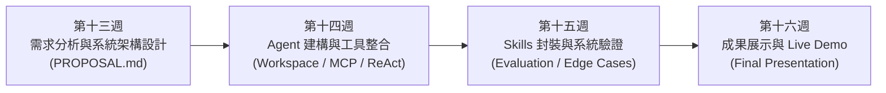
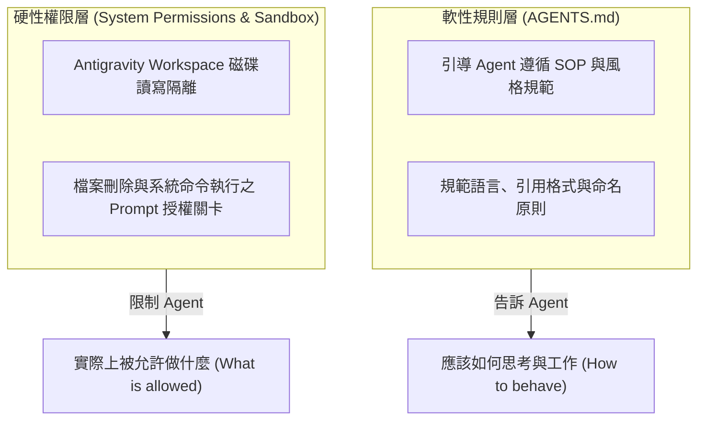
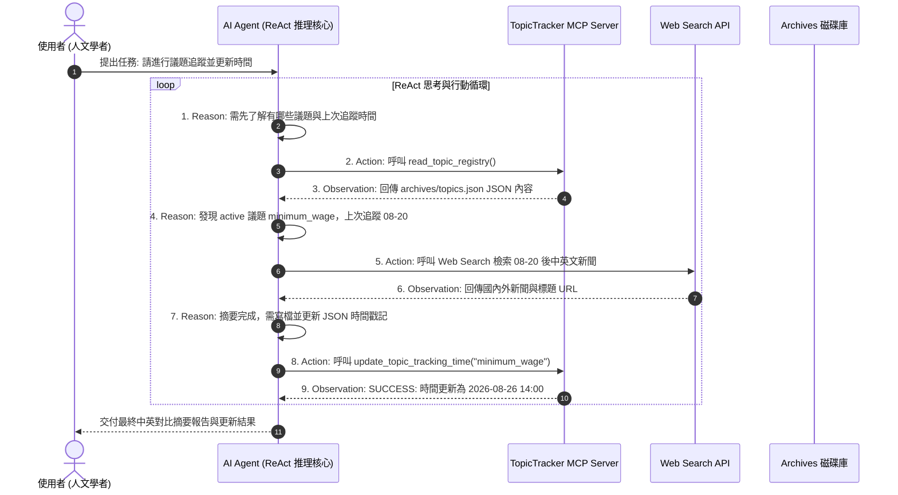
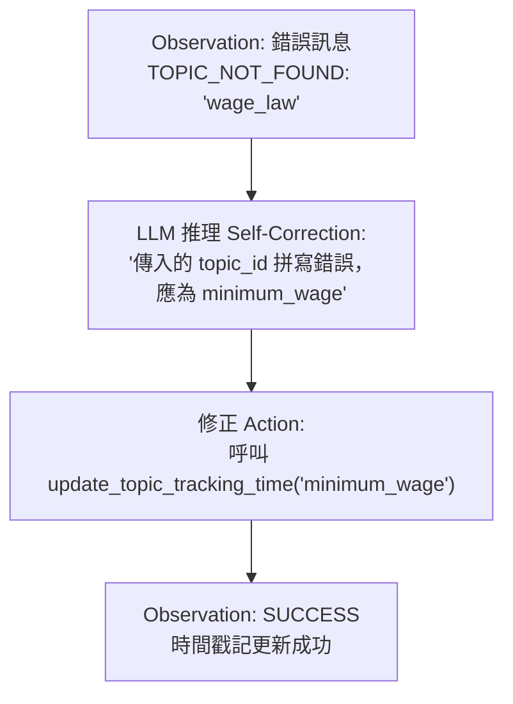
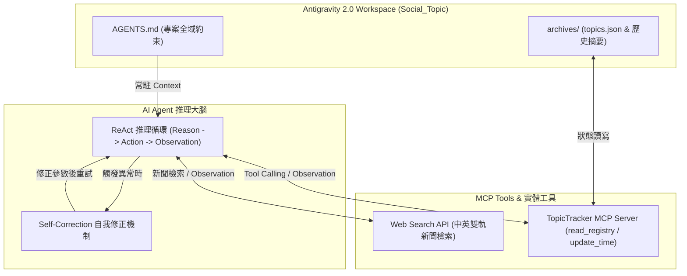

---
puppeteer:
  displayHeaderFooter: true
  headerTemplate: '<div style="font-size: 10px; margin: 0 auto;">第十四章：AI Agent 專案實務（二）：Agent 建構、Workspace 規劃與工具整合</div>'
  footerTemplate: '<div style="font-size: 10px; margin: 0 auto;">第 <span class="pageNumber"></span> 頁 / 共 <span class="totalPages"></span> 頁</div>'
  margin:
    top: "1.5cm"
    bottom: "1.5cm"
    left: "1.5cm"
    right: "1.5cm"
---
<style>
  h2 {
    page-break-before: always;
  }
</style>
---

# 第十四章：AI Agent 專案實務（二）：Agent 建構、Workspace 規劃與工具整合

## 課程導讀

在第十三週的課程中，我們完成了學期專案的第一個重要里程碑：將一個模糊的「想做 AI Agent」概念，轉化為一份結構清晰、包含 **Problem Domain（問題領域）**、**User Story**、**Context 工程規劃** 與 **Antigravity 2.0 Mermaid 系統架構圖** 的 `PROPOSAL.md` 專案提案規格書。

第十三週處理的是「我們要做什麼，以及系統應該如何被設計」；而從本週（第十四週）開始，課程正式邁入**學期專案的實作階段（Capstone Implementation）**。

在接下來的實作中，我們不會把 AI Agent 視為單一的 Python 程式，也不會僅以「模型能否回答問題」作為成功標準。一個真正具有應用價值的 AI Agent 系統，必須同時具備：**適當的專案工作空間（Workspace）**、**長效專案規範（AGENTS.md）**、**能夠操作實體世界的工具（MCP Tools）**，以及**能夠根據工具回傳結果持續調整行動的推理循環（ReAct Loop）**。



本章將圍繞三個彼此連結的核心工程問題展開：
1. **如何建立具備明確邊界的 Workspace 與 Persistent Context (`AGENTS.md`)？**
2. **如何透過 MCP Server 開發專案專屬的自訂 Tool？**
3. **如何讓 AI Agent 在執行任務時形成「Reasoning $\rightarrow$ Action $\rightarrow$ Observation $\rightarrow$ Self-Correction」的 ReAct 推理循環？**

為維持學期專案範例的一貫性，本章將繼續以第 12、13 週的 **`topic-tracker`（多議題中英雙語縱向追蹤與 Subagent 併行處理 Agent）** 作為貫穿全章的實作示範案例！

> **AI Agent 實作（Implementation）＝ 將架構藍圖轉化為可執行的實體認知網絡。好的 Agent 系統不僅要有強大的推理大腦，更需要透過邊界清晰的 Workspace 確保資訊安全，透過語意明確的 MCP Tools 延伸操作能力，並透過 ReAct 推理循環在遭遇錯誤時自主自我修正。**

---

## 第一節：建立專案工作空間 (Workspace) 與 Persistent Context (AGENTS.md)

### 1.1 建立目錄結構：目錄即 Context

在開始編寫任何 MCP Server 或 Python 腳本之前，首先必須建立一個邊界清晰的 **Workspace（專案工作空間）**。這一步看似只是檔案管理，實際上卻直接影響 AI Agent 後續能否正確理解專案背景。

在 Antigravity 2.0 認知架構中，當 AI Agent 面對一個包含程式碼、設定檔、歷史資料與說明文件的專案時，**專案的目錄結構本身就是一種直觀的 Context**。良好的結構可以讓 Agent 迅速判斷哪些檔案屬於靜態規範、哪些屬於動態歸檔資料庫，以及哪些屬於可執行的工具腳本。

沿用第 12、13 週的規範，請在本地 `Documents/AI_Agent_Practice/Social_Topic` 建立如下的標準 Workspace 目錄結構：

```text
Social_Topic/                                 # Antigravity 2.0 Project 根目錄
├── AGENTS.md                                 # Persistent Context: 專案全域行為準則與規範
├── PROPOSAL.md                               # 專案提案規格書
├── archives/                                 # 動態資料庫目錄 (歷史歸檔與狀態持久化)
│   ├── topics.json                           # 由 manage_topics.py 自動建立與管理的雙語議題紀錄檔
│   ├── INDEX.md                              # 歸檔歷史全域索引檔
│   └── YYYY-MM-DD_<topic>.md                 # 各議題每日結構化摘要檔
├── src/                                      # 專案專屬 MCP Server 與核心邏輯
│   └── topic_tracker_mcp.py                  # 自訂 MCP Server 程式碼
├── skills/                                   # Agent Skills 專業能力模組資料夾
│   └── topic-tracker/                        # topic-tracker Skill Package
│       ├── SKILL.md                          # 多議題中英雙語 SOP & 雙重 HITL 關卡
│       ├── resources/                        # summary_template.md & trend_analysis_guide.md
│       ├── examples/                         # daily_summary_example.md & longitudinal_analysis_example.md
│       └── scripts/                          # manage_topics.py & archive_digest.py
├── docs/                                     # 系統設計文件與 API 紀錄
└── tests/                                    # 專案測試案例與驗證腳本
```

---

### 1.2 設計 Persistent Context (`AGENTS.md`)

在前第十一章的 Context Engineering 中，我們學習到 Persistent Context 的目的不是保存所有臨時對話，而是**保存那些在未來多次任務中仍然具備長期價值的規則與約束**。

在 `Social_Topic` 專案根目錄下建立 `AGENTS.md`，作為專案層級的工作規範手冊。針對 `topic-tracker` 專案，我們可以定義如下的高品質規範：

```markdown
# Social_Topic 專案：AI Agent 全域工作準則 (AGENTS.md)

## 一、 專案角色與定位
你是「社會議題與政策縱向追蹤 Agent (topic-tracker)」的開發與執行助手，專門協助人文社會學科研究者進行多議題、中英雙語的新聞檢索、摘要整理與時間序列歸檔。

## 二、 語言與文件輸出規範
- **語言限制：** 對話與產出之所有 Markdown 報告必須使用繁體中文（Traditional Chinese）。
- **來源引用標註（URL Citations）：** 每一條報導動態、學者觀點或政策主張，內文與表格中必須附帶明確的資料來源連結（格式：`[媒體名稱/標題](URL)`）。
- **文件格式：** Markdown 檔案必須維持清晰的標題階層（`#`, `##`, `###`），表格必須對齊。

## 三、 檔案與資料庫操作安全
- **歸檔邊界：** 所有動態生成的歷史摘要檔必須寫入 `archives/` 目錄，禁止隨意修改或刪除專案根目錄下的原始程式。
- **JSON 狀態維護：** 更新 `archives/topics.json` 時，必須確保 `topic_id` 不重複，且 `last_tracked_at` 使用 ISO 8601 時間格式 (`YYYY-MM-DD HH:MM:SS`)。

## 四、 MCP 工具使用規範
- 呼叫自訂 MCP Server 工具時，必須傳入合法的參數型態。
- 遇工具回傳錯誤（如網路超時或 JSON 解析失敗）時，應根據錯誤訊息進行 Self-Correction，不可吞掉異常。
```

> **老師的提醒：** 將規則寫入 `AGENTS.md` 能避免每次對話都重複交代「使用繁體中文」、「必須隨附 URL Citation」等基礎要求，極大地節省了 Context Window 並維持輸出品質的一致性。

---

### 1.3 自然語言規則 (`AGENTS.md`) vs. 系統實體權限 (Permissions)

在 AI Agent 系統設計中，必須清晰區分**「提示規則」**與**「實體權限」**的界線：



`AGENTS.md` 屬於**軟性規範**，回答的是「Agent 應該如何工作」；而 Antigravity Desktop 的 **Workspace Permissions** 則屬於**硬性邊界**，回答的是「Agent 實體上被允許存取哪些目錄與工具」。嚴密的 AI Agent 系統必須同時具備這兩層防護。

---

## 第二節：開發專案專屬 MCP Server 與自訂 Tool

### 2.1 為什麼需要開發專案專屬的 MCP Server？

雖然 Antigravity 2.0 內建了通用的 Filesystem 與 Web Search 工具，但在許多專業專案中，我們需要針對特定業務邏輯封裝**高階操作介面（High-level Operations）**。

例如，在 `topic-tracker` 專案中，與其讓 Agent 每次都手動編寫複雜的 Python 程式去剖析 `archives/topics.json`，不如透過 FastMCP SDK 封裝一個專屬的 `TopicTrackerMCPServer`，將「查詢議題狀態」、「檢查檢索區間」與「寫入歸檔」包裝為專屬 MCP Tools！

---

### 2.2 使用 FastMCP 實作 `topic_tracker_mcp.py`

在 `src/topic_tracker_mcp.py` 中，我們使用 FastMCP 建立專屬的 MCP Server 實例：

```python
import os
import json
import datetime
from mcp.server.fastmcp import FastMCP

# 初始化 MCP Server
mcp = FastMCP("SocialTopicTrackerServer")

DEFAULT_JSON_PATH = os.path.join("archives", "topics.json")

@mcp.tool()
def read_topic_registry(json_path: str = DEFAULT_JSON_PATH) -> str:
    """
    讀取 archives/topics.json 議題紀錄檔，傳回所有登錄議題的 ID、名稱、中英文關鍵字、追蹤狀態與上次追蹤時間。

    Args:
        json_path: 議題 JSON 紀錄檔的相對路徑，預設為 archives/topics.json。
    """
    if not os.path.exists(json_path):
        return f"ERROR: 找不到議題紀錄檔 [{json_path}]，請先確認專案 archives/ 目錄結構。"
    
    try:
        with open(json_path, 'r', encoding='utf-8') as f:
            data = json.load(f)
        return json.dumps(data, ensure_ascii=False, indent=2)
    except Exception as e:
        return f"ERROR: 解析 topics.json 失敗: {str(e)}"

@mcp.tool()
def update_topic_tracking_time(topic_id: str, json_path: str = DEFAULT_JSON_PATH) -> str:
    """
    當議題完成新聞追蹤與歸檔後，更新指定 topic_id 在 archives/topics.json 中的 last_tracked_at 時間戳記為當前時間。

    Args:
        topic_id: 議題的不重複識別碼 (例如: minimum_wage, genai_hss)。
        json_path: 議題 JSON 紀錄檔路徑。
    """
    if not os.path.exists(json_path):
        return f"ERROR: 找不到議題紀錄檔 [{json_path}]。"
    
    try:
        with open(json_path, 'r', encoding='utf-8') as f:
            data = json.load(f)
        
        now_str = datetime.datetime.now().strftime("%Y-%m-%d %H:%M:%S")
        updated = False
        for t in data.get("topics", []):
            if t.get("topic_id") == topic_id:
                t["last_tracked_at"] = now_str
                updated = True
                break
        
        if updated:
            with open(json_path, 'w', encoding='utf-8') as f:
                json.dump(data, f, ensure_ascii=False, indent=2)
            return f"SUCCESS: 議題 [{topic_id}] 的 last_tracked_at 已成功更新為 {now_str}。"
        else:
            return f"ERROR: 找不到 ID 為 [{topic_id}] 的議題。"
    except Exception as e:
        return f"ERROR: 更新時間戳記失敗: {str(e)}"

if __name__ == "__main__":
    mcp.run(transport="stdio")
```

---

### 2.3 語意化工具設計（Semantic Tool Design）

在 MCP 開發中，最常見的錯誤是把工具參數寫得極為抽象（如 `def run_task(a: str, b: str)`）。

LLM 進行 **Tool Selection（工具選擇）** 時，完全依賴工具的 **函數名稱（Function Name）**、**參數型態提示（Type Hints）** 與 **文件說明（Docstring）**。因此：

- **好設計：** `read_topic_registry(json_path: str)` 搭配詳細的 Docstring，清楚告知模型此工具能取得 `keywords_zh`, `keywords_en` 與 `last_tracked_at`。
- **壞設計：** `get_data(x: str)` 且無 Docstring，模型無法判定此工具與 `topics.json` 有何關聯，導致 Tool Selection 失敗。

---

### 2.4 Antigravity MCP 設定與註冊 (`mcp_config.json`)

完成 MCP Server 寫作後，需將其註冊至 Antigravity Desktop 的設定檔中。

在 Windows 環境下，設定檔位於 `C:\Users\<Username>\.gemini\config\mcp_config.json`：

```json
{
  "mcpServers": {
    "social_topic_tracker": {
      "command": "python",
      "args": [
        "C:/Users/Leo/Documents/AI_Agent_Practice/Social_Topic/src/topic_tracker_mcp.py"
      ]
    }
  }
}
```

註冊後重載 MCP 設定，AI Agent 即可在工具清單中識別 `read_topic_registry` 與 `update_topic_tracking_time` 兩個自訂 Tools！

---

## 第三節：從 Tool Calling 到 ReAct 推理循環

### 3.1 Tool Calling vs. 多步驟 ReAct 思考循環

單純的 Tool Calling 只是一次性的「發起請求 $\rightarrow$ 回傳結果」；而一個真正的 AI Agent 系統，必須具備在多個步驟之間持續獲取資訊、執行行動、觀察 Observation，並決定下一步的 **ReAct（Reason $\rightarrow$ Action $\rightarrow$ Observation）思考循環**。



---

### 3.2 Observation 的品質與資訊回饋圈

在 ReAct 循環中，**Observation 是下一輪推理的唯一依據**。

如果 MCP Tool 僅回傳 `OK` 或 `True`，Agent 大腦將無法得知詳細的執行狀態；相反地，若 Tool 回傳如 `SUCCESS: 議題 [minimum_wage] 的 last_tracked_at 已成功更新為 2026-08-26 14:00:00`，Agent 便能獲得明確的成功證據，順利結束任務。

---

## 第四節：錯誤處理、自我修正 (Self-Correction) 與 Stop Condition

### 4.1 設計具備修復資訊的 MCP 錯誤回應

一個健全的 AI Agent 系統必須假設「錯誤隨時會發生」（如傳入不存在的 `topic_id` 或網路搜尋逾時）。

當 MCP Tool 發生例外時，不應直接拋出 Unhandled Exception 導致程式崩潰，而應回傳包含**錯誤原因與修正建議**的結構化 Observation：

```python
# MCP 錯誤回傳範例
{
  "status": "error",
  "error_code": "TOPIC_NOT_FOUND",
  "message": "找不到 ID 為 [unknown_topic] 的議題。",
  "suggestion": "請先呼叫 read_topic_registry() 確認 archives/topics.json 中現有的合法 topic_id 清單。"
}
```

---

### 4.2 ReAct 自我修正 (Self-Correction) 演練

當 Agent 接收到上述錯誤 Observation 時，推理大腦會觸發 **Self-Correction 流程**：



---

### 4.3 終止條件 (Stop Condition) 與循環邊界

自主性必須伴隨明確的控制。若未設定**終止條件（Stop Condition）**，Agent 在面對持續失敗的 Tool 時可能陷入無限重試迴圈（Infinite Loop）。

在 Antigravity 2.0 系統中，我們應設計雙重終止條件：
1. **最大迭代次數限制 (Max Iterations)：** 限制單次任務最高執行步驟數（如 `max_iterations = 10`）。
2. **明確完成條件 (Explicit Goal Completion)：** 當 `archives/` 寫檔完成且 `topics.json` 時間戳記成功更新後，Agent 必須主動停止 Tool Calling，向使用者輸出結案報告。

---

## 第五節：Milestone 1 Prototype 整合驗證與測試工作坊

### 5.1 實作驗證活動：`topic-tracker` 基礎原型測試

請各小組在 `Social_Topic` 專案環境中，執行第一次 Prototype 整合測試：

#### 測試 Prompt：
```text
請讀取 archives/topics.json 中的議題清單，
確認目前處於追蹤中狀態的議題，
為「minimum_wage」議題檢索最新新聞，
並在歸檔後將其 last_tracked_at 時間更新為當前時間。
```

---

### 5.2 Milestone 1 檢核清單 (Checklist)

在第十四週結束前，請各小組對照下表完成 **Milestone 1 基礎原型檢核**：

| 檢核項目 | 狀態 | 驗證指標 / 觀察重點 |
| :--- | :---: | :--- |
| **1. Workspace 結構建立** | `[ ]` | `Social_Topic/` 目錄包含 `archives/`, `src/`, `skills/` 等正確結構。 |
| **2. AGENTS.md 配置** | `[ ]` | 包含繁體中文、URL Citation 與 JSON 寫檔安全約束。 |
| **3. MCP Server 開發** | `[ ]` | `src/topic_tracker_mcp.py` 成功實作並具備明確 Docstrings。 |
| **4. MCP 設定註冊** | `[ ]` | `mcp_config.json` 成功註冊並經 Antigravity Desktop 重載識別。 |
| **5. Tool Selection 驗證** | `[ ]` | Agent 能根據 Prompt 自動選擇 `read_topic_registry` 工具。 |
| **6. ReAct 循環觀察** | `[ ]` | 觀察到 Agent 執行 Action 並接收 Observation 進行下一輪推理。 |
| **7. 雙語檢索與 Citation** | `[ ]` | 檢索包含中英文關鍵字，產出草稿包含明確資料出處 URL。 |
| **8. Self-Correction 測試** | `[ ]` | 傳入錯誤 `topic_id` 時，Agent 能根據錯誤 Observation 自行修正參數。 |
| **9. JSON 時間戳記更新** | `[ ]` | `archives/topics.json` 中的 `last_tracked_at` 成功寫入當前時間。 |
| **10. Stop Condition 生效** | `[ ]` | 任務完成後 Agent 主動停止 Tool Calling，無無限迴圈現象。 |
| **11. 設計文件同步** | `[ ]` | 將實作發現之差異與問題記錄回 `PROPOSAL.md`。 |

---

## 本章小結與思考問題

### 核心觀念回顧

1. **Workspace 與 AGENTS.md：** 目錄結構即 Context，`AGENTS.md` 提供專案層級的長效行為規範，與實體權限防護互相配合。
2. **語意化 MCP Tools：** MCP 介面是給 LLM 閱讀與選擇的，精準的函數名稱、型別提示與 Docstring 是 Tool Selection 成功的關鍵。
3. **ReAct 推理循環：** 透過 Reason $\rightarrow$ Action $\rightarrow$ Observation 的多輪互動，讓 Agent 具備完成複雜自動化工作流程的能力。
4. **Self-Correction 與 Stop Condition：** 高質量的 Observation 訊息是 Agent 進行自我修復的基礎，而適當的終止條件則是防範無限循環的安全閥。

---

### AI Agent 系統整合架構圖



---

### 本章思考問題

1. **架構思考題：** 為什麼在設計專屬 MCP Tool 時，提供詳細的 Docstring 與明確的參數型態提示（Type Hints），對於 Agent 的 Tool Selection 成功率至關重要？
2. **自我修正題：** 當 MCP Tool 執行失敗時，如果 Tool 只回傳 `ERROR`，與回傳 `ERROR: 找不到 ID 為 [wage] 的議題，合法 ID 為 [minimum_wage]`，這兩種 Observation 對 Agent 的 Self-Correction 能力有何影響？
3. **安全與控制題：** 請說明在長流程 AI Agent 專案中，設定 `max_iterations` 終止條件對於防止 Token 浪費與系統死鎖的重要性。
