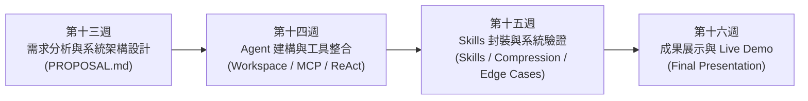
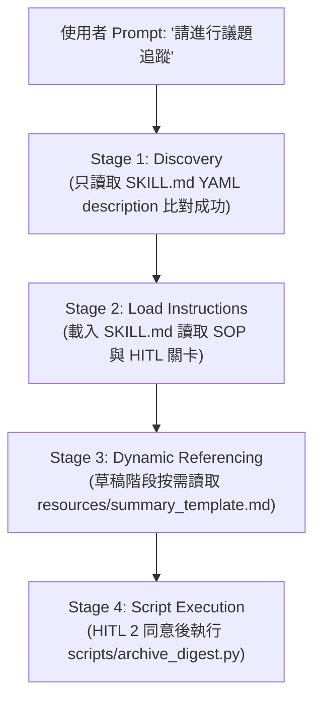
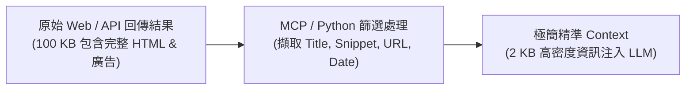
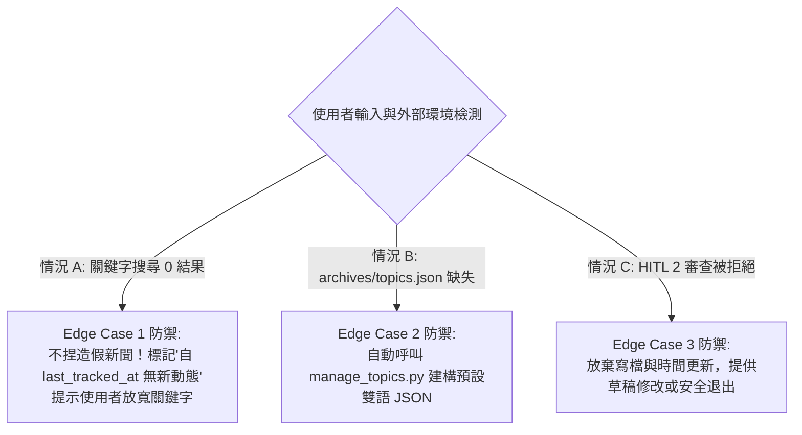
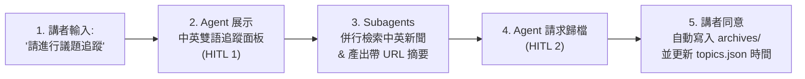
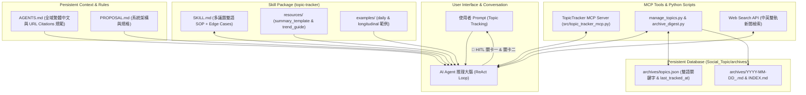

---
puppeteer:
  displayHeaderFooter: true
  headerTemplate: '<div style="font-size: 10px; margin: 0 auto;">第十五章：AI Agent 專案實務（三）：Skills 封裝、Context 優化與系統穩健性</div>'
  footerTemplate: '<div style="font-size: 10px; margin: 0 auto;">第 <span class="pageNumber"></span> 頁 / 共 <span class="totalPages"></span> 頁</div>'
  margin:
    top: "1.5cm"
    bottom: "1.5cm"
    left: "1.5cm"
    right: "1.5cm"
---
<style>
  h2 {
    page-break-before: always;
  }
</style>
---

# 第十五章：AI Agent 專案實務（三）：Skills 封裝、Context 優化與系統穩健性

## 課程導讀

在第十四週的課程中，我們完成了學期專案實作的第一階段：建立專案工作空間（Workspace `Social_Topic/`）、配置全域專案規範（`AGENTS.md`）、使用 FastMCP 開發自訂 MCP Server（`src/topic_tracker_mcp.py`），並透過 **ReAct 思考循環（Reasoning $\rightarrow$ Action $\rightarrow$ Observation）** 讓 Agent 能自動讀取與更新 `archives/topics.json`。

然而，當一個 AI Agent 從「能夠執行單次命令的原型（Prototype）」邁向「能夠穩定完成複雜任務的系統（Production System）」時，工程上的問題也會逐漸浮現：

- 如果每次任務都需要在 Prompt 中重新解釋複雜的工作流程與寫作格式，系統將極難維護；
- 如果每次都將整座歷史檔案庫直接塞進 Context Window，模型不僅容易引發 **Lost in the Middle（中段迷失）**，更會暴增 Token 成本；
- 如果使用者提供模糊指令、外部 Web 工具查無結果，或使用者在審查時拒絕歸檔，Agent 是否具備足夠的 **系統穩健性（System Robustness）** 安全停止或修正？



本章（第十五週）的目的並非增加全新工具，而是處理 AI Agent 系統的 **「工程化與硬化（Engineering & Hardening）」** ：
1. **將專案領域 SOP 封裝為標準 Agent Skill Package**；
2. **調控與優化 Context Window（檢索、壓縮與快取）**；
3. **進行邊界例外測試（Edge Cases & Robustness Testing）與寫入 Stop Condition**；
4. **完成 Milestone 2 階段性檢核，籌備第十六週的 Live Demo 展示。**

本章將繼續以 **`topic-tracker`（多議題中英雙語縱向追蹤與 Subagent 併行處理 Agent）** 作為貫穿全章的實作示範案例！

> **AI Agent 系統工程化（System Hardening）＝ 從「可運作的原型」邁向「可被信任的可靠系統」。好的 Agent 系統不僅要能在理想狀態下完成 Happy Path 任務，更必須在遭遇模糊輸入、工具失敗或使用者撤回授權時，展現出高度可預測的安全性與自我修復能力。**

---

## 第一節：Agent Skills 封裝：將工作 SOP 模組化與漸進式揭露

### 1.1 從散落 Prompt 走向 Skill 模組化封裝

在第十四週的實作中，我們的 Agent 已經具備呼叫 MCP 工具的能力。然而，如果換一位使用者，他可能不知道該如何下達精準的檢索語法、不知道要要求中英雙語關鍵字、更不知道要要求產出帶有 URL 引用連結的 Markdown 報告。

如果專業知識與作業流程散落在對話歷史或使用者的 Prompt 中，Agent 的產出品質就會因人而異。

為了解決此痛點，我們必須將 `topic-tracker` 的完整工作流程打包為標準的 **Skill Package（專業能力模組）**，存放在 `Social_Topic/skills/topic-tracker/` 資料夾中：

```text
Social_Topic/skills/topic-tracker/
├── SKILL.md                          # 核心入口：YAML Metadata + 多議題雙語 SOP + 雙 HITL 關卡
├── resources/                        # 靜態知識庫
│   ├── summary_template.md           # 雙語摘要報告模板 (含中外 URL 引用規範)
│   └── trend_analysis_guide.md       # 縱向演變與跨議題比較指南
├── examples/                         # Few-shot 示範案例
│   ├── daily_summary_example.md      # 單日中英對比摘要範例
│   └── longitudinal_analysis_example.md # 縱向甘特圖報告範例
└── scripts/                          # 程式工具箱 (SSOT 核心)
    ├── manage_topics.py              # 議題 JSON 讀寫與 CRUD 腳本
    └── archive_digest.py             # 摘要寫檔與時間戳記更新腳本
```

---

### 1.2 精修 `SKILL.md` YAML Metadata 與 Instructions

`SKILL.md` 是 Agent 進入此能力模組的入口。其中 **YAML Metadata 的 `description`** 必須提供充足的語意線索，讓 LLM 推理大腦在 **Stage 1 (Discovery)** 階段能精準匹配：

```yaml
---
name: topic-tracker
description: >
  Tracks, searches, summarizes, and archives daily news on MULTIPLE social topics using archives/topics.json
  with BILINGUAL (Chinese & English) keyword matrices, Subagent execution, Edge Case handling, and Human-in-the-Loop review.
  Use this skill when the user requests Topic Tracking, 議題追蹤, bilingual news tracking, or topic registry management.
---
```

在正文中，我們明確規範 4 階段 SOP 步驟、雙重 HITL 關卡與引用 `resources/` 的時機：

```markdown
# Instructions: 多議題中英雙語縱向追蹤 SOP

1. **第一階段 (Read Registry)：** 呼叫 MCP `read_topic_registry()` 或執行 `scripts/manage_topics.py list` 讀取 `archives/topics.json`。
2. **🛑 關卡一 (HITL 1)：** 向使用者展示中英雙語追蹤面板，詢問「開始追蹤」、「暫停/恢復」或「新增議題」。
3. **第二階段 (Subagent Execution)：** 發起 Subagents 執行 `keywords_zh`（國內新聞）與 `keywords_en`（國際報導）雙軌檢索。
4. **第三階段 (Digest & Citations)：** 參照 `resources/summary_template.md` 生成含國內外網址引用（URL Citations）之摘要草稿。
5. **🛑 關卡二 (HITL 2)：** 展示草稿並詢問使用者歸檔授權。
6. **第四階段 (Archiving)：** 同意後執行 `scripts/archive_digest.py` 寫入 `archives/` 並更新時間戳記。
```

---

### 1.3 驗證 Progressive Disclosure（漸進式揭露） Pipeline

在 `topic-tracker` 執行過程中，Agent 嚴格遵循 **Progressive Disclosure 4 階段 Pipeline**，避免一次性將所有檔案擠爆 Context：



---

## 第二節：Context 優化 (Context Optimization)：極致發揮有限 Context Window

### 2.1 避免盲目的 Long Context 轉向 Targeted Retrieval

當 `Social_Topic/archives/` 資料夾累積了數十份歷史摘要與 `INDEX.md` 時，若 Agent 在每次追蹤時都要求「把所有歷史 Markdown 檔案全部讀進 Context Window」，這將導致極大的 Token 浪費與中段迷失。

好的 Context 工程主張 **Targeted Retrieval（精準檢索）**：
- 當使用者需要「當日最新追蹤」時，Agent 僅讀取 `archives/topics.json` 的 `last_tracked_at` 與最新新聞；
- 只有當使用者明確要求「比較 8 月份演變趨勢」時，Agent 才透過 `archives/INDEX.md` 索引篩選出特定日期區間的 3~5 份相關摘要讀入 Context。

---

### 2.2 Context Compression（Context 壓縮策略）

在呼叫 MCP 工具或 Web Search 時，外部 API 回傳的原始 JSON 可能包含大量 HTML 標籤、廣告或冗餘欄位。若原封不動注入 Context Window，會迅速耗盡容量。

我們可在 Python 工具腳本或 MCP Server 中加入 **Context Compression（壓縮機制）**：



在 `src/topic_tracker_mcp.py` 中，`read_topic_registry` 僅傳回結構化的 JSON 陣列，移除掉不必要的系統底層細節，這就是標準的 Context Compression 實踐。

---

### 2.3 Context Caching（上下文快取原則）

在 `Social_Topic` 專案中，有些資訊屬於 **「內容極度穩定、但每次推理都需要參考」** 的高頻資料：
- `AGENTS.md`（全域繁體中文與 URL Citation 規範）
- `resources/summary_template.md`（ Markdown 報告結構與欄位要求）

這些靜態檔案適合透過 Antigravity 2.0 的 **Context Caching（快取機制）** 常駐於系統層，避免 Agent 在每一個 ReAct 輪次中重複發起檔案讀寫命令，有效降低回應延遲與 Token 開銷。

---

## 第三節：系統穩健性 (System Robustness)：非理想情境與 Edge Cases 防禦

一個成熟的 AI Agent 系統不僅要在 Happy Path（順利流程）下正常運作，更必須在遭遇**模糊需求、極端輸入或工具失敗**時展現出強大的**系統穩健性（Robustness）**。

针对 `topic-tracker` 專案，我們在 `SKILL.md` 中專門精修了以下三大 **Edge Cases（邊界例外防禦）**：



---

### 3.1 三大 Edge Cases 防禦實作解構

#### 1. Edge Case 1：Web Search 檢索結果為 0
- **問題：** 當某議題在 `last_tracked_at` 後全網無任何新聞報導時，傳統 LLM 容易產生**幻覺（Hallucination）**憑空捏造新聞。
- **防禦 SOP：** `SKILL.md` 規定 Agent 必須輸出：
  > `「自 2026-08-20 09:00:00 上次追蹤以來，全網未檢索到相關最新動態。請問是否需要放寬檢索關鍵字或時間區間？」`

#### 2. Edge Case 2：`archives/topics.json` 檔案損毀或不存在
- **問題：** 首次執行或檔案被誤刪時，MCP 工具可能拋出 FileNotFoundError。
- **防禦 SOP：** `manage_topics.py` 與 MCP 工具自帶初始化邏輯（Auto-initialization），自動建構包含預設雙語議題的 JSON 檔案，確保系統不崩潰。

#### 3. Edge Case 3：使用者在【HITL 關卡二】拒絕歸檔授權
- **問題：** 使用者查看摘要草稿後選擇「不同意儲存」。
- **防禦 SOP：** Agent 立即中斷第四階段，**不得呼叫 `archive_digest.py`**，禁止寫檔與更新時間戳記，並提供「重新生成」或「結束對話」選項。

---

### 3.2 終止條件 (Stop Condition) 與無窮迴圈防禦

在長流程推理中，若 MCP 工具遭遇連續失敗，Agent 可能陷入反覆重試的無限迴圈。

在 `topic-tracker` 系統中，我們設置了嚴格的 **Stop Condition**：
- **最大迭代次數上限：** `max_iterations = 10`。
- **明確結案標記：** 當 `archive_digest.py` 回傳成功，或使用者在 HITL 中選擇退出時，Agent 必須主動結束 Tool Calling，向使用者輸出最終回報。

---

## 第四節：Milestone 2 檢核、評估 (Evaluation) 與 Live Demo 籌備

### 4.1 自動化評估與測試集 (tests/test_mcp_eval.py)

在前面的軟體開發中，我們通常依靠手動下達 Prompt 測試 Agent 是否能正常回答。然而，在一個包含 MCP 工具、Skill SOP 與持久化 JSON 資料庫的完整 AI Agent 系統中，單靠手動隨機 Prompt 測試極易遺漏邊界漏洞。

在第十五週「系統工程化」階段，我們必須導入 **自動化迴歸評估（Automated Evaluation Suite）**。透過編寫 `tests/test_mcp_eval.py` 單元測試集，能在幾秒鐘內驗證系統底層資料結構與核心約束是否被破壞。

---

#### 4.1.1 評估測試集腳本解析 (`tests/test_mcp_eval.py`)

在 `Social_Topic/tests/test_mcp_eval.py` 中，我們基於 Python 內建的 `unittest` 框架建立評估套件：

```python
import os
import sys
import unittest
import json

# 自動將 src/ 加入 Python 模組搜尋路徑
sys.path.insert(0, os.path.abspath(os.path.join(os.path.dirname(__file__), "..", "src")))

class TestTopicTrackerSystem(unittest.TestCase):
    """
    第 15 週 AI Agent 系統 Milestone 2 單元評估測試集 (Evaluation Suite)
    """

    def setUp(self):
        self.json_path = os.path.join("archives", "topics.json")

    def test_json_structure(self):
        """評估 1: 驗證持久化資料庫 archives/topics.json 是否存在且結構合法"""
        self.assertTrue(os.path.exists(self.json_path), "archives/topics.json 必須存在")
        with open(self.json_path, 'r', encoding='utf-8') as f:
            data = json.load(f)
        self.assertIn("topics", data, "topics.json 必須包含 'topics' 根陣列")

    def test_bilingual_keywords(self):
        """評估 2: 驗證所有議題是否同時具備 keywords_zh 與 keywords_en 雙語陣列"""
        with open(self.json_path, 'r', encoding='utf-8') as f:
            data = json.load(f)
        for t in data["topics"]:
            self.assertIn("keywords_zh", t, f"議題 {t['topic_id']} 缺失中文關鍵字")
            self.assertIn("keywords_en", t, f"議題 {t['topic_id']} 缺失英文關鍵字")
            self.assertGreater(len(t["keywords_zh"]), 0, "中文關鍵字不得為空")
            self.assertGreater(len(t["keywords_en"]), 0, "英文關鍵字不得為空")

    def test_index_markdown_exists(self):
        """評估 3: 驗證歸檔歷史全域索引檔 archives/INDEX.md 是否已建立"""
        index_path = os.path.join("archives", "INDEX.md")
        self.assertTrue(os.path.exists(index_path), "archives/INDEX.md 全域索引必須存在")

if __name__ == "__main__":
    unittest.main()
```

---

#### 4.1.2 評估測試集的使用方式與實作情境

在第 15 週的實作中，評估測試集主要有以下兩種使用方式：

##### 1. 由開發者 / 小組在控制台手動觸發（開發者單元測試）
在專案根目錄（如 `Social_Topic/`）下開啟 Terminal 或 PowerShell，執行以下命令：

```bash
# 透過 unittest 模組執行測試
python -m unittest tests/test_mcp_eval.py

# 或直接執行測試腳本
python tests/test_mcp_eval.py
```

- **通關標誌 (OK)：** 若主機印出 `Ran 3 tests in 0.015s ... OK`，代表專案核心架構與雙語關鍵字約束全數合格。
- **失敗除錯 (FAILED)：** 若有議題遺漏 `keywords_en`，測試會精準指明哪一個 `topic_id` 違規，方便小組迅速修正。

##### 2. 由 AI Agent 在 ReAct 循環中自主呼叫（自主系統健檢）
使用者可以在 Prompt 中要求 Agent：
> **Prompt 範例：** `「請執行 tests/test_mcp_eval.py 評估測試集，確認目前的專案資料庫狀態。」`

Agent 會透過內建的命令執行工具呼叫測試腳本，剖析 Observation 後向使用者報告：
> **Agent 報告範例：** `「已為您執行單元評估測試集，3 項評估指標全數通過 (OK)。系統目前資料庫結構穩定，隨時可進行 Live Demo。」`

---

#### 4.1.3 評估測試集的擴充指引 (Extension Guide)

小組可根據各自 Capstone 專案的業務邏輯，在 `test_mcp_eval.py` 中自主擴充測試案例。例如：
- **時間格式檢驗：** 撰寫 `test_last_tracked_format` 驗證 `last_tracked_at` 是否符合 ISO 8601 標準格式 (`YYYY-MM-DD HH:MM:SS`)。
- **MCP 回應檢驗：** 撰寫 `test_mcp_response` 模擬呼叫 `read_topic_registry()` 並驗證回傳值非空。


---

### 4.2 Milestone 2 階段性檢核清單

在第十五週結束前，請各小組完成 **Milestone 2 系統硬化檢核**：

| 檢核項目 | 狀態 | 評估標準與重點 |
| :--- | :---: | :--- |
| **1. Skill Package 完整性** | `[ ]` | `skills/topic-tracker/` 包含完整五大元件（`SKILL.md`, `resources/`, `examples/`, `scripts/`）。 |
| **2. YAML Metadata 觸發** | `[ ]` | `description` 包含 Topic Tracking、中英雙語關鍵字等精準語意觸發詞。 |
| **3. Progressive Disclosure** | `[ ]` | 按需讀取 `summary_template.md`，無一次性載入大量無關檔案。 |
| **4. Context 壓縮與優化** | `[ ]` | `read_topic_registry` 回傳結構化輕量 JSON，無大量冗餘 HTML。 |
| **5. 雙語 URL Citations** | `[ ]` | 產出的摘要草稿 100% 包含國內外媒體來源網址引用。 |
| **6. Edge Case 1 (0 結果)** | `[ ]` | 查無新聞時 Agent 主動提示並詢問放寬關鍵字，絕不捏造假新聞。 |
| **7. Edge Case 2 (JSON 缺失)** | `[ ]` | `topics.json` 不存在時，系統能自動建構初始預設檔。 |
| **8. Edge Case 3 (拒絕歸檔)** | `[ ]` | HITL 2 被拒絕時，Agent 安全退出且不寫入檔案或更新時間。 |
| **9. Stop Condition 邊界** | `[ ]` | `max_iterations = 10` 運作正常，無無限重試迴圈。 |
| **10. Demo 流程與簡報** | `[ ]` | 完成第十六週 Live Demo 腳本預演與簡報草案。 |

---

### 4.3 第十六週 Live Demo 流程設計建議

在第十六週的成果展示中，精彩的 Live Demo 應避免由講者逐字命令，而是展示 **Agent 系統的自主協同能力**：



---

## 第五節：小組專案精修與 Demo 預演工作坊

### 5.1 更新 `PROPOSAL.md` 專案設計文件

請各小組根據第 14、15 週的實作成果，將實際發現的限制、Edge Cases 防禦邏輯與 MCP 介面更新回 `PROPOSAL.md`，使提案書轉化為一份真實反映系統現況的 **Architecture Spec Sheet**。

---

### 5.2 Live Demo 彩排避坑指南 (Pitfall Prevention)

在第十六週 Demo 前，請務必排查以下常見技術陷阱：

1. **API Key / Web 工具斷線：** 預先準備好本地備用檢索快取檔。
2. **路徑硬編碼錯誤：** 確保所有 Python 腳本均使用相對路徑（如 `os.path.join("archives", "topics.json")`），避免換台電腦後路徑找不到。
3. **HITL 互動流暢度：** 確保 Agent 觸發 HITL 關卡時，顯示的選項清晰易懂。

---

## 本章小結與思考問題

### 核心觀念回顧

1. **Agent Skills 模組化：** 將 SOP 封裝為 Skill Package，遵循 Progressive Disclosure 避免 Context 膨脹。
2. **Context 工程優化：** 透過 Targeted Retrieval、Context Compression 與 Context Caching，在有限 Context Window 下發揮最大資訊密度。
3. **系統穩健性與 Edge Cases：** 好的 Agent 系統必須妥善處理模糊指令、0 搜尋結果、JSON 缺失與 HITL 審查拒絕，並具備 Stop Condition。
4. **Milestone 2 與系統工程化：** 通過自動化 Evaluation 測試，確認系統已從「原型」走向「可被信任的生產系統」。

---

### AI Agent 全方位系統整合架構圖



---

### 本章思考問題

1. **架構思考題：** 在 `topic-tracker` 專案中，當 Web Search 回傳 0 筆新聞結果時，為什麼嚴禁讓 LLM 自行發揮填補內容？ Skill Instructions 應如何規範這種 Edge Case？
2. **Context 優化題：** 請說明為什麼將 `AGENTS.md` 與 `summary_template.md` 進行 Context Caching，比每次發起檔案讀寫工具更具備效能優勢？
3. **系統控制題：** 請舉出兩個可能導致 AI Agent 陷入無限 Tool Calling 迴圈的情境，並說明 `max_iterations = 10` 如何扮演最後的安全防線。
