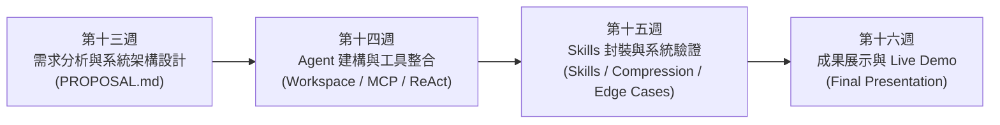
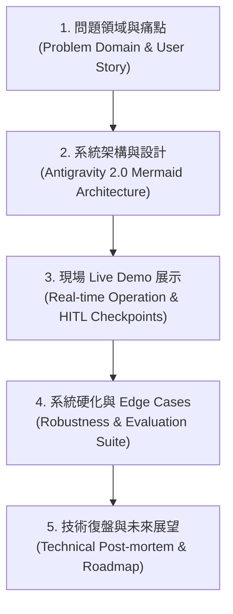
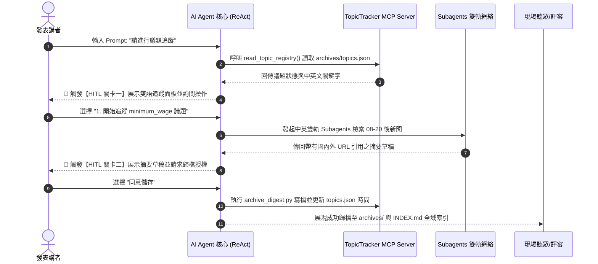
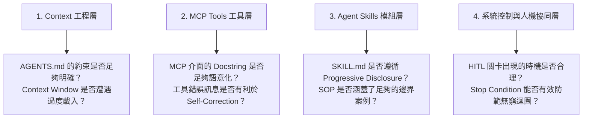
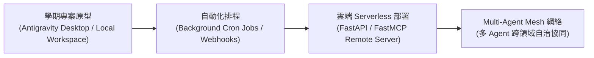

---
puppeteer:
  displayHeaderFooter: true
  headerTemplate: '
第十六章：AI Agent 專案實務（四）：成果發表、Live Demo 展示與系統檢討
'
  footerTemplate: '
第  頁 / 共  頁
'
  margin:
    top: "1.5cm"
    bottom: "1.5cm"
    left: "1.5cm"
    right: "1.5cm"
---

---

# 第十六章：AI Agent 專案實務（四）：成果發表、Live Demo 展示與系統檢討

## 課程導讀

歡迎來到學期專案的最終章！經過前十五週的學習，我們從基礎的 Prompt Engineering、Context Engineering，一路跨越至 Agent Skills 模組化、FastMCP 自訂 Server 開發、ReAct 思考循環以及 Edge Cases 系統硬化。

在第十三至十五週中，各組已陸續完成了：
1. **第十三週：** 需求分析、User Story 與 `PROPOSAL.md` 系統架構設計；
2. **第十四週：** `Social_Topic/` Workspace 建立、`AGENTS.md` 配置與自訂 MCP Server（`src/topic_tracker_mcp.py`）開發；
3. **第十五週：** `skills/topic-tracker/` Skill Package 封裝、Context 優化與 `tests/test_mcp_eval.py` 自動化評估。

本週（第十六週）是學期專案的成果總結與展示（Final Presentation & Live Demo）。

在 AI Agent 領域，一個成功的專案展示絕非「讓模型朗讀一段漂亮文字」，而是清楚呈現：**一個結合了專案規範（AGENTS.md）、外接工具（MCP）、專業 SOP（Agent Skills）與人機協同（HITL）的完整工程化系統，如何在真實情境下自主解決複雜問題。**

本章將引導各組編排高品質的 Live Demo 展示腳本、進行同儕評審（Peer Review），並對專案進行技術復盤（Technical Retrospective），為本學期的 AI Agent 實務課程劃下圓滿句點！

> **AI Agent 成果發表（Final Presentation）＝ 展現工程化認知系統的實體價值。最好的展示不是避開錯誤，而是展示 Agent 在理解問題、執行工具、人機審查與遭遇例外時，如何展現出高度透明、安全且可預測的工程成熟度。**

---

## 第一節：專案發表架構與簡報敘事設計 (Presentation Architecture)

### 1.1 從技術規格走向問題解決敘事

許多工程團隊在進行技術簡報時，容易陷入「直接逐行說明程式碼」的陷阱。然而，聽眾（包括研究同儕與評審）最關心的核心是：**這個 AI Agent 究竟為使用者解決了什麼真實痛點？**

因此，10 分鐘的成果發表簡報應採取 **五段式黃金敘事架構（5-Part Presentation Framework）**：

---

### 1.2 將 `PROPOSAL.md` 轉化為簡報結構

在第十三週時，我們撰寫了包含 12 個區塊的 `PROPOSAL.md`。在發表簡報中，我們可以將這些區塊提煉為視覺化投影片：

| 簡報投影片單元 | 對應 `PROPOSAL.md` 區塊 | 視覺化重點與表現形式 |
| :--- | :--- | :--- |
| **Slide 1: 封面與主題** | 1. Project Overview | 專案名稱、團隊成員與一句話產品定位。 |
| **Slide 2: 研究痛點與 User Story** | 2. Problem Domain & 3. User Story | 使用者人物誌 (Persona) 與手動追蹤的多議題痛點。 |
| **Slide 3: 系統架構藍圖** | 6. System Architecture | Antigravity 2.0 Mermaid 架構圖（突出 Workspace, MCP, Skills）。 |
| **Slide 4: 人機協同設計** | 5. Main Workflow & HITL Checkpoints | 雙重 HITL 關卡流程圖（議題選擇關卡 $\rightarrow$ 歸檔授權關卡）。 |
| **Slide 5: Live Demo (現場操作)** | 4. Agent Goal & 8. Agent Skills Design | 現場切換至 Antigravity Desktop 進行實體演示。 |
| **Slide 6: 系統評估與 Edge Cases** | 11. Evaluation & Test Plan | 展示 `tests/test_mcp_eval.py` 通過結果與 0 結果防禦。 |
| **Slide 7: 復盤與未來展望** | 10. Expected Challenges & 未來方向 | Token 成本分析、限制反思與未來產品化規劃。 |

---

## 第二節：Live Demo 腳本編排與人機協同展示 (Live Demo Scripting)

### 2.1 Live Demo 的黃金原則：展現 Agent 的自主性

在現場 Live Demo 中，最忌諱講者在對話框中發起十幾次細微的微觀指令（Micro-prompting）。這種操作會讓聽眾覺得 Agent 只是「依照指令動作的命令列工具」，而非具備自主推理能力的 AI Agent。

理想的 Live Demo 應該是：**「講者下達一個高階任務目標 $\rightarrow$ Agent 語意觸發 Skill SOP $\rightarrow$ Agent 自主呼叫 MCP 工具與 Subagents $\rightarrow$ 在關鍵關卡主動發起 HITL 請講者審查 $\rightarrow$ 產出最終結果。」**

---

### 2.2 `topic-tracker` 現場演示腳本示範

以下為 `topic-tracker` 專案在 Live Demo 中的標準演示流程腳本：

---

### 2.3 演示系統穩健性與 Edge Case 防禦

在 Live Demo 中，除了示範順利的 Happy Path 之外，**適度演示系統在非理想情境下的防禦能力**能極大地提升評審對系統成熟度的評價：

#### 示範範例：演示 Edge Case 1 (Web 檢索 0 結果防禦)
1. **講者操作：** 將 `archives/topics.json` 中的 `last_tracked_at` 手動修改為當前時間。
2. **下達任務：** 再次執行議題追蹤。
3. **Agent 自主反應：** 檢索後發現無最新新聞，Agent 輸出：
   > `「自 2026-08-31 10:00:00 以來全網無最新報導。系統已自動標記無新動態，絕不捏造新聞。請問是否需要放寬檢索關鍵字？」`
4. **展示效益：** 證明系統具備防止 LLM 產生幻覺（Hallucination）的硬化防禦能力！

---

## 第三節：專案技術復盤與架構反思 (Project Retrospective)

在專案完成後，進行客觀的 **技術復盤（Technical Post-mortem）** 是成為優秀 AI Agent 架構師的核心習慣。

### 3.1 四大技術層級的復盤反思

各組應針對學期專案中的四個工程層級進行檢討：

---

### 3.2 效能與成本分析 (Performance & Token Metrics)

請各小組針對專案執行的 Token 開銷與回應延遲進行數據化分析：
- **Token 效率：** 透過 Context Compression 策略後，單次 ReAct 循環節省了多少 Token？
- **回應延遲 (Latency)：** 呼叫 MCP 工具與 Subagent 併行檢索平均耗時多久？
- **可靠度 (Reliability)：** 在 `tests/test_mcp_eval.py` 的自動化評估中，單元測試通過率是否達到 100%？

---

## 第四節：同儕評審 (Peer Review) 與評分量表 (Evaluation Rubric)

### 4.1 學期專案成果同儕評分量表

在第十六週的展示現場，聽眾與同儕將依據以下四大維度進行 **Peer Review 同儕評分**（總分 100 分）：

| 評分維度 | 權重 | 具體評估指標與觀察重點 |
| :--- | :---: | :--- |
| **1. 問題匹配度與實用性 (Problem Domain Fit)** | 25% | 專案是否切中真實使用者痛點？User Story 與實際 Agent 功能是否一致？ |
| **2. 架構工程與 MCP 整合 (Architecture & Tools)** | 25% | Workspace 結構是否清晰？`AGENTS.md` 與自訂 MCP Server 設計是否語意化？ |
| **3. Skills 模組化與 SOP (Skills & Progressive Disclosure)** | 25% | `SKILL.md` 是否遵循 Progressive Disclosure？雙重 HITL 關卡設計是否合理？ |
| **4. 系統穩健性與 Live Demo (Robustness & Demo)** | 25% | Live Demo 是否流暢？能否處理 Edge Cases？`tests/test_mcp_eval.py` 是否通過？ |

---

### 5.2 同儕回饋與建設性評論工作坊 (Constructive Feedback)

聽眾在填寫同儕評分表時，請提供包含 **「優點（Keep）」** 與 **「升級建議（Try）」** 的建設性回饋：
- **Keep：** 「`topic-tracker` 的中英雙語對比表格與 URL Citation 標註非常清晰，HITL 關卡出現時機非常精準。」
- **Try：** 「建議未來可以在 `topics.json` 中加入自動統計追蹤次數的欄位，讓縱向分析更具備數據感。」

---

## 第五節：未來展望：AI Agent 的產品化與持續升級

### 5.1 從 Workspace 原型走向 Production 部署

學期專案在 Antigravity 2.0 Desktop 環境中運作成功，是邁向 Production 的第一步。若要將 Agent 正式產品化（Productization），未來的升級路線圖包含：

1. **背景自動化排程 (Cron Jobs)：** 結合排程工具，讓 `topic-tracker` 每日深夜自動觸發新聞追蹤並發送 Email 摘要。
2. **雲端 MCP 部署 (Remote MCP)：** 將 `src/topic_tracker_mcp.py` 部署至雲端微服務，支援多位學者同時存取 `topics.json`。
3. **Multi-Agent 認知網絡：** 讓 `topic-tracker` 與「論文寫作 Agent」、「政策評估 Agent」跨領域溝通。

---

### 5.2 結語：成為 AI Agent 時代的工程創作者

在本學期的課程中，我們從最基本的提示詞寫作，一路成長為能夠設計 Workspace、編寫 MCP Server、封裝 Agent Skills 並進行系統硬化的 AI Agent 系統架構師。

請記住：**大型語言模型（LLM）提供了無窮的推理潛能，而真正將潛能轉化為現實價值的，是身為工程創作者的你所建立的架構、規範與控制機制。**

---

## 本章小結與思考問題

### 核心觀念回顧

1. **五段式簡報敘事：** 從問題痛點、架構藍圖、Live Demo 到系統硬化與技術復盤，展現系統工程價值。
2. **流暢的 Live Demo 腳本：** 以高階目標觸發 Agent 自主執行，現場展示雙重 HITL 關卡與邊界例外防禦。
3. **技術復盤 (Post-mortem)：** 從 Context、MCP、Skills 與控管四大層級檢討系統效能、Token 開銷與評估測試結果。
4. **邁向 Production：** 理解 Workspace 原型與雲端 Remote MCP、背景 Cron 排程及 Multi-Agent 網絡的演進方向。

---

### 學期 Capstone AI Agent 完整系統終極架構圖

```mermaid
graph TD
    subgraph Layer1["User Interface & Presentation Layer"]
        User["使用者 / 人文學者"] <-->|高階需求 Prompt| AgentBrain["AI Agent 推理大腦 (ReAct Loop)"]
        AgentBrain -- 🛑 HITL 關卡一: 議題選擇關卡 --> User
        AgentBrain -- 🛑 HITL 關卡二: 摘要歸檔授權 --> User
    end

    subgraph Layer2["Persistent Context & Governance Layer"]
        AGENTS_MD["AGENTS.md (全域繁體中文 & URL Citations 規範)"] --> AgentBrain
        PROPOSAL_MD["PROPOSAL.md (專案架構與規格藍圖)"] --> AgentBrain
    end

    subgraph Layer3["Agent Skills Modular Package (topic-tracker)"]
        SKILL_MD["SKILL.md (多議題雙語 SOP + Edge Cases 防禦)"] <--> AgentBrain
        Resources["resources/ (summary_template & trend_guide)"] --> AgentBrain
        Examples["examples/ (daily & longitudinal 範例)"] --> AgentBrain
    end

    subgraph Layer4["MCP Tools & Execution Layer"]
        MCP["TopicTracker MCP Server (src/topic_tracker_mcp.py)"] <--> AgentBrain
        Scripts["manage_topics.py & archive_digest.py"] <--> AgentBrain
        WebTool["Web Search API (中英雙軌新聞檢索)"] <--> AgentBrain
    end

    subgraph Layer5["Persistent Database Layer (Social_Topic/archives/)"]
        Scripts <--> TopicsJSON["archives/topics.json (雙語關鍵字 & last_tracked_at)"]
        Scripts --> MarkdownFiles["archives/YYYY-MM-DD_<topic>.md & INDEX.md"]
    end

    subgraph Layer6["Evaluation & Quality Assurance Layer"]
        EvalSuite["tests/test_mcp_eval.py (單元迴歸評估測試集)"] <--> TopicsJSON
    end
```

---

### 本章思考問題

1. **簡報敘事題：** 在學期成果發表中，為什麼直接展示程式碼通常不如展示「使用者痛點 $\rightarrow$ 架構圖 $\rightarrow$ Live Demo 互動」更能吸引聽眾？
2. **Live Demo 設計題：** 當現場 Live Demo 遇到網路中斷或 Web 搜尋失敗時，好的 Demo 腳本應該如何預先設計備援機制（Fallback）？
3. **未來展望題：** 經過本學期的實作，你認為一個能在企業或研究環境中真正上線營運的 AI Agent，還需要增加哪些安全或部署方面的工程機制？
