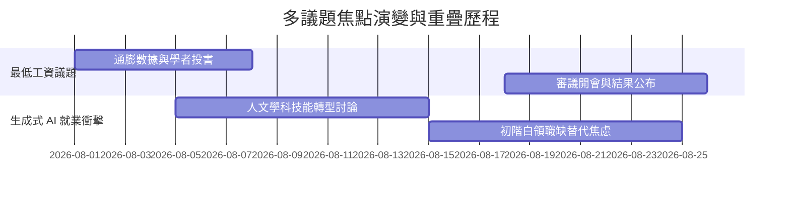

# 【多議題縱向趨勢對比報告】8 月份社會議題演變分析

- **比較區間：** 2026-08-01 至 2026-08-25 (採計 6 份歷史摘要檔)
- **涵蓋議題：** 最低工資法修法 (`minimum_wage`)、生成式 AI 就業影響 (`genai_hss`)
- **歸檔檔案列表：** `2026-08-01_wage.md`, `2026-08-10_wage.md`, `2026-08-25_wage.md`, `2026-08-05_genai.md`, `2026-08-22_genai.md`

---

## 一、 議題熱度與框架演變趨勢

### 核心發現與多議題交叉分析：
1. **論述主軸移轉：** 8 月初「最低工資」偏向純經濟指標；8 月底審議完畢後，與「生成式 AI 就業衝擊」產生交叉碰撞，媒體開始討論「基本工資調升是否會加速企業導入 AI 替代初階勞工」。
2. **來源引用聲明：** 本縱向分析報告所引用的 18 篇報導均附帶完整 URL 出處，完整記錄於 `archives/INDEX.md`。
